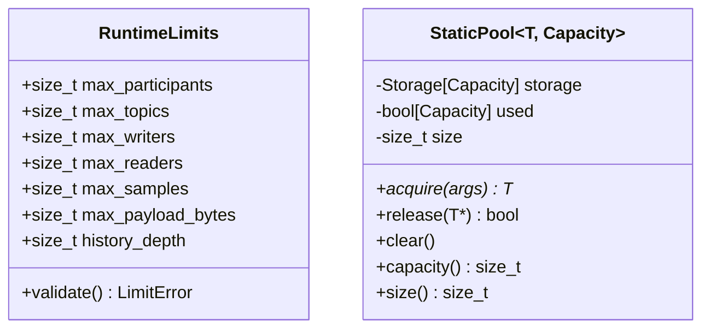
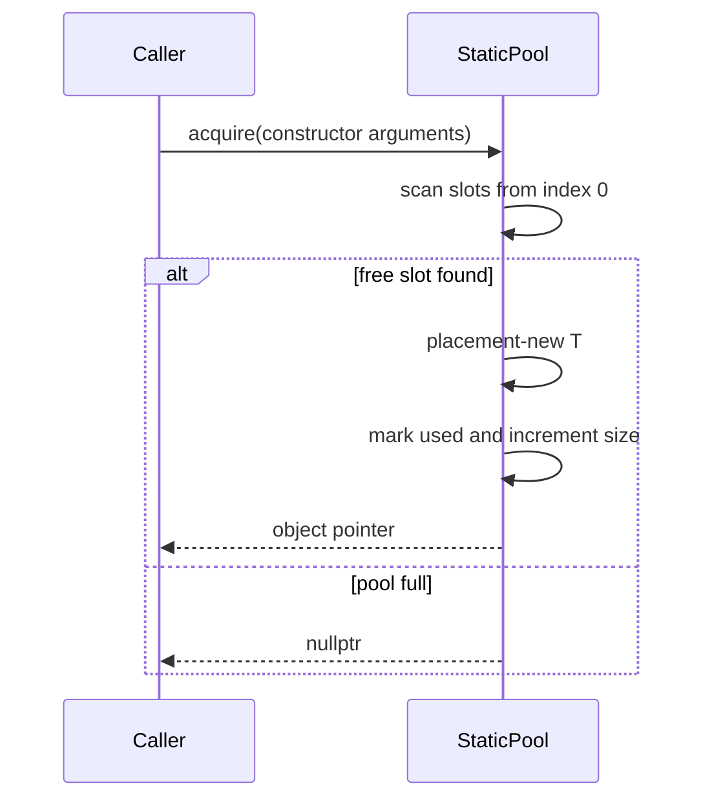

# Core resource detailed design

**Design status:** Current  
**Requirements:** ORT-CORE-001, ORT-CORE-002  
**Source:** `include/openrtdds/core/runtime_limits.hpp`,
`include/openrtdds/core/static_pool.hpp`, `src/core/runtime_limits.cpp`

## Responsibilities

The core resource layer validates startup-wide capacity declarations and
provides compile-time fixed-capacity object storage. It contains no locks,
threads, heap allocation, or operating-system calls.

## Types and class relationships

`RuntimeLimits` is a value object. `StaticPool<T, Capacity>` owns raw aligned
storage and explicitly constructs/destructs `T` objects in that storage.

## RuntimeLimits behavior

`validate()` applies checks in deterministic order:

1. participants must be nonzero;
2. topics must be nonzero;
3. writers and readers must both be nonzero;
4. samples must be nonzero;
5. payload bytes must be nonzero;
6. history depth must be in `[1, max_samples]`.

The first failing condition is returned. Validation is `constexpr`, `noexcept`,
constant-space, and constant-time with respect to configured values.

### API contract

| API | Preconditions | Success | Failure |
|---|---|---|---|
| `RuntimeLimits::validate()` | none | `LimitError::none` | first specific `LimitError` |
| `to_string(LimitError)` | any enum value | stable human-readable text | unknown values return fallback text |

### LimitError

| Enumerator | Condition |
|---|---|
| `none` | all bounds valid |
| `zero_participants` | `max_participants == 0` |
| `zero_topics` | `max_topics == 0` |
| `zero_endpoints` | writers or readers equals zero |
| `zero_samples` | `max_samples == 0` |
| `zero_payload` | `max_payload_bytes == 0` |
| `invalid_history_depth` | depth is zero or greater than samples |

Any non-`none` result maps to `ORT-FLT-CFG-001` at application startup.

## StaticPool behavior

### Acquire sequence

The first free slot is selected. Search cost is bounded by `Capacity`.
Construction occurs before the slot is marked used; the API's `noexcept`
condition follows whether `T` is nothrow-constructible with the supplied
arguments.

### Release and clear

- `release(nullptr)` returns `false`.
- `release(pointer)` scans at most `Capacity` entries.
- Only a pointer equal to a currently used slot is accepted.
- An accepted object is destroyed once, its slot is cleared, and size is
  decremented.
- A foreign, stale, or already released pointer returns `false` without state
  change.
- `clear()` destroys each live object once and resets size to zero.
- The pool destructor calls `clear()`.

## Invariants

- `0 <= size() <= Capacity`.
- `full()` is equivalent to `size() == Capacity`.
- Each `used_[i]` corresponds to exactly one live `T` in `storage_[i]`.
- No pointer is returned when every slot is used.
- Copy construction and copy assignment are disabled.

## Memory, concurrency, and timing

Memory is `Capacity * (sizeof(Storage) + sizeof(bool))` plus object overhead;
there is no heap allocation. Acquire, release, and clear are `O(Capacity)`
worst case. The type is intentionally not thread-safe. Synchronization, if
needed, belongs at the owning subsystem boundary.

## Verification

- `tests/test_runtime_limits.cpp`
- `tests/test_static_pool.cpp`

