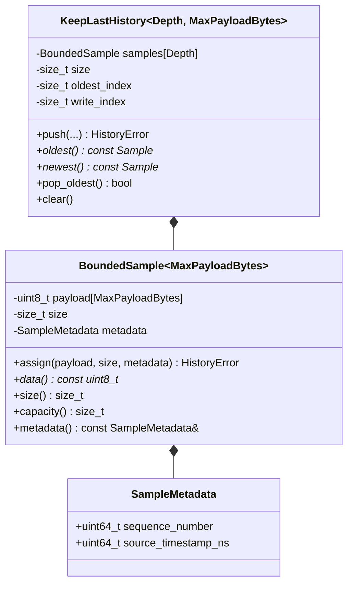
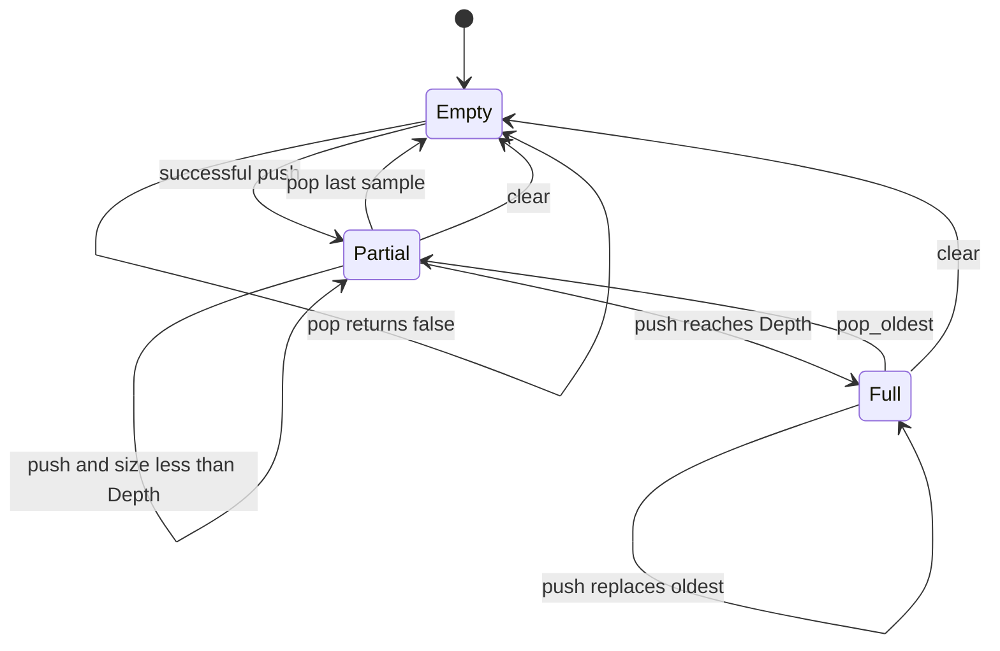
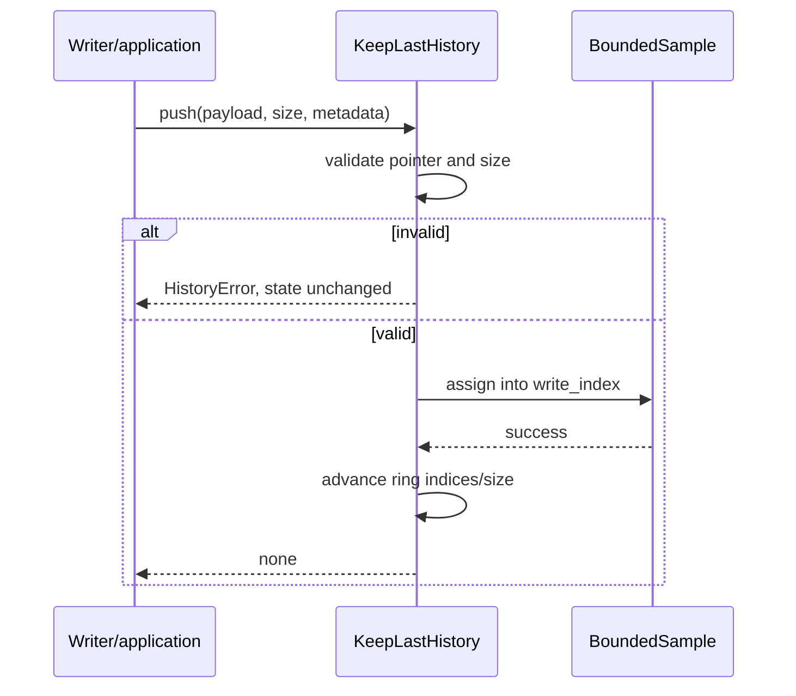

# Bounded history detailed design

**Design status:** Current  
**Requirements:** ORT-HIST-001, ORT-HIST-002, ORT-HIST-003, ORT-HIST-004  
**Source:** `include/openrtdds/core/keep_last_history.hpp`

## Responsibility

The history layer owns serialized samples and metadata in compile-time fixed
storage. `KeepLastHistory` implements DDS KEEP_LAST replacement without heap
allocation. It does not perform reliability, acknowledgements, locking, or
deadline monitoring.

## Class definitions

`Depth` and `MaxPayloadBytes` must be nonzero. The templates own all sample
memory inline.

## BoundedSample assignment

`assign()` validates the entire input before modifying observable size or
metadata:

1. nonempty payload requires a non-null pointer;
2. payload size must not exceed `MaxPayloadBytes`;
3. bytes are copied when size is nonzero;
4. size and metadata are committed.

Bytes beyond current size are unspecified retained storage and are never
exposed through the returned `size()`.

## KEEP_LAST state

State variables satisfy:

- `size_ <= Depth`;
- `oldest_index_ < Depth` and `write_index_ < Depth`;
- when nonempty, `oldest_index_` identifies the next sample to pop;
- `write_index_` identifies the slot for the next successful push;
- when full, a push advances both oldest and write indices.

## Push sequence

## API contracts

| API | Success | Failure/empty behavior |
|---|---|---|
| `push` | sample copied; ring committed | explicit error; no state change |
| `oldest` | pointer to oldest live sample | `nullptr` when empty |
| `newest` | pointer to newest live sample | `nullptr` when empty |
| `pop_oldest` | removes logical oldest | `false` when empty |
| `clear` | logical size and indices reset | cannot fail |

Returned sample pointers refer to internal slots. They may be invalidated or
refer to replaced content after a subsequent mutating history operation.

## HistoryError

| Enumerator | Condition | Fault mapping |
|---|---|---|
| `none` | sample accepted | none |
| `invalid_argument` | null pointer with nonzero size | `ORT-FLT-HIST-001` |
| `payload_too_large` | size exceeds compile-time bound | `ORT-FLT-HIST-001` |

## Memory, concurrency, and timing

Memory is dominated by `Depth * MaxPayloadBytes` plus metadata and indices.
Push is linear in payload size; ring index updates are constant time. Access,
pop, and clear are constant time (clear is logical and does not erase bytes).
No allocation, locks, threads, or system calls occur. A history instance is
single-owner unless the caller supplies synchronization.

## Verification

- `tests/test_keep_last_history.cpp`

