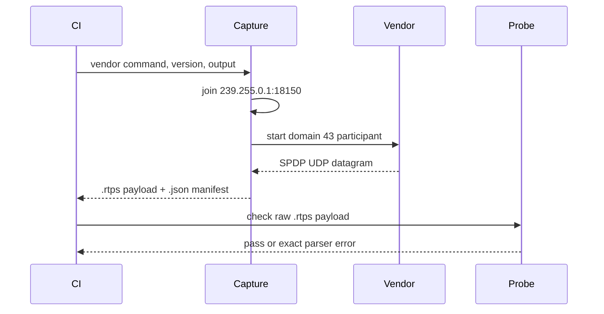

# Vendor packet evidence detailed design

**Design status:** Current for SPDP and SEDP publications; Planned for user DATA  
**Requirements:** ORT-INT-001, ORT-INT-002, ORT-INT-003  
**Requirements:** ORT-INT-004, ORT-INT-005

## Behavior and interfaces

The GitHub Actions interoperability job uses Ubuntu 24.04 with exact Ubuntu
package versions for Fast DDS and Cyclone DDS. Small vendor programs create
one participant in DDS domain 43 and keep it alive for five seconds. A Python
capture process joins the standard SPDP multicast group and binds the domain
multicast port before it launches each vendor.

The capture filter walks bounded RTPS submessages using each submessage's
endianness and selects the first DATA with the standard SPDP built-in writer
entity ID. The raw UDP payload is written without modification to a `.rtps`
file. The companion `.json` manifest records exact package version, command,
domain/endpoint, SHA-256 digest, byte count, and format. CI uploads both
files even when the parse gate fails, provided capture succeeded.

The matched SEDP/SPDP pair from each vendor is also committed beside the
original frozen SPDP packets. The SEDP manifest identifies both hashes and
the originating Actions run; ordinary GCC and Clang CTest jobs parse both
frozen endpoint packets and their matching participants on each PR.

One capture from each pinned package is committed under
`tests/interop/fixtures/<vendor>/<package-version>/`. The manifests also
identify the originating Actions run and generator source. Ordinary GCC and
Clang jobs check the committed SHA-256 digests and parse both fixed payloads,
so a vendor installation is only needed for the independent fresh-capture
job. Capture-specific GUIDs and timestamps may change between fresh runs;
acceptance is semantic, not a byte-for-byte comparison with the frozen files.

The C++ probe reads at most 65,507 bytes, calls `parse_spdp_message` with
domain 43, and rejects missing participant sequence or unicast locators. It
returns `0` on acceptance, `1` on parser failure, or `2` on invocation/input
failure. A CI failure is a visible interoperability gap and shall not be
converted to a passing result.

For ORT-INT-005, vendor programs additionally create a `VendorProbe` writer
on `OpenRTDDSProbe`; the IDL specifies one unsigned 32-bit value. A second
participant in the same domain triggers SEDP exchange. The Linux capture
process opens an IPv4 packet socket before either participant starts. It
extracts bounded UDP payloads and selects a DATA submessage from the
publications built-in writer (`00 00 03 c2`) plus the SPDP announcement with
the same RTPS source GUID prefix. This permits observation of
unicast announcements while the vendor owns its UDP receive ports. Captures
are emitted as raw `.rtps` and `.json` records; no packet is rewritten.

`vendor_packet_probe --sedp <file> <matched-participant-file>` parses the
same-run SPDP first, obtains the SEDP source GUID prefix using the RTPS router,
requires the two prefixes to match, and calls `parse_sedp_message`. It requires
positive sequence, nonempty topic and type, plus SPDP default UDPv4 unicast
locators. Some vendors omit `PID_PARTICIPANT_GUID` and endpoint locator PIDs:
the endpoint GUID supplies the participant prefix and an empty endpoint
locator list indicates inheritance from this matched SPDP participant.
Explicit unsupported-only locator lists remain an error; malformed UDPv4
locator values still fail. Fast DDS includes shared-memory locators beside
UDPv4; valid-length unsupported kinds are skipped without consuming a slot.
The output remains an inbound parser gate; a second vendor process does not
constitute an OpenRTDDS discovery exchange. Python and C++ return nonzero for
timeouts, invalid packets, and missing endpoint fields. `SedpError` and
`RtpsError` identify failures at the probe boundary. The probe owns only a
fixed input buffer and one bounded `SedpMessageView`.

Fast DDS also advertises a shared-memory locator in the same packet as UDPv4
locators. The SPDP parser skips unsupported locator kinds only when the value
has the required wire length, then requires supported UDPv4 unicast locators.

## Normal sequence

The SEDP sequence creates the packet socket first, then the vendor writer and
peer participant. The publisher announces its participant and endpoint; capture
selects both unmodified packets sharing the source prefix; the probe checks
participant locators, endpoint fields, and identity correspondence.

## Failure behavior

| Failure | Detection | Recovery owner |
|---|---|---|
| Package version unavailable | pinned `apt-get install` fails | CI maintainer updates pin in review |
| Vendor process fails or times out | capture program exit / ten-second deadline | CI maintainer |
| Multicast or SPDP absent | capture deadline | CI environment/network maintainer |
| Malformed datagram | bounded filter or C++ parser failure | receiver implementation owner |
| Missing required participant fields | probe fails | SPDP implementation owner |
| SEDP and SPDP source prefixes differ | matched-packet probe fails | capture owner |
| Committed fixture bytes or metadata changed | SHA/manifest checker fails | evidence owner |
| No outbound SEDP within ten seconds | packet socket deadline | CI/network owner |
| SEDP identity, parameter or locator invalid | `SedpError` or `RtpsError` from probe | receive parser owner |

No failure is silently skipped. The C++ probe never transmits, retries,
allocates in the RTPS parser, or changes the production receive API. File I/O,
process creation, and hashing are isolated to the CI harness.

## Ownership and timing

`capture_spdp.py` owns one socket and one child process, both released before
the command returns. The Python filter is for capture selection only; the
OpenRTDDS C++ parser decides acceptance. Each vendor process waits five
seconds; the capture deadline is ten seconds. The probe owns a fixed input
buffer and does not retain the parsed view after its call.

## Planned extension

ORT-INT-004 extends this same provenance and parse pattern to user
DATA from both vendors. G2 stays partial until those packets are captured and
accepted in CI. G3 additionally requires both directions of live discovery
and application data exchange. No ROS 2 RMW evidence is claimed here.
