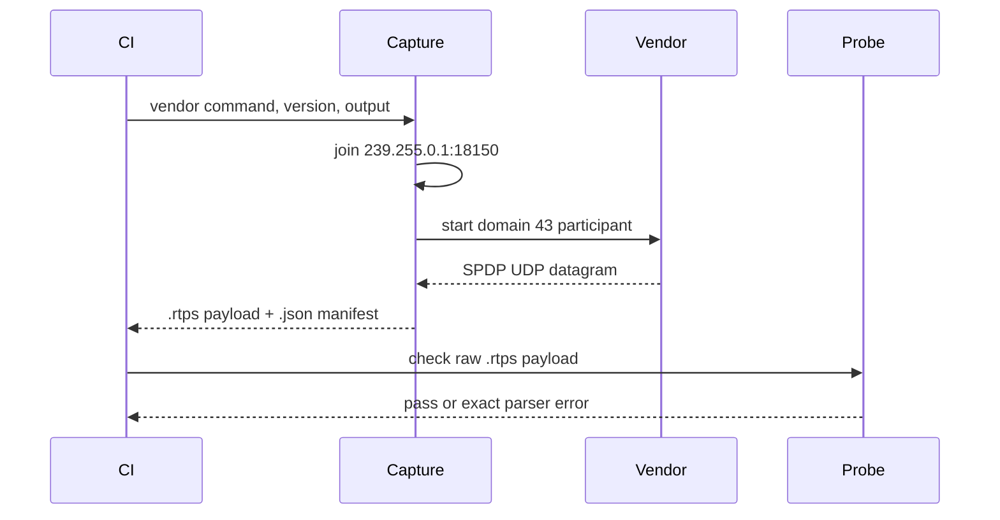

# Vendor packet evidence detailed design

**Design status:** Current for SPDP; Planned for SEDP and user DATA  
**Requirements:** ORT-INT-001, ORT-INT-002, ORT-INT-003  
**Requirements:** ORT-INT-004

## Behavior and interfaces

The GitHub Actions interoperability job uses Ubuntu 24.04 with exact Ubuntu
package versions for Fast DDS and Cyclone DDS. Small vendor programs create
one participant in DDS domain 43 and keep it alive for five seconds. A Python
capture process joins the standard SPDP multicast group and binds the domain
multicast port before it launches each vendor.

The capture filter walks bounded RTPS submessages using each submessage's
endianness and selects the first DATA with the standard SPDP built-in writer
entity ID. The raw UDP payload is written without modification to a `.rtps`
file. The companion `.json` manifest records exact package version, command,
domain/endpoint, SHA-256 digest, byte count, and format. CI uploads both
files even when the parse gate fails, provided capture succeeded.

The C++ probe reads at most 65,507 bytes, calls `parse_spdp_message` with
domain 43, and rejects missing participant sequence or unicast locators. It
returns `0` on acceptance, `1` on parser failure, or `2` on invocation/input
failure. A CI failure is a visible interoperability gap and shall not be
converted to a passing result.

## Normal sequence

## Failure behavior

| Failure | Detection | Recovery owner |
|---|---|---|
| Package version unavailable | pinned `apt-get install` fails | CI maintainer updates pin in review |
| Vendor process fails or times out | capture program exit / ten-second deadline | CI maintainer |
| Multicast or SPDP absent | capture deadline | CI environment/network maintainer |
| Malformed datagram | bounded filter or C++ parser failure | receiver implementation owner |
| Missing required participant fields | probe fails | SPDP implementation owner |

No failure is silently skipped. The C++ probe never transmits, retries,
allocates in the RTPS parser, or changes the production receive API. File I/O,
process creation, and hashing are isolated to the CI harness.

## Ownership and timing

`capture_spdp.py` owns one socket and one child process, both released before
the command returns. The Python filter is for capture selection only; the
OpenRTDDS C++ parser decides acceptance. Each vendor process waits five
seconds; the capture deadline is ten seconds. The probe owns a fixed input
buffer and does not retain the parsed view after its call.

## Planned extension

ORT-INT-004 extends this same provenance and parse pattern to SEDP and user
DATA from both vendors. G2 stays partial until those packets are captured and
accepted in CI. G3 additionally requires both directions of live discovery
and application data exchange. No ROS 2 RMW evidence is claimed here.
