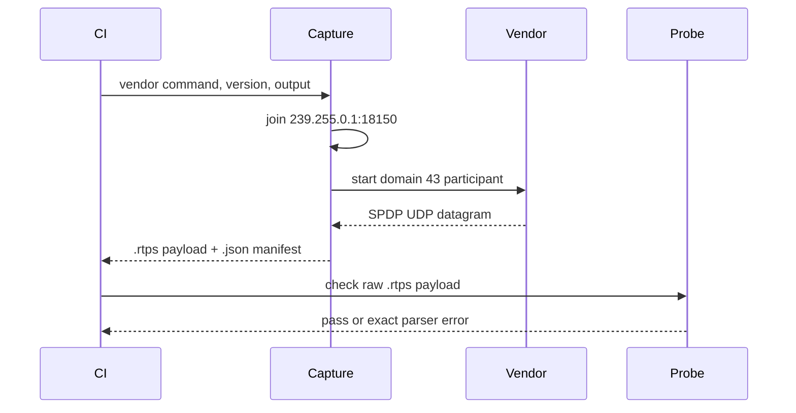
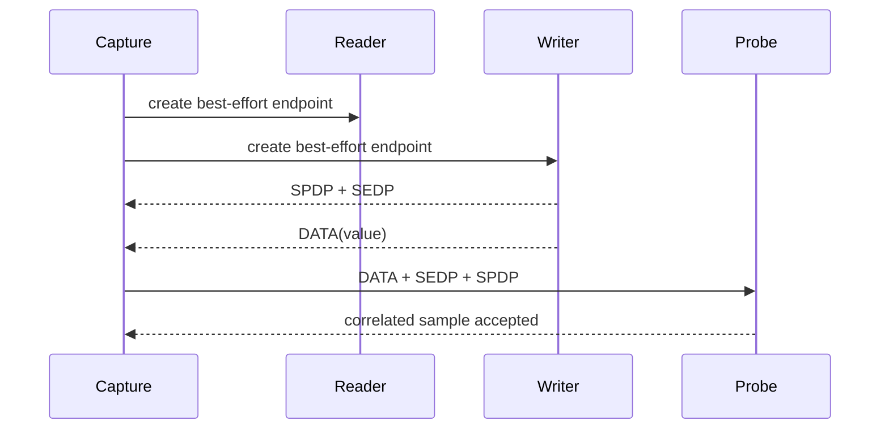
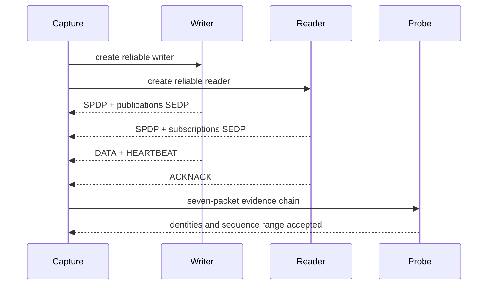

# Vendor packet evidence detailed design

**Design status:** Current for SPDP, SEDP, best-effort DATA, and reliable DATA/control evidence
**Requirements:** ORT-INT-001, ORT-INT-002, ORT-INT-003  
**Requirements:** ORT-INT-004, ORT-INT-005, ORT-INT-006, ORT-INT-007

## Behavior and interfaces

The GitHub Actions interoperability job uses Ubuntu 24.04 with exact Ubuntu
package versions for Fast DDS and Cyclone DDS. Small vendor programs create
one participant in DDS domain 43 and keep it alive for five seconds. A Python
capture process joins the standard SPDP multicast group and binds the domain
multicast port before it launches each vendor.

The capture filter walks bounded RTPS submessages using each submessage's
endianness and selects the first DATA with the standard SPDP built-in writer
entity ID. The raw UDP payload is written without modification to a `.rtps`
file. The companion `.json` manifest records exact package version, command,
domain/endpoint, SHA-256 digest, byte count, and format. CI uploads both
files even when the parse gate fails, provided capture succeeded.

The matched SEDP/SPDP pair from each vendor is also committed beside the
original frozen SPDP packets. The SEDP manifest identifies both hashes and
the originating Actions run; ordinary GCC and Clang CTest jobs parse both
frozen endpoint packets and their matching participants on each PR.

One capture from each pinned package is committed under
`tests/interop/fixtures/<vendor>/<package-version>/`. The manifests also
identify the originating Actions run and generator source. Ordinary GCC and
Clang jobs check the committed SHA-256 digests and parse both fixed payloads,
so a vendor installation is only needed for the independent fresh-capture
job. Capture-specific GUIDs and timestamps may change between fresh runs;
acceptance is semantic, not a byte-for-byte comparison with the frozen files.

The C++ probe reads at most 65,507 bytes, calls `parse_spdp_message` with
domain 43, and rejects missing participant sequence or unicast locators. It
returns `0` on acceptance, `1` on parser failure, or `2` on invocation/input
failure. A CI failure is a visible interoperability gap and shall not be
converted to a passing result.

For ORT-INT-005, vendor programs additionally create a `VendorProbe` writer
on `OpenRTDDSProbe`; the IDL specifies one unsigned 32-bit value. A second
participant in the same domain triggers SEDP exchange. The Linux capture
process opens an IPv4 packet socket before either participant starts. It
extracts bounded UDP payloads and selects a DATA submessage from the
publications built-in writer (`00 00 03 c2`) plus the SPDP announcement with
the same RTPS source GUID prefix. This permits observation of
unicast announcements while the vendor owns its UDP receive ports. Captures
are emitted as raw `.rtps` and `.json` records; no packet is rewritten.

`vendor_packet_probe --sedp <file> <matched-participant-file>` parses the
same-run SPDP first, obtains the SEDP source GUID prefix using the RTPS router,
requires the two prefixes to match, and calls `parse_sedp_message`. It requires
positive sequence, nonempty topic and type, plus SPDP default UDPv4 unicast
locators. Some vendors omit `PID_PARTICIPANT_GUID` and endpoint locator PIDs:
the endpoint GUID supplies the participant prefix and an empty endpoint
locator list indicates inheritance from this matched SPDP participant.
Explicit unsupported-only locator lists remain an error; malformed UDPv4
locator values still fail. Fast DDS includes shared-memory locators beside
UDPv4; valid-length unsupported kinds are skipped without consuming a slot.
The output remains an inbound parser gate; a second vendor process does not
constitute an OpenRTDDS discovery exchange. Python and C++ return nonzero for
timeouts, invalid packets, and missing endpoint fields. `SedpError` and
`RtpsError` identify failures at the probe boundary. The probe owns only a
fixed input buffer and one bounded `SedpMessageView`.

Fast DDS also advertises a shared-memory locator in the same packet as UDPv4
locators. The SPDP parser skips unsupported locator kinds only when the value
has the required wire length, then requires supported UDPv4 unicast locators.

### Best-effort application DATA behavior

For ORT-INT-006, each vendor creates the same `VendorProbe` topic endpoints
with `BEST_EFFORT` reliability. The delayed publisher starts first so the
capture retains its initial SPDP identity; the subscriber follows after 300
milliseconds. After a bounded three-second discovery interval, the publisher
writes one sample whose only field is the unsigned 32-bit value `0x4F525444`.
Fast DDS uses an explicit UDPv4-only participant transport and disables the
DataSharing QoS policy on both endpoints, so same-host shared-memory delivery
cannot satisfy the wire test. The CI environment also sets
`FASTDDS_BUILTIN_TRANSPORTS=UDPv4` as a defense-in-depth constraint. The
capture process selects a DATA submessage whose writer entity kind is a keyed
or unkeyed user writer, resolves its effective source GUID prefix from the
RTPS header plus any preceding `INFO_SRC`, then retains the SEDP publication
and SPDP announcement with that same effective source. All three UDP payloads
remain unmodified.

The probe interface is:

```text
openrtdds_vendor_packet_probe --data DATA SEDP SPDP
```

It invokes the existing production APIs in this order:

1. `parse_spdp_message(SPDP, domain=43)` validates the participant and its
   usable default UDPv4 unicast locator.
2. `parse_data_message(DATA)` validates the compound RTPS message, user DATA
   flags, sequence number, and serialized-payload representation.
3. `parse_sedp_message(SEDP, DATA.source_guid_prefix)` validates the writer
   announcement.
4. The probe requires equal participant prefixes and equal DATA/SEDP writer
   entity IDs, writer endpoint kind, `OpenRTDDSProbe`, `VendorProbe`, and
   best-effort reliability.
5. A bounded CDR decoder requires an eight-byte CDR payload and compares the
   decoded value with `0x4F525444`.

The capture script owns one raw packet socket and two child processes. Its
maps are keyed by the fixed 12-byte GUID prefix and live only until the
12-second deadline. The probe owns three fixed 65,508-byte input buffers and
non-owning parser views. No heap allocation or file I/O is added to the
production RTPS receive implementation.

| Boundary | Success result | Failure result |
|---|---|---|
| Capture CLI | three `.rtps` files plus JSON manifest | exit `1` on timeout, peer failure, or incomplete chain |
| Probe input | readable bounded files | exit `2` on invocation or file error |
| RTPS DATA parser | `RtpsError::none` | exit `1` with exact `RtpsError` text |
| Discovery correlation | same participant and writer entity | exit `1` on identity/QoS/topic/type mismatch |
| CDR value check | exactly `0x4F525444` | exit `1` on representation, size, or value mismatch |

### Reliable DATA and control behavior

ORT-INT-007 uses the same generated `VendorProbe` type and fixed value with
`RELIABLE` writer and reader QoS. The publisher starts first and delays its
write for three seconds; the subscriber starts 300 milliseconds later. Fast
DDS again uses UDPv4-only transports with DataSharing disabled. The raw packet
capture retains seven correlated payloads. Reliable subscribers remain alive
for 12 seconds so the bounded 16-second capture includes a periodic SPDP
announcement even when a vendor suppresses its initial multicast response:

| Evidence | Required identity |
|---|---|
| user DATA | publisher prefix and user writer entity |
| publications SEDP | publisher prefix and the same writer entity |
| publisher SPDP | publisher prefix and default UDPv4 locator |
| HEARTBEAT | publisher prefix, same writer, range covering DATA sequence |
| ACKNACK | subscriber prefix, same writer, user reader entity |
| subscriptions SEDP | subscriber prefix and the same reader entity |
| subscriber SPDP | subscriber prefix and default UDPv4 locator |

The Python selector performs only bounded framing and identity correlation.
It walks RTPS submessages, applies preceding `INFO_SRC`, and accepts fixed-size
HEARTBEAT plus bounded ACKNACK content. The C++ probe is the acceptance
authority and calls `parse_data_message`, `parse_sedp_message`,
`parse_heartbeat_message`, `parse_acknack_message`, and `parse_spdp_message`.
The ACKNACK parser enforces the 256-bit `SequenceNumberSet` ceiling. The probe
does not require a missing-sample bit because a no-loss exchange may produce a
final ACKNACK; loss/repair policy remains covered by deterministic reliability
state tests.

The reliable probe interface is:

```text
openrtdds_vendor_packet_probe --reliable DATA PUB_SEDP PUB_SPDP HEARTBEAT ACKNACK SUB_SEDP SUB_SPDP
```

The harness owns one packet socket, two child processes, bounded packet lists,
and a 16-second deadline. Production parser views are non-owning and allocate
no memory. A complete chain is required atomically; partial evidence is kept
only as a failure diagnostic artifact.

## Normal sequence



The SEDP sequence creates the packet socket first, then the vendor writer and
peer participant. The publisher announces its participant and endpoint; capture
selects both unmodified packets sharing the source prefix; the probe checks
participant locators, endpoint fields, and identity correspondence.





## Failure behavior

| Failure | Detection | Recovery owner |
|---|---|---|
| Package version unavailable | pinned `apt-get install` fails | CI maintainer updates pin in review |
| Vendor process fails or times out | capture program exit / ten-second deadline | CI maintainer |
| Multicast or SPDP absent | capture deadline | CI environment/network maintainer |
| Malformed datagram | bounded filter or C++ parser failure | receiver implementation owner |
| Missing required participant fields | probe fails | SPDP implementation owner |
| SEDP and SPDP source prefixes differ | matched-packet probe fails | capture owner |
| Committed fixture bytes or metadata changed | SHA/manifest checker fails | evidence owner |
| No outbound SEDP within ten seconds | packet socket deadline | CI/network owner |
| SEDP identity, parameter or locator invalid | `SedpError` or `RtpsError` from probe | receive parser owner |
| Shared-memory path hides Fast DDS DATA | forced UDPv4 transport and capture timeout | CI configuration owner |
| DATA has foreign writer or participant | three-packet correlation fails | evidence owner |
| DATA payload or QoS differs | probe comparison fails | vendor-emitter owner |
| HEARTBEAT excludes DATA sequence | reliability probe fails | control-parser owner |
| ACKNACK targets foreign writer | reliability probe fails | evidence owner |
| ACKNACK reader differs from subscriptions SEDP | correlation fails | evidence owner |
| ACKNACK bitmap exceeds 256 bits | `bitmap_bound_exceeded` | control-parser owner |

No failure is silently skipped. The C++ probe never transmits, retries,
allocates in the RTPS parser, or changes the production receive API. File I/O,
process creation, and hashing are isolated to the CI harness.

## Ownership and timing

`capture_spdp.py` owns one socket and one child process, both released before
the command returns. The Python filter is for capture selection only; the
OpenRTDDS C++ parser decides acceptance. Each vendor process waits five
seconds; the capture deadline is ten seconds. The probe owns a fixed input
buffer and does not retain the parsed view after its call.

## Planned extension

After ORT-INT-007 is verified, ORT-INT-004 and G2 are complete for the scoped
packet corpus. G3 still requires both directions of live OpenRTDDS discovery
and application data exchange. No ROS 2 RMW evidence is claimed here.
