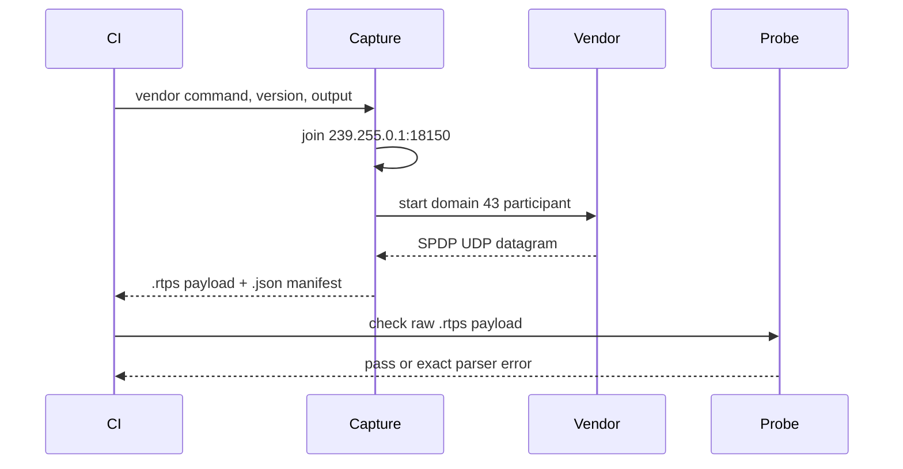
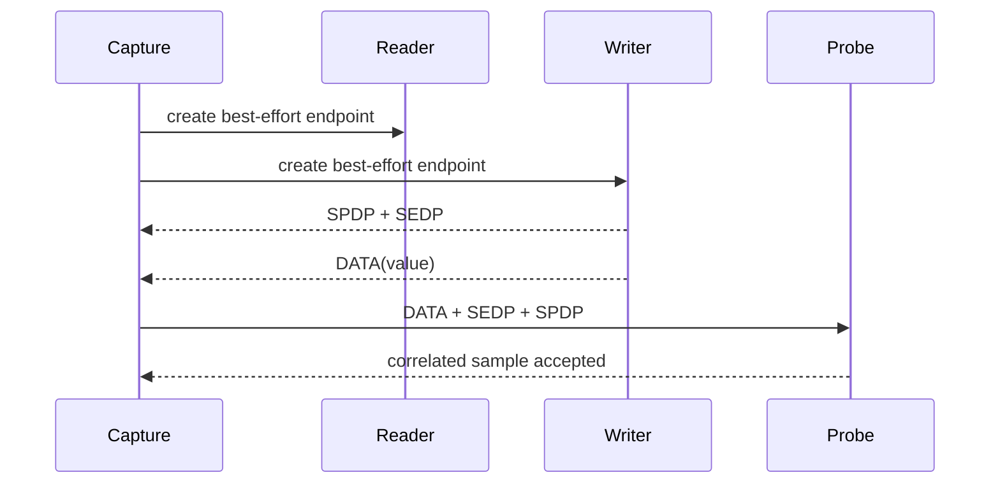
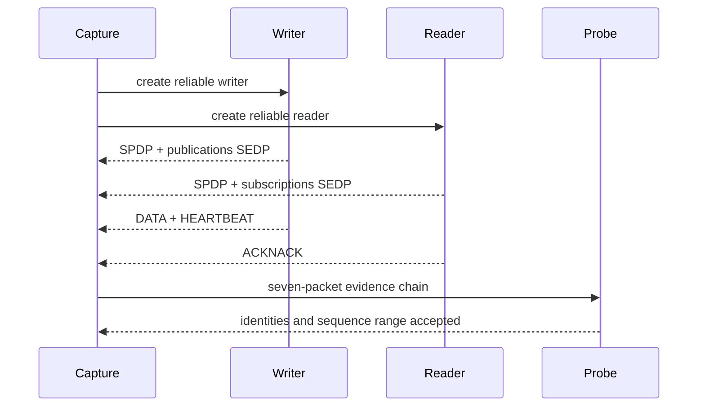
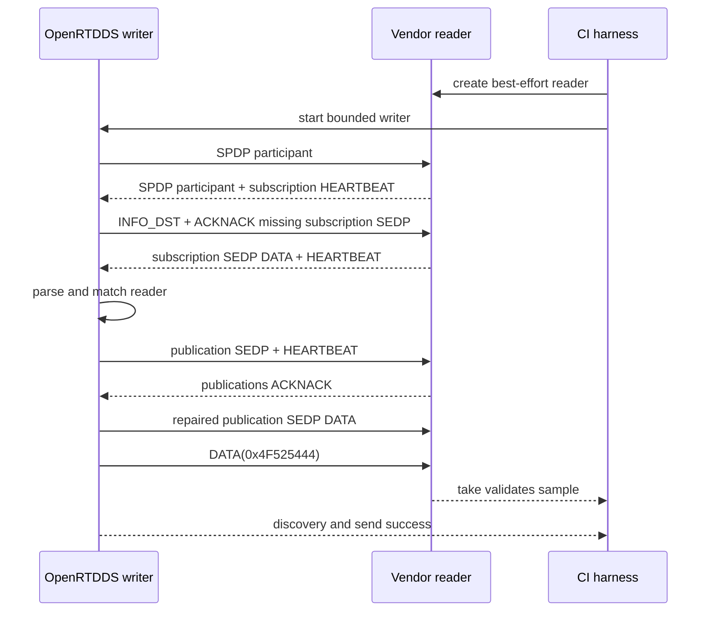
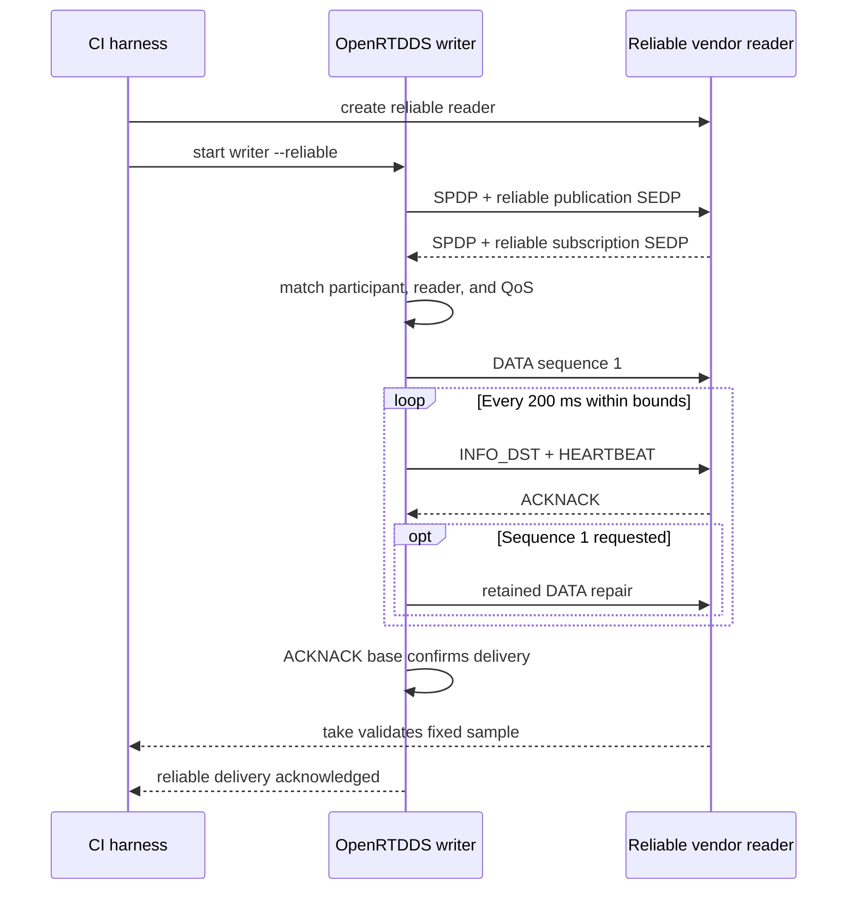
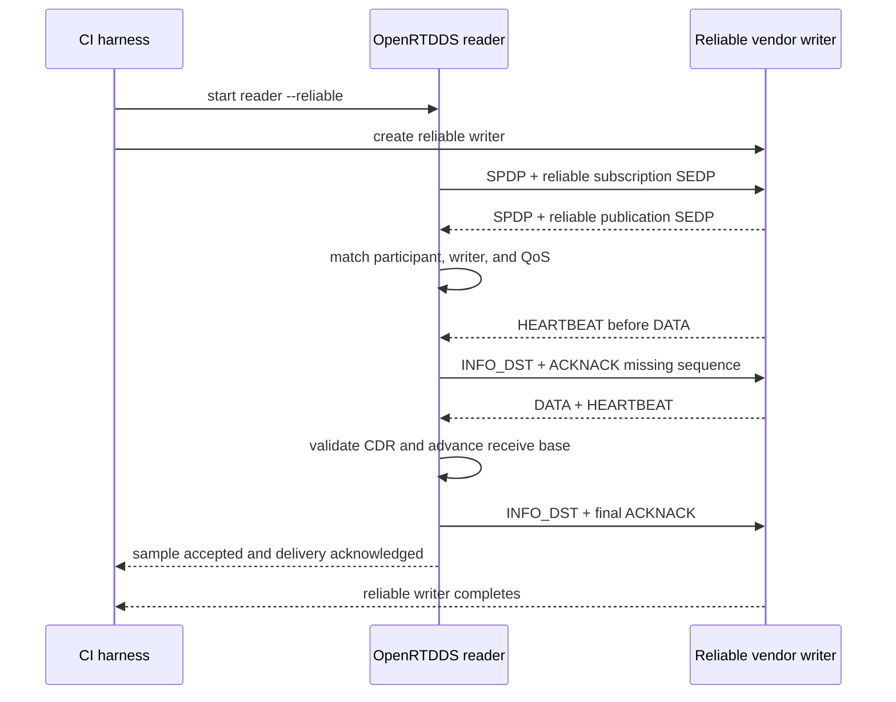
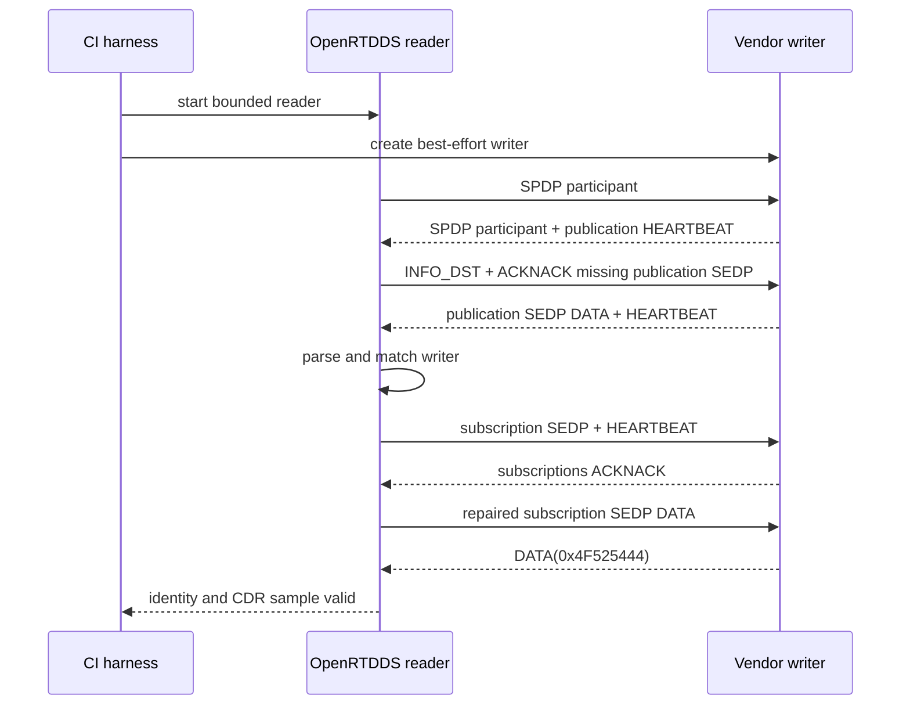

# Vendor interoperability detailed design

**Design status:** Current for G2 and both best-effort and reliable live
directions
**Requirements:** ORT-INT-001, ORT-INT-002, ORT-INT-003  
**Requirements:** ORT-INT-004, ORT-INT-005, ORT-INT-006, ORT-INT-007
**Requirements:** ORT-INT-008, ORT-INT-009, ORT-INT-010, ORT-INT-011

## Behavior and interfaces

The GitHub Actions interoperability job uses Ubuntu 24.04 with exact Ubuntu
package versions for Fast DDS and Cyclone DDS. Small vendor programs create
one participant in DDS domain 43 and keep it alive for five seconds. A Python
capture process joins the standard SPDP multicast group and binds the domain
multicast port before it launches each vendor.

The capture filter walks bounded RTPS submessages using each submessage's
endianness and selects the first DATA with the standard SPDP built-in writer
entity ID. The raw UDP payload is written without modification to a `.rtps`
file. The companion `.json` manifest records exact package version, command,
domain/endpoint, SHA-256 digest, byte count, and format. CI uploads both
files even when the parse gate fails, provided capture succeeded.

The matched SEDP/SPDP pair from each vendor is also committed beside the
original frozen SPDP packets. The SEDP manifest identifies both hashes and
the originating Actions run; ordinary GCC and Clang CTest jobs parse both
frozen endpoint packets and their matching participants on each PR.

One capture from each pinned package is committed under
`tests/interop/fixtures/<vendor>/<package-version>/`. The manifests also
identify the originating Actions run and generator source. Ordinary GCC and
Clang jobs check the committed SHA-256 digests and parse both fixed payloads,
so a vendor installation is only needed for the independent fresh-capture
job. Capture-specific GUIDs and timestamps may change between fresh runs;
acceptance is semantic, not a byte-for-byte comparison with the frozen files.

The C++ probe reads at most 65,507 bytes, calls `parse_spdp_message` with
domain 43, and rejects missing participant sequence or unicast locators. It
returns `0` on acceptance, `1` on parser failure, or `2` on invocation/input
failure. A CI failure is a visible interoperability gap and shall not be
converted to a passing result.

For ORT-INT-005, vendor programs additionally create a `VendorProbe` writer
on `OpenRTDDSProbe`; the IDL specifies one unsigned 32-bit value. A second
participant in the same domain triggers SEDP exchange. The Linux capture
process opens an IPv4 packet socket before either participant starts. It
extracts bounded UDP payloads and selects a DATA submessage from the
publications built-in writer (`00 00 03 c2`) plus the SPDP announcement with
the same RTPS source GUID prefix. This permits observation of
unicast announcements while the vendor owns its UDP receive ports. Captures
are emitted as raw `.rtps` and `.json` records; no packet is rewritten.

`vendor_packet_probe --sedp <file> <matched-participant-file>` parses the
same-run SPDP first, obtains the SEDP source GUID prefix using the RTPS router,
requires the two prefixes to match, and calls `parse_sedp_message`. It requires
positive sequence, nonempty topic and type, plus SPDP default UDPv4 unicast
locators. Some vendors omit `PID_PARTICIPANT_GUID` and endpoint locator PIDs:
the endpoint GUID supplies the participant prefix and an empty endpoint
locator list indicates inheritance from this matched SPDP participant.
Explicit unsupported-only locator lists remain an error; malformed UDPv4
locator values still fail. Fast DDS includes shared-memory locators beside
UDPv4; valid-length unsupported kinds are skipped without consuming a slot.
The output remains an inbound parser gate; a second vendor process does not
constitute an OpenRTDDS discovery exchange. Python and C++ return nonzero for
timeouts, invalid packets, and missing endpoint fields. `SedpError` and
`RtpsError` identify failures at the probe boundary. The probe owns only a
fixed input buffer and one bounded `SedpMessageView`.

Fast DDS also advertises a shared-memory locator in the same packet as UDPv4
locators. The SPDP parser skips unsupported locator kinds only when the value
has the required wire length, then requires supported UDPv4 unicast locators.

### Best-effort application DATA behavior

For ORT-INT-006, each vendor creates the same `VendorProbe` topic endpoints
with `BEST_EFFORT` reliability. The delayed publisher starts first so the
capture retains its initial SPDP identity; the subscriber follows after 300
milliseconds. After a bounded three-second discovery interval, the publisher
writes one sample whose only field is the unsigned 32-bit value `0x4F525444`.
Fast DDS uses an explicit UDPv4-only participant transport and disables the
DataSharing QoS policy on both endpoints, so same-host shared-memory delivery
cannot satisfy the wire test. The CI environment also sets
`FASTDDS_BUILTIN_TRANSPORTS=UDPv4` as a defense-in-depth constraint. The
capture process selects a DATA submessage whose writer entity kind is a keyed
or unkeyed user writer, resolves its effective source GUID prefix from the
RTPS header plus any preceding `INFO_SRC`, then retains the SEDP publication
and SPDP announcement with that same effective source. All three UDP payloads
remain unmodified.

The probe interface is:

```text
openrtdds_vendor_packet_probe --data DATA SEDP SPDP
```

It invokes the existing production APIs in this order:

1. `parse_spdp_message(SPDP, domain=43)` validates the participant and its
   usable default UDPv4 unicast locator.
2. `parse_data_message(DATA)` validates the compound RTPS message, user DATA
   flags, sequence number, and serialized-payload representation.
3. `parse_sedp_message(SEDP, DATA.source_guid_prefix)` validates the writer
   announcement.
4. The probe requires equal participant prefixes and equal DATA/SEDP writer
   entity IDs, writer endpoint kind, `OpenRTDDSProbe`, `VendorProbe`, and
   best-effort reliability.
5. A bounded CDR decoder requires an eight-byte CDR payload and compares the
   decoded value with `0x4F525444`.

The capture script owns one raw packet socket and two child processes. Its
maps are keyed by the fixed 12-byte GUID prefix and live only until the
12-second deadline. The probe owns three fixed 65,508-byte input buffers and
non-owning parser views. No heap allocation or file I/O is added to the
production RTPS receive implementation.

| Boundary | Success result | Failure result |
|---|---|---|
| Capture CLI | three `.rtps` files plus JSON manifest | exit `1` on timeout, peer failure, or incomplete chain |
| Probe input | readable bounded files | exit `2` on invocation or file error |
| RTPS DATA parser | `RtpsError::none` | exit `1` with exact `RtpsError` text |
| Discovery correlation | same participant and writer entity | exit `1` on identity/QoS/topic/type mismatch |
| CDR value check | exactly `0x4F525444` | exit `1` on representation, size, or value mismatch |

### Reliable DATA and control behavior

ORT-INT-007 uses the same generated `VendorProbe` type and fixed value with
`RELIABLE` writer and reader QoS. The publisher starts first and delays its
write for three seconds; the subscriber starts 300 milliseconds later. Fast
DDS again uses UDPv4-only transports with DataSharing disabled. The raw packet
capture retains seven correlated payloads. The Cyclone CI invocation records
an explicit one-second `SPDPInterval` in the manifest so both participant
announcements occur inside the bounded seven-second peer lifetime:

| Evidence | Required identity |
|---|---|
| user DATA | publisher prefix and user writer entity |
| publications SEDP | publisher prefix and the same writer entity |
| publisher SPDP | publisher prefix and default UDPv4 locator |
| HEARTBEAT | publisher prefix, same writer, range covering DATA sequence |
| ACKNACK | subscriber prefix, same writer, user reader entity |
| subscriptions SEDP | subscriber prefix and the same reader entity |
| subscriber SPDP | subscriber prefix and default UDPv4 locator |

The Python selector performs only bounded framing and identity correlation.
It walks RTPS submessages, applies preceding `INFO_SRC`, and accepts fixed-size
HEARTBEAT plus bounded ACKNACK content. The C++ probe is the acceptance
authority and calls `parse_data_message`, `parse_sedp_message`,
`parse_heartbeat_message`, `parse_acknack_message`, and `parse_spdp_message`.
The ACKNACK parser enforces the 256-bit `SequenceNumberSet` ceiling. The probe
does not require a missing-sample bit because a no-loss exchange may produce a
final ACKNACK; loss/repair policy remains covered by deterministic reliability
state tests.

The reliable probe interface is:

```text
openrtdds_vendor_packet_probe --reliable DATA PUB_SEDP PUB_SPDP HEARTBEAT ACKNACK SUB_SEDP SUB_SPDP
```

The harness owns one raw packet socket, one SPDP multicast socket, two child
processes, bounded packet lists, and a 16-second deadline. The multicast socket
is bound to the standard domain-43 SPDP port and preserves the received RTPS
payload unchanged; the raw socket supplies DATA, SEDP, HEARTBEAT, and ACKNACK.
Production parser views are non-owning and allocate no memory. A complete chain
is required atomically; partial evidence is kept only as a failure diagnostic
artifact.

### Live OpenRTDDS writer behavior

ORT-INT-008 is the first G3 direction. The
`openrtdds_vendor_best_effort_writer` example uses only production builders,
parsers, matching, CDR, and `UdpSocket` APIs. It creates a static participant
in domain 43 at participant index 5, which maps to metatraffic port 18170 and
user-data port 18171. It binds a separate reusable socket to the standard SPDP
multicast port 18150 and joins `239.255.0.1` on the caller-selected local IPv4
interface. The same address is encoded in its metatraffic and user-data
locators. The command defaults to loopback for local use; CI passes the
runner's primary IPv4 address so both vendor implementations use a reachable
locator.

The local participant advertises the participant announcer/detector,
publications announcer, and subscriptions detector built-in endpoints. Every
250 milliseconds until the bounded deadline, it sends SPDP and, after finding
a vendor participant, sends its publications SEDP DATA plus a HEARTBEAT to the
vendor's discovered metatraffic unicast locator. The SEDP DATA targets the
standard publications built-in reader rather than using an unknown reader
identity. Its HEARTBEAT count increases for every announcement. Incoming SPDP
and subscription SEDP messages are accepted only through
`parse_spdp_message` and
`parse_sedp_message`. Because SEDP is reliable, a subscription-writer
HEARTBEAT is parsed with the production reliability parser and answered with a
bounded ACKNACK requesting its advertised sequence range. The ACKNACK is
preceded by `INFO_DST` containing the discovered vendor participant GUID
prefix; this prevents a vendor from resolving the writer EntityId against an
unknown destination participant. Ranges above the 256-bit production bound
are ignored. Incoming SEDP DATA is dispatched before a HEARTBEAT found in the
same datagram because vendors may compound the repair DATA and its reliability
control. `evaluate_endpoint_match` must accept the vendor reader's topic, type,
best-effort reliability, and volatile durability before user DATA is
constructed. The discovery phase remains active until the vendor publications
reader sends an ACKNACK for the local SEDP writer; the writer immediately
repairs the SEDP DATA and allows a bounded 100-millisecond settling interval
before user DATA is sent.

The application sample is eight CDR bytes: a little-endian XCDR1
encapsulation followed by unsigned `0x4F525444`. The DATA writer entity is
`00 00 01 03`; the DATA reader entity and destination UDP locator come from
the matched vendor subscription, falling back to the participant's SPDP
default unicast locator only when SEDP omits endpoint locators. Four identical
best-effort sends are permitted inside a fixed 200-millisecond transmit window;
this is bounded test stimulus, not a middleware retry policy.

The vendor programs expose `receive-openrtdds`. They configure a best-effort
`VendorProbe` reader, use their public take API, and return success only for a
valid sample containing the exact fixed value. Fast DDS disables DataSharing
and uses UDPv4-only transport. `run_live_writer.py` owns both child processes,
enforces one 16-second deadline, and always writes JSON evidence containing the
pinned version, commands, exits, timeout flags, stdout, and stderr.

| Interface | Success | Failure |
|---|---|---|
| multicast setup | `UdpError::none` | `socket_option_error`, `bind_error`, or `multicast_membership_error` |
| participant parse | `SpdpResult::ok()` | ignored until deadline; timeout exits `7` |
| subscription HEARTBEAT | bounded, `INFO_DST`-directed ACKNACK sent | send/build failure exits `6`; oversize range ignored |
| reader parse/match | `SedpResult::ok()` and `MatchStatus::matched` | ignored until deadline; timeout exits `8` |
| publication ACKNACK | SEDP DATA repair sent | timeout exits `12`; send failure exits `6` |
| discovery sends | complete UDP datagram | writer exits `5` or `6` |
| user DATA build/send | four complete UDP datagrams | writer exits `9`–`11` |
| vendor take | valid fixed value | vendor exits nonzero |
| process harness | both exit zero before 16 seconds | evidence retained and harness exits `1` |

The example has no background thread, heap-backed discovery table, hidden
retry, or blocking socket call. Its only waits are explicit ten-millisecond
scheduling intervals controlled by the example. Vendor libraries and the
Python evidence harness are test-only and are not linked into OpenRTDDS.

### Live reliable OpenRTDDS writer behavior

ORT-INT-010 extends the same executable with `--reliable`; omitting the option
preserves the ORT-INT-008 path. Discovery remains identical except that the
publication and local writer descriptors offer `ReliabilityKind::reliable`,
so `evaluate_endpoint_match` rejects a best-effort vendor subscription. The
vendor programs expose `receive-openrtdds-reliable`, create a reliable reader,
disable Fast DDS DataSharing, validate the fixed sample through the vendor
take API, and remain alive for 500 milliseconds after acceptance so the RTPS
reader can emit its final ACKNACK.

The reliable application path reuses the production state and wire APIs:

```cpp
ReliableWriterConfig config{
    .reader_id = discovered_reader,
    .writer_id = user_writer,
    .max_repair_attempts = 2,
    .repair_window_ns = 3'000'000'000ULL,
};
ReliableWriter<1, 256> writer(config);
ReliabilityActionBuffer<4> actions;
```

`ReliableWriter<1, 256>` owns exactly one retained RTPS DATA datagram. The
256-byte record bound includes the RTPS header, DATA submessage, XCDR1
encapsulation, and the four-byte sample. The action buffer can hold every
possible transition for the single record without allocation. Sequence number
1 is inserted by `write()` before the first send; failure to retain the record
prevents any network transmission.

After the initial DATA, the writer calls `fill_heartbeat()` and sends one
HEARTBEAT every 200 milliseconds until delivery or a terminal bound. Each
HEARTBEAT is preceded by `INFO_DST` for the discovered vendor participant and
names the exact discovered user reader plus local user writer. Incoming user
ACKNACK is accepted only when `parse_acknack_message()` succeeds, its source
GUID prefix equals the SPDP participant, its reader EntityId equals the SEDP
subscription, and its writer EntityId equals `00 00 01 03`. All other control
traffic is ignored without changing retained history.

The accepted ACKNACK is passed unchanged to `ReliableWriter::on_acknack()`.
A set bitmap bit for sequence 1 produces one `retransmit_data` action; a base
greater than sequence 1 produces `sample_delivered`. `stale_control` is an
observable duplicate and is ignored. Any other state error terminates the
example. `on_timer()` runs on every loop iteration and converts the retained
sample to `sample_failed` at the three-second repair-window boundary. At most
two ACKNACK-requested retransmissions are possible. The example never performs
an autonomous DATA retry; only HEARTBEAT is periodic.

| Interface | Preconditions | Success | Failure/error |
|---|---|---|---|
| `ReliableWriter::write` | one bounded DATA datagram, sequence 1, monotonic time | retained record plus `send_data` | `ReliabilityError`; exit `11` |
| `fill_heartbeat` | valid configured writer state | bounded range/count for sequence 1 | state/build/send failure; exit `13` |
| `parse_acknack_message` | immutable UDP datagram | bounded `AckNackView` | malformed or unrelated control is rejected |
| `ReliableWriter::on_acknack` | correlated participant and endpoint identities | repair or delivery action | non-stale state error; exit `14` |
| `ReliableWriter::on_timer` | non-regressing monotonic time | retained state or terminal failure action | state error; exit `14` |
| repair policy | no more than two requests before 3 seconds | requested datagram retransmitted | bound exhaustion; exit `15` |
| delivery policy | ACKNACK advances base past sequence 1 | example exits `0` | no confirmation by 4 seconds; exit `16` |
| process harness | both children finish before 20 seconds | JSON with `qos: reliable` | evidence retained; harness exits `1` |

The relevant stable fault mappings are `ORT-FLT-UDP-002` for send failure,
`ORT-FLT-RTPS-001` or `ORT-FLT-RTPS-002` for malformed or unsupported control,
`ORT-FLT-RTPS-003` for invalid sequence state, `ORT-FLT-TIME-001` for time
regression, and `ORT-FLT-REL-001` for repair-window or repair-count exhaustion.
The example reports the immediate symbolic error and numeric process exit; it
does not publish a fault event or select a system safe state.

### Live OpenRTDDS reader behavior

ORT-INT-009 completes the reverse G3 direction. The
`openrtdds_vendor_best_effort_reader` example has the same domain, participant
index, ports, caller-selected IPv4 interface, fixed buffers, and three-socket
ownership model as the live writer. Its SPDP endpoint mask advertises the
participant announcer/detector, publications detector, and subscriptions
announcer. Its SEDP sample announces best-effort reader `00 00 01 04` with the
exact `OpenRTDDSProbe` topic, `VendorProbe` type, volatile durability, and
user-data unicast locator.

Every 250 milliseconds the reader sends SPDP and, after participant discovery,
its subscriptions SEDP DATA plus an increasing HEARTBEAT to the vendor's
metatraffic unicast locator. A vendor subscriptions-reader ACKNACK causes an
immediate SEDP repair and proves the vendor consumed the local subscription.
A publications-writer HEARTBEAT is accepted only from the discovered vendor
prefix and only for a non-empty sequence range no larger than 256 bits. The
reader answers with an ACKNACK preceded by `INFO_DST` for that vendor prefix.
SEDP DATA is dispatched before a HEARTBEAT in the same datagram, then
`evaluate_endpoint_match` requires writer kind, topic, type, best-effort
reliability, and volatile durability.

The user-data socket accepts a sample only after a compatible publication is
known. `parse_data_message` must report a valid unfragmented DATA submessage;
its effective source prefix and writer EntityId must equal the matched SPDP and
SEDP identities. Its destination, when present, must be the local participant,
and its reader EntityId must be either `00 00 01 04` or the unknown reader.
`CdrReader` then requires a valid XCDR1 encapsulation, exactly one unsigned
32-bit value equal to `0x4F525444`, and zero trailing bytes. Samples failing any
check are ignored until the fixed 12-second reader deadline.

The vendor programs expose `publish-openrtdds`. They create an explicitly
best-effort UDP writer, wait three seconds for discovery, and write the same
fixed sample four times at 100-millisecond intervals as bounded test stimulus.
Fast DDS disables DataSharing. `run_live_reader.py` starts the OpenRTDDS reader
first, starts the vendor writer 300 milliseconds later, enforces one 16-second
deadline, terminates unfinished children, and preserves commands, versions,
exit codes, timeout flags, and both output streams as JSON evidence.

| Reader interface | Success | Failure |
|---|---|---|
| participant discovery | valid SPDP and metatraffic UDPv4 locator | timeout exits `7` |
| publication HEARTBEAT | bounded, `INFO_DST`-directed ACKNACK sent | send/build failure exits `6`; oversize range ignored |
| writer parse/match | correlated SEDP writer and `MatchStatus::matched` | timeout exits `8` |
| subscription ACKNACK | SEDP repair sent | timeout exits `9`; send failure exits `6` |
| DATA identity | source participant, writer, destination, and reader all match | datagram ignored |
| CDR sample | exact unsigned value and no trailing bytes | datagram ignored; timeout exits `10` |
| process harness | both children exit zero before 16 seconds | evidence retained and harness exits `1` |

### Live reliable OpenRTDDS reader behavior

ORT-INT-011 extends `openrtdds_vendor_best_effort_reader` with `--reliable`;
omitting the option preserves ORT-INT-009. The subscription and local reader
descriptors request `ReliabilityKind::reliable`, so SEDP matching rejects a
best-effort vendor writer. The matched publication supplies both the exact user
writer EntityId and its UDPv4 unicast locator, with the participant default
unicast locator as the DDSI fallback. The vendor modes
`publish-openrtdds-reliable` create one reliable writer, publish the fixed
sample once after discovery, and remain alive for the vendor reliability
protocol to complete.

The reader constructs its fixed state only after a compatible publication is
correlated to the SPDP participant:

```cpp
ReliableReaderConfig config{
    .reader_id = user_reader,
    .writer_id = discovered_writer,
    .initial_sequence_number = 1,
};
ReliableReader<8> reader(config);
ReliabilityActionBuffer<4> actions;
```

`ReliableReader<8>` contains an inline eight-sequence receive window; it does
not retain application payload bytes. A user datagram is interpreted in DATA
then HEARTBEAT order even when both submessages are compounded. DATA must pass
the ORT-INT-009 participant, writer, destination, reader, CDR representation,
exact value, and trailing-byte checks before `on_data()` is called. A valid
sample advances the receive base and emits `sample_received`. Duplicate and
stale repairs are ignored without delivering the sample twice; all other
state errors terminate the example.

A user HEARTBEAT must have the discovered source prefix and writer EntityId,
and target either `00 00 01 04` or the unknown reader. Unknown-reader
HEARTBEAT is normalized to the matched local reader only after those checks so
the state machine emits a correctly addressed ACKNACK. If the HEARTBEAT covers
an absent sequence, `on_heartbeat()` sets the missing bit in a bounded
`SequenceNumberSet`; if DATA has advanced the base beyond the writer's last
sequence and the HEARTBEAT is non-final, it emits an empty final ACKNACK. The
ACKNACK is built through `ReliabilityMessageBuilder`, preceded by `INFO_DST`
for the vendor participant, and sent to the discovered user-data locator.

| Reader interface | Preconditions | Success | Failure/error |
|---|---|---|---|
| publication match | correlated SPDP/SEDP writer with reliable QoS | user locator and fixed reader state initialized | discovery timeout; exit `8` |
| `parse_data_message` + CDR | matched source/writer/destination/reader and exact value | candidate sequence accepted | invalid datagram ignored until deadline |
| `ReliableReader::on_data` | sequence inside eight-entry window | `sample_received`, base advances | non-duplicate/stale `ReliabilityError`; exit `11` |
| `parse_heartbeat_message` | matched source/writer and local/unknown reader | bounded `HeartbeatView` | unrelated or malformed control ignored |
| `ReliableReader::on_heartbeat` | valid non-stale count/range | one `send_acknack` action when required | non-stale state error; exit `11` |
| ACKNACK build/send | bounded action and discovered user locator | directed repair request or delivery acknowledgment | build/direction/send failure; exit `12` |
| reliable completion | exact sample plus empty ACKNACK base above its sequence | example exits `0` | no delivery ACKNACK by 12 seconds; exit `13` |
| process harness | both children finish before 20 seconds | JSON with `qos: reliable` | evidence retained; harness exits `1` |

The reader maps malformed control to `ORT-FLT-RTPS-001` or
`ORT-FLT-RTPS-002`, invalid sequence to `ORT-FLT-RTPS-003`, an unrepairable
gap to `ORT-FLT-REL-001`, state capacity to the configured resource policy,
ACKNACK send failure to `ORT-FLT-UDP-002`, and missing completion to the
application deadline/availability policy. It returns immediate errors only;
fault publication and safe-state selection remain outside this example.

## Normal sequence


```mermaid
sequenceDiagram
    participant CI
    participant Capture
    participant Vendor
    participant Probe
    CI->>Capture: vendor command, version, output
    Capture->>Capture: join 239.255.0.1:18150
    Capture->>Vendor: start domain 43 participant
    Vendor-->>Capture: SPDP UDP datagram
    Capture-->>CI: .rtps payload + .json manifest
    CI->>Probe: check raw .rtps payload
    Probe-->>CI: pass or exact parser error
```

The SEDP sequence creates the packet socket first, then the vendor writer and
peer participant. The publisher announces its participant and endpoint; capture
selects both unmodified packets sharing the source prefix; the probe checks
participant locators, endpoint fields, and identity correspondence.


```mermaid
sequenceDiagram
    participant Capture
    participant Reader
    participant Writer
    participant Probe
    Capture->>Reader: create best-effort endpoint
    Capture->>Writer: create best-effort endpoint
    Writer-->>Capture: SPDP + SEDP
    Writer-->>Capture: DATA(value)
    Capture->>Probe: DATA + SEDP + SPDP
    Probe-->>Capture: correlated sample accepted
```


```mermaid
sequenceDiagram
    participant Capture
    participant Writer
    participant Reader
    participant Probe
    Capture->>Writer: create reliable writer
    Capture->>Reader: create reliable reader
    Writer-->>Capture: SPDP + publications SEDP
    Reader-->>Capture: SPDP + subscriptions SEDP
    Writer-->>Capture: DATA + HEARTBEAT
    Reader-->>Capture: ACKNACK
    Capture->>Probe: seven-packet evidence chain
    Probe-->>Capture: identities and sequence range accepted
```


```mermaid
sequenceDiagram
    participant O as OpenRTDDS writer
    participant V as Vendor reader
    participant H as CI harness
    H->>V: create best-effort reader
    H->>O: start bounded writer
    O->>V: SPDP participant
    V-->>O: SPDP participant + subscription HEARTBEAT
    O->>V: INFO_DST + ACKNACK missing subscription SEDP
    V-->>O: subscription SEDP DATA + HEARTBEAT
    O->>O: parse and match reader
    O->>V: publication SEDP + HEARTBEAT
    V-->>O: publications ACKNACK
    O->>V: repaired publication SEDP DATA
    O->>V: DATA(0x4F525444)
    V-->>H: take validates sample
    O-->>H: discovery and send success
```


```mermaid
sequenceDiagram
    participant H as CI harness
    participant O as OpenRTDDS writer
    participant V as Reliable vendor reader
    H->>V: create reliable reader
    H->>O: start writer --reliable
    O->>V: SPDP + reliable publication SEDP
    V-->>O: SPDP + reliable subscription SEDP
    O->>O: match participant, reader, and QoS
    O->>V: DATA sequence 1
    loop Every 200 ms within bounds
        O->>V: INFO_DST + HEARTBEAT
        V-->>O: ACKNACK
        opt Sequence 1 requested
            O->>V: retained DATA repair
        end
    end
    O->>O: ACKNACK base confirms delivery
    V-->>H: take validates fixed sample
    O-->>H: reliable delivery acknowledged
```


```mermaid
sequenceDiagram
    participant H as CI harness
    participant O as OpenRTDDS reader
    participant V as Reliable vendor writer
    H->>O: start reader --reliable
    H->>V: create reliable writer
    O->>V: SPDP + reliable subscription SEDP
    V-->>O: SPDP + reliable publication SEDP
    O->>O: match participant, writer, and QoS
    V-->>O: HEARTBEAT before DATA
    O->>V: INFO_DST + ACKNACK missing sequence
    V-->>O: DATA + HEARTBEAT
    O->>O: validate CDR and advance receive base
    O->>V: INFO_DST + final ACKNACK
    O-->>H: sample accepted and delivery acknowledged
    V-->>H: reliable writer completes
```


```mermaid
sequenceDiagram
    participant H as CI harness
    participant O as OpenRTDDS reader
    participant V as Vendor writer
    H->>O: start bounded reader
    H->>V: create best-effort writer
    O->>V: SPDP participant
    V-->>O: SPDP participant + publication HEARTBEAT
    O->>V: INFO_DST + ACKNACK missing publication SEDP
    V-->>O: publication SEDP DATA + HEARTBEAT
    O->>O: parse and match writer
    O->>V: subscription SEDP + HEARTBEAT
    V-->>O: subscriptions ACKNACK
    O->>V: repaired subscription SEDP DATA
    V-->>O: DATA(0x4F525444)
    O-->>H: identity and CDR sample valid
```

## Failure behavior

| Failure | Detection | Recovery owner |
|---|---|---|
| Package version unavailable | pinned `apt-get install` fails | CI maintainer updates pin in review |
| Vendor process fails or times out | capture program exit / ten-second deadline | CI maintainer |
| Multicast or SPDP absent | capture deadline | CI environment/network maintainer |
| Malformed datagram | bounded filter or C++ parser failure | receiver implementation owner |
| Missing required participant fields | probe fails | SPDP implementation owner |
| SEDP and SPDP source prefixes differ | matched-packet probe fails | capture owner |
| Committed fixture bytes or metadata changed | SHA/manifest checker fails | evidence owner |
| No outbound SEDP within ten seconds | packet socket deadline | CI/network owner |
| SEDP identity, parameter or locator invalid | `SedpError` or `RtpsError` from probe | receive parser owner |
| Shared-memory path hides Fast DDS DATA | forced UDPv4 transport and capture timeout | CI configuration owner |
| DATA has foreign writer or participant | three-packet correlation fails | evidence owner |
| DATA payload or QoS differs | probe comparison fails | vendor-emitter owner |
| HEARTBEAT excludes DATA sequence | reliability probe fails | control-parser owner |
| ACKNACK targets foreign writer | reliability probe fails | evidence owner |
| ACKNACK reader differs from subscriptions SEDP | correlation fails | evidence owner |
| ACKNACK bitmap exceeds 256 bits | `bitmap_bound_exceeded` | control-parser owner |
| SEDP ACKNACK lacks the vendor destination prefix | vendor rejects it as an unknown connection | discovery reliability owner |
| Compounded subscription DATA is skipped for its HEARTBEAT | writer exit `8` at ten seconds | submessage dispatch owner |
| SPDP multicast membership fails | `multicast_membership_error` plus errno | platform/network owner |
| Vendor participant is not discovered | writer exit `7` at ten seconds | discovery owner |
| Vendor reader is absent or incompatible | writer exit `8` at ten seconds | endpoint/QoS owner |
| Vendor publications reader does not request SEDP | writer exit `12` at ten seconds | discovery reliability owner |
| Vendor rejects or does not take DATA | vendor nonzero exit before 16 seconds | wire-compatibility owner |
| Reliable ACKNACK source or endpoint identity differs | control ignored; writer remains bounded | routing/discovery owner |
| Reliable ACKNACK requests sequence 1 | one retained repair, limited to two attempts | reliability owner |
| Reliable repair window or attempt bound expires | `sample_failed`, writer exit `15` | application/safety monitor |
| Reliable delivery ACKNACK is absent | writer exit `16` before harness deadline | peer/network owner |
| Vendor writer is absent or incompatible | reader exit `8` at 12 seconds | endpoint/QoS owner |
| Vendor subscriptions reader does not request SEDP | reader exit `9` at 12 seconds | discovery reliability owner |
| DATA destination or source identity differs | DATA ignored; reader exit `10` if no valid sample arrives | wire-compatibility owner |
| CDR is malformed, differs, or has trailing bytes | DATA ignored; reader exit `10` if no valid sample arrives | serialization owner |
| Reliable DATA lies outside the eight-sequence receive window | state error and reader exit `11` | writer/reliability owner |
| Reliable HEARTBEAT identifies another participant, writer, or reader | control ignored without state change | routing/discovery owner |
| Reliable HEARTBEAT exposes an unrepairable gap | `gap_not_repairable`, reader exit `11` | writer/reliability owner |
| Reliable ACKNACK construction or send fails | reader exit `12` | transport/control owner |
| Sample arrives but delivery ACKNACK is not emitted | reader exit `13` at deadline | reliability/application owner |
| Either live child exceeds the deadline | harness timeout flag and exit `1` | CI/integration owner |

No failure is silently skipped. The C++ probe never transmits, retries,
allocates in the RTPS parser, or changes the production receive API. File I/O,
process creation, and hashing are isolated to the CI harness.

## Ownership and timing

`capture_spdp.py` owns one socket and one child process, both released before
the command returns. The Python filter is for capture selection only; the
OpenRTDDS C++ parser decides acceptance. Each vendor process waits five
seconds; the capture deadline is ten seconds. The probe owns a fixed input
buffer and does not retain the parsed view after its call.

For the live writer gate, the C++ example owns three descriptors: SPDP
multicast receive, metatraffic unicast, and user-data unicast. All close by
RAII. The Python harness owns exactly two child processes and kills an
unfinished child at the shared 16-second deadline. The vendor reader owns the
vendor entities and deletes them on normal completion.

Reliable mode adds one inline history record, a four-entry action buffer, a
HEARTBEAT builder buffer, and a directed-HEARTBEAT buffer. Their storage is
automatic and fixed. It adds no descriptor, thread, heap-backed collection, or
blocking operation. The reliable child-process deadline is 20 seconds; the
writer's application reliability phase is independently bounded to four
seconds and its retained record expires at three seconds.

The live reader owns the same three descriptor roles and no vendor object.
The vendor writer owns its DDS entities and deletes them on normal completion.
The reverse harness has the same two-child, one-deadline ownership rule.
Reliable reader mode adds one inline eight-entry sequence window, a four-entry
action buffer, and fixed ACKNACK/directed-message buffers. It adds no payload
history, descriptor, thread, heap-backed collection, or blocking operation.
The reliable harness deadline is 20 seconds while the reader's own discovery,
sample, and control deadline remains 12 seconds.

## Next extension

ORT-INT-004, ORT-INT-007, and G2 are complete for the scoped pinned packet
corpus. ORT-INT-008 and ORT-INT-009 implement both best-effort G3 directions
for Fast DDS and Cyclone DDS. The pinned ORT-INT-009 live CI evidence is green,
so G3 is passed for that bounded scope. ORT-INT-010 is Verified by both pinned
vendor CI exchanges and establishes the OpenRTDDS reliable-writer direction.
ORT-INT-011 implements the reverse reliable direction; its status becomes
Verified only after both pinned vendor CI exchanges pass. A ROS 2 RMW remains
a separate extension; no bidirectional reliable or ROS 2 RMW evidence is
claimed before that verification.
