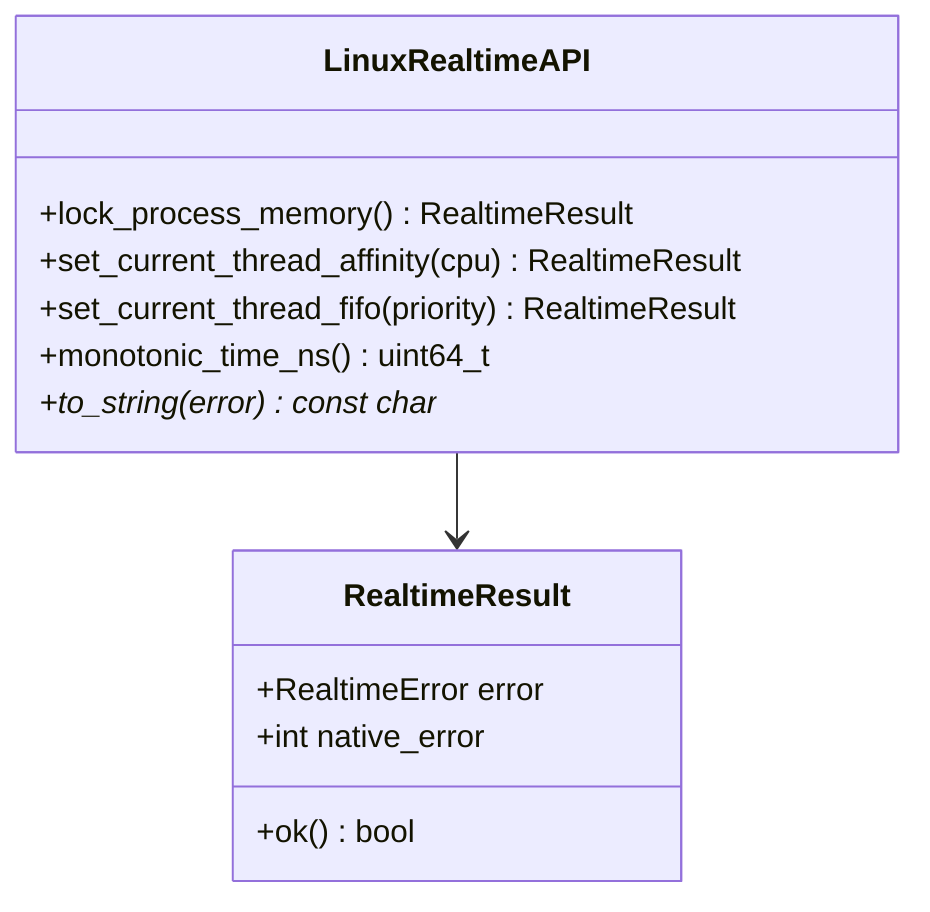
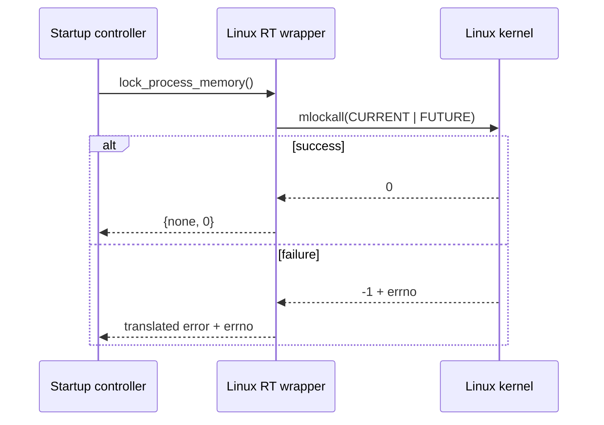

# Linux real-time detailed design

**Design status:** Current  
**Requirements:** ORT-LNX-001, ORT-LNX-002, ORT-LNX-003, ORT-LNX-004  
**Source:** `include/openrtdds/os/linux/realtime.hpp`,
`src/os/linux/realtime.cpp`

## Responsibility

This layer provides small, synchronous wrappers for process memory locking,
calling-thread affinity, calling-thread FIFO policy, and monotonic time. It
does not create threads, elevate privileges, change resource limits, or retry.

## Public types

`native_error` preserves Linux/pthread error information. For pthread APIs the
returned error number is translated directly; for system calls `errno` is
captured immediately after failure.

## Error translation

| Native error | RealtimeError | Fault mapping |
|---|---|---|
| `0` | `none` | none |
| `EINVAL` | `invalid_argument` | API misuse/configuration |
| `EPERM`, `EACCES` | `permission_denied` | `ORT-FLT-OS-001..003` by operation |
| `ENOMEM`, `EAGAIN` | `resource_limit` | `ORT-FLT-OS-001..003` by operation |
| other | `operating_system_error` | `ORT-FLT-OS-001..003` by operation |

## Memory-lock behavior

`lock_process_memory()` calls `mlockall(MCL_CURRENT | MCL_FUTURE)`. Success
means current mappings are resident and future mappings are requested locked.
The application must configure `RLIMIT_MEMLOCK` and privileges before the call.

Failure does not silently continue; the application decides whether its
selected deterministic profile may activate. Fault mapping is
`ORT-FLT-OS-001`.

## Affinity behavior

`set_current_thread_affinity(cpu_index)`:

1. rejects `cpu_index >= CPU_SETSIZE` with `EINVAL`;
2. creates an empty `cpu_set_t` and selects exactly one CPU;
3. calls `pthread_setaffinity_np` for `pthread_self()`;
4. returns the translated result.

The function does not verify deployment CPU isolation, IRQ affinity, or
whether the selected CPU is online. Those are deployment responsibilities.
Fault mapping is `ORT-FLT-OS-002`.

## FIFO scheduling behavior

`set_current_thread_fifo(priority)` obtains the platform min/max for
`SCHED_FIFO`, rejects an out-of-range priority, and applies the policy to the
calling thread through `pthread_setschedparam`. It does not alter `RLIMIT_RTPRIO`
or capabilities. Fault mapping is `ORT-FLT-OS-003`.

## Monotonic time behavior

`monotonic_time_ns()` reads `CLOCK_MONOTONIC` and returns:

`seconds * 1,000,000,000 + nanoseconds`.

On `clock_gettime` failure it returns zero. Callers that use zero as a valid
epoch-independent timestamp must separately establish whether the platform
can produce zero; normal running systems should map an unexpected zero to
`ORT-FLT-TIME-001`.

## API contracts

| API | Affects | Blocking/allocation | Result |
|---|---|---|---|
| `lock_process_memory()` | whole process mappings | bounded syscall; no heap | `RealtimeResult` |
| `set_current_thread_affinity()` | calling thread | bounded pthread call; no heap | `RealtimeResult` |
| `set_current_thread_fifo()` | calling thread | bounded pthread calls; no heap | `RealtimeResult` |
| `monotonic_time_ns()` | none | bounded syscall; no heap | timestamp or zero |

## Concurrency and ordering

Calls operate on the process or calling thread and contain no shared library
state. They are reentrant subject to Linux API behavior. Recommended ordering
is memory lock, stack pre-fault by the application, affinity, then scheduling.

## Verification and demonstration

- `tests/test_realtime.cpp`
- `examples/runtime_probe.cpp`

