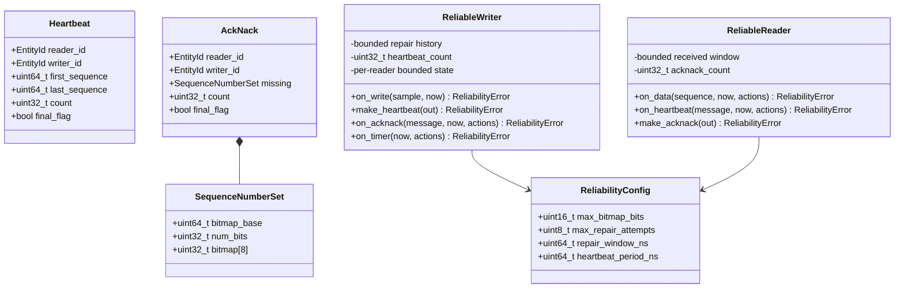
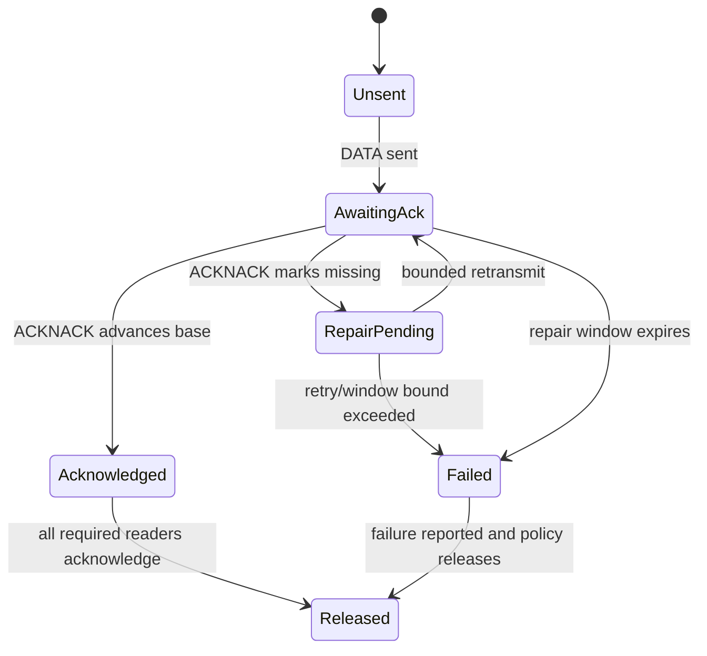
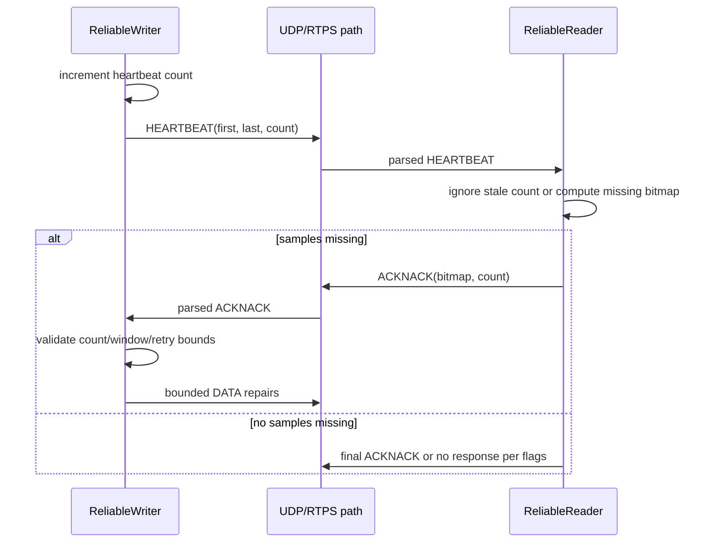

# Bounded reliability detailed design

**Design status:** Planned  
**Requirements:** ORT-REL-001, ORT-REL-002, ORT-REL-003, ORT-REL-004  
**Requirements:** ORT-REL-005, ORT-REL-006  
**Implementation:** Not present; API names are provisional until the
requirements and this design are approved.

## Scope

The first reliable profile adds bounded HEARTBEAT/ACKNACK processing and
repair for statically configured reader/writer pairs. It does not add dynamic
discovery, fragmentation, persistence, durability, or unbounded recovery.

## Proposed types



Templates or generated configuration shall define history and matched-reader
capacity at compile time. No state object may grow after initialization.

## Proposed caller-driven API model

The reliability component shall not own a thread, timer, socket, or callback.
The application supplies monotonic `now_ns`, invokes event functions, and
executes returned bounded actions.

```cpp
enum class ReliabilityActionKind : std::uint8_t {
  none,
  send_heartbeat,
  send_acknack,
  retransmit_data,
  sample_delivered,
  sample_failed,
};

struct ReliabilityAction final {
  ReliabilityActionKind kind;
  std::uint64_t sequence_number;
  std::uint32_t peer_id;
};
```

An action list shall use caller-owned fixed storage. If more work is pending
than fits, the API shall report `action_capacity_exceeded` and preserve the
remaining state for a later bounded call; it shall not allocate.

## Writer state

For every retained sequence number, the writer stores payload/history
reference, first-send time, last-repair time, repair count, and acknowledgement
state for a fixed set of readers.



History eviction shall never silently discard a sample that is still required
for repair. The configured policy must either reject the new sample or emit a
terminal failure for the oldest sample; that choice will be fixed before
implementation.

## Reader state

The reader tracks a fixed window beginning at the next expected sequence. DATA
marks a position received. HEARTBEAT declares the writer's available range.
Missing positions within the intersection of the fixed window and writer range
become ACKNACK bits.

Duplicate DATA does not redeliver a sample. DATA older than the reader window
is ignored as stale. A jump larger than the configured window produces a
bounded gap fault rather than expanding storage.

## HEARTBEAT sequence



Counts use wrap-aware RTPS ordering. Duplicate or stale control counts must not
consume retry budget or change acknowledgement state.

## SequenceNumberSet bound

The ACKNACK bitmap supports at most 256 positions using eight 32-bit words.
`num_bits` is in `[0, 256]`. Bits beyond `num_bits` are zero. Parsing validates
that the declared word count fits both the datagram and fixed object before
publishing the object.

## Bounded repair behavior

- At most `max_repair_attempts` are emitted per sample/reader.
- Repairs occur only within `repair_window_ns` from first transmission.
- One event invocation examines no more than fixed history depth, fixed reader
  capacity, and 256 bitmap bits.
- No internal loop waits for acknowledgement or time passage.
- When a retry or time bound is exceeded, exactly one terminal failure action
  and `ORT-FLT-REL-001` are produced for that sample/reader.
- Application deadline policy may additionally raise
  `ORT-FLT-DEADLINE-001`.

## Planned wire interfaces

| Submessage | ID | Supported fields |
|---|---:|---|
| HEARTBEAT | `0x07` | reader/writer IDs, first/last sequence, count, Final/Liveliness flags |
| ACKNACK | `0x06` | reader/writer IDs, bounded SequenceNumberSet, count, Final flag |

Both byte orders shall be supported. Unsupported flags or inconsistent lengths
shall fail closed without partially updating state.

## Planned ReliabilityError

| Enumerator | Meaning | Fault mapping |
|---|---|---|
| `none` | event accepted | none |
| `invalid_argument` | invalid pointer/configuration | configuration |
| `invalid_sequence_number` | zero, negative, or invalid range | `ORT-FLT-RTPS-003` |
| `bitmap_bound_exceeded` | more than 256 declared bits | `ORT-FLT-RTPS-001` |
| `history_full` | no safe retained slot | `ORT-FLT-REL-001` |
| `stale_control` | duplicate/older count | no fault; observable statistic |
| `repair_limit_exceeded` | attempts exhausted | `ORT-FLT-REL-001` |
| `repair_window_expired` | time bound exceeded | `ORT-FLT-REL-001` |
| `action_capacity_exceeded` | caller action buffer full | resource/configuration |
| `malformed_control` | invalid wire message | `ORT-FLT-RTPS-001` |

`stale_control` may be returned as an observable condition or normalized to
success with a counter; the implementation PR must resolve this API choice.

## Memory and WCET model

All memory is a function of compile-time history depth, maximum payload, reader
capacity, and 256-bit control bitmap. No heap allocation is permitted after or
during initialization for this profile. WCET analysis must account for:

- scanning retained history depth;
- scanning the fixed reader set;
- processing at most 256 bitmap positions;
- copying at most the configured payload bound per emitted repair;
- returning at most the caller's fixed action capacity per invocation.

## Verification plan

The implementation PR shall include golden HEARTBEAT/ACKNACK bytes in both byte
orders; malformed length, flag, bitmap, count, and sequence tests; duplicate
and stale control tests; retry/window boundary tests; history-exhaustion tests;
zero-allocation checks; and end-to-end loss/repair simulations with fixed time.

