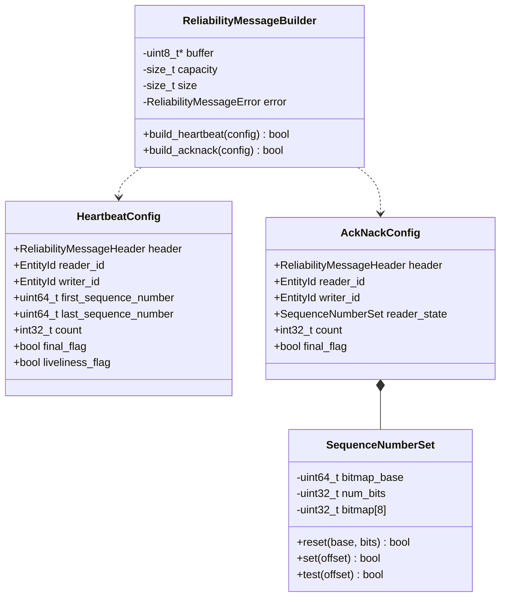
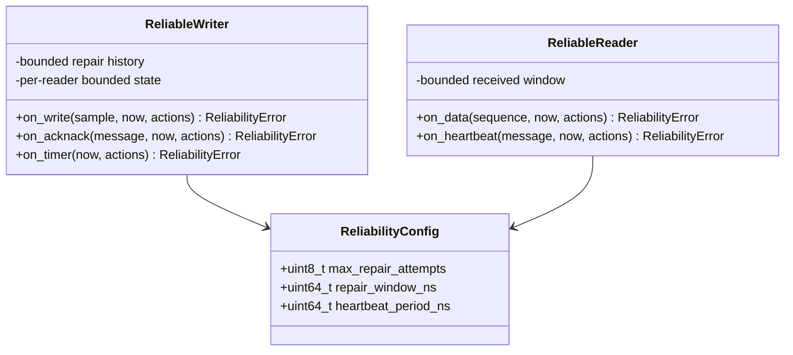
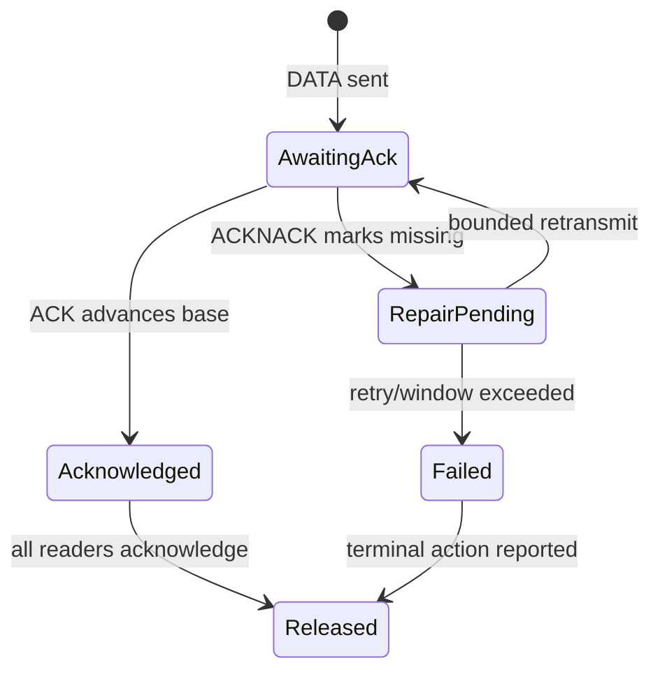

# Bounded reliability detailed design

**Design status:** Current  
**Requirements:** ORT-REL-001, ORT-REL-002, ORT-REL-003, ORT-REL-004  
**Requirements:** ORT-REL-005, ORT-REL-006  
**Current implementation:** `rtps/reliability_messages.hpp`,
`src/rtps/reliability_messages.cpp`  
**Current verification:** `tests/test_reliability_messages.cpp`  
**Current example:** `examples/rtps_reliability_message.cpp`

## Scope and delivery boundary

The current increment implements deterministic construction and validation of
one RTPS message containing exactly one HEARTBEAT or ACKNACK submessage. It
does not retain peer state, compare control-message counts, schedule a repair,
or own a timer, thread, socket, or callback.

The planned increment will add bounded writer and reader state machines for
statically configured pairs. Dynamic discovery, fragmentation, persistence,
durability, GroupInfo, and unbounded recovery remain outside this profile.

| Capability | Status |
|---|---|
| HEARTBEAT build/parse | Current |
| ACKNACK build/parse | Current |
| 256-bit `SequenceNumberSet` | Current |
| writer repair history | Planned |
| reader receive window | Planned |
| stale-count handling | Planned |
| retry/window policy | Planned |

## Current class definitions



`HeartbeatView` and `AckNackView` mirror their configuration types and receive
validated parsed values. `ReliabilityMessageHeader` holds protocol version,
vendor ID, GUID prefix, and submessage byte order. All APIs are `noexcept`.

## Public API

```cpp
class ReliabilityMessageBuilder final {
 public:
  ReliabilityMessageBuilder(std::uint8_t* buffer,
                            std::size_t capacity) noexcept;
  bool build_heartbeat(const HeartbeatConfig& config) noexcept;
  bool build_acknack(const AckNackConfig& config) noexcept;
  const std::uint8_t* data() const noexcept;
  std::size_t size() const noexcept;
  ReliabilityMessageError error() const noexcept;
};

ReliabilityMessageError parse_heartbeat_message(
    const std::uint8_t* message, std::size_t message_size,
    HeartbeatView& view) noexcept;

ReliabilityMessageError parse_acknack_message(
    const std::uint8_t* message, std::size_t message_size,
    AckNackView& view) noexcept;
```

The builder writes to caller-owned storage. A failed build returns `false`,
sets `size()` to zero, and exposes a sticky error for that operation. A parse
function writes the output view only after every validation succeeds, so a
failure preserves the caller's prior view.

## Common RTPS message envelope

Both operations use this 24-byte prefix:

| Absolute offset | Size | Field | Validation |
|---:|---:|---|---|
| 0 | 4 | protocol | ASCII `RTPS` |
| 4 | 2 | version | major 2, minor 1 through 5 |
| 6 | 2 | vendor ID | retained without interpretation |
| 8 | 12 | GUID prefix | retained without interpretation |
| 20 | 1 | submessage ID | `0x07` or `0x06` as requested |
| 21 | 1 | flags | feature-specific allowed mask |
| 22 | 2 | content length | selected submessage byte order |

An explicit content length must equal the remaining datagram bytes. A zero
length is accepted with RTPS last-submessage semantics and consumes all
remaining bytes. The current API intentionally rejects multiple submessages in
one datagram so that its single-message ownership and WCET remain unambiguous.

## HEARTBEAT wire definition

The submessage ID is `0x07`. Its fixed content is 28 bytes, making the full
message 52 bytes.

| Content offset | Size | Field |
|---:|---:|---|
| 0 | 4 | reader entity ID |
| 4 | 4 | writer entity ID |
| 8 | 8 | first sequence number |
| 16 | 8 | last sequence number |
| 24 | 4 | signed count |

Supported flags are Endianness (`E`, bit 0), Final (`F`, bit 1), and
Liveliness (`L`, bit 2). GroupInfo (`G`, bit 3) and all reserved flags are
rejected as `unsupported_feature`.

`first_sequence_number` must be positive. `last_sequence_number` may be zero,
but neither value may exceed signed 64-bit RTPS sequence range. The range is
valid when `last >= first - 1`; equality to `first - 1` deliberately encodes an
empty writer history.

## ACKNACK wire definition

The submessage ID is `0x06`. With `M = ceil(num_bits / 32)`, content size is
`24 + 4M` bytes and full message size is `48 + 4M` bytes. The maximum full
message is therefore 80 bytes.

| Content offset | Size | Field |
|---:|---:|---|
| 0 | 4 | reader entity ID |
| 4 | 4 | writer entity ID |
| 8 | 8 | bitmap base sequence number |
| 16 | 4 | number of bits |
| 20 | `4M` | bitmap words |
| `20 + 4M` | 4 | signed count |

Supported flags are Endianness (`E`, bit 0) and Final (`F`, bit 1). All other
flags are rejected. The bitmap base must be positive. `num_bits` is in
`[0, 256]`, the implied final sequence must remain in signed 64-bit range, and
the declared content size must exactly match its implied word count.

The first sequence position is the most significant bit of the first bitmap
word. In general, position `n` maps to word `n / 32` and mask
`1 << (31 - n % 32)`. Bits outside `num_bits` are never exposed through the
public set.

## Build and parse behavior

```mermaid
sequenceDiagram
    participant C as Caller
    participant B as Builder
    participant P as Parser
    C->>B: build(config, fixed buffer)
    B->>B: validate version, range, capacity
    B-->>C: bytes + exact size
    C->>P: parse(bytes, prior view)
    P->>P: validate envelope, flags, length, fields
    alt valid
      P-->>C: commit candidate view
    else invalid
      P-->>C: error; prior view unchanged
    end
```

The codec performs only fixed copies, a maximum eight-word bitmap loop, and a
maximum 256-bit reconstruction loop. It performs no allocation, deallocation,
locking, waiting, system call, logging, or callback. Work is therefore bounded
by a small constant independent of payload traffic.

## Error codes and fault mapping

| `ReliabilityMessageError` | Condition | Fault mapping |
|---|---|---|
| `none` | operation succeeded | none |
| `invalid_argument` | invalid pointer/byte-order use | configuration/API |
| `buffer_overflow` | caller output storage is too small | resource/configuration |
| `truncated` | bytes end before declared content | `ORT-FLT-RTPS-001` |
| `invalid_protocol` | message header is not RTPS | `ORT-FLT-RTPS-001` |
| `unsupported_version` | protocol is outside 2.1 through 2.5 | `ORT-FLT-RTPS-002` |
| `unsupported_submessage` | requested parser sees another kind | `ORT-FLT-RTPS-002` |
| `unsupported_feature` | GroupInfo or another unsupported flag | `ORT-FLT-RTPS-002` |
| `invalid_submessage` | flags/length/layout are inconsistent | `ORT-FLT-RTPS-001` |
| `invalid_sequence_number` | invalid base or sequence range | `ORT-FLT-RTPS-003` |
| `bitmap_bound_exceeded` | ACKNACK declares over 256 bits | `ORT-FLT-RTPS-001` |

Counts are encoded as RTPS signed 32-bit values and the codec accepts every
bit pattern. Monotonic/wrap-aware comparison belongs to the planned peer state
machine, not to the stateless wire parser.

## Current verification

`test_reliability_messages.cpp` covers:

- byte-exact little-endian HEARTBEAT and ACKNACK messages;
- big-endian encoding and parsing;
- the legal empty HEARTBEAT range;
- zero-bit and maximum 256-bit ACKNACK sets;
- MSB-first bitmap position mapping;
- zero-length last-submessage encoding;
- invalid sequence ranges and bitmap bounds;
- unsupported flags and submessage kinds;
- truncated and inconsistent lengths;
- builder capacity failure; and
- transactional parse output on failure.

The example builds and parses both control messages with fixed 80-byte
storage. CI builds it with the same warning policy and runs it as a test.

## Planned state-machine design

The next reliability increment will introduce caller-driven `ReliableWriter`
and `ReliableReader` objects. Templates or generated configuration will fix
history and matched-peer capacity at compile time. No object may grow after
initialization.



The application will supply monotonic `now_ns`, invoke event functions, and
execute returned actions from caller-owned fixed storage. Planned action kinds
are `send_heartbeat`, `send_acknack`, `retransmit_data`, `sample_delivered`, and
`sample_failed`.

### Planned writer behavior

For each retained sequence number, the writer will store a payload/history
reference, first-send time, last-repair time, repair count, and acknowledgement
state for a fixed peer set.



History eviction will not silently discard a repairable sample. The policy
must either reject the new sample or produce one terminal failure for the old
sample; that choice will be frozen in the state-machine PR.

### Planned reader behavior

The reader will track a fixed window beginning at the next expected sequence.
DATA marks a position received. HEARTBEAT intersects the writer's advertised
range with that window, and missing positions become ACKNACK bits. Duplicate
DATA will not be redelivered. DATA older than the window will be stale; a jump
larger than the window will produce a bounded gap fault.

Duplicate or stale HEARTBEAT and ACKNACK counts will not change state or
consume repair budget. Count ordering will use wrap-aware RTPS comparison.

### Planned bounds and fault behavior

- no more than `max_repair_attempts` per sample and peer;
- repair only within `repair_window_ns` from first transmission;
- no more than fixed history depth, peer capacity, and 256 bits per event;
- no internal waiting for acknowledgement or time passage;
- exactly one `ORT-FLT-REL-001` terminal action on retry/window exhaustion; and
- optional application-level `ORT-FLT-DEADLINE-001` escalation.

State-machine verification will add duplicate/stale count cases, repair and
time boundaries, history exhaustion, zero-allocation instrumentation, and
fixed-time loss/repair simulations.
