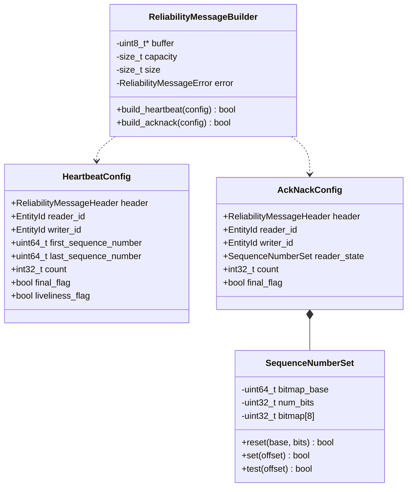
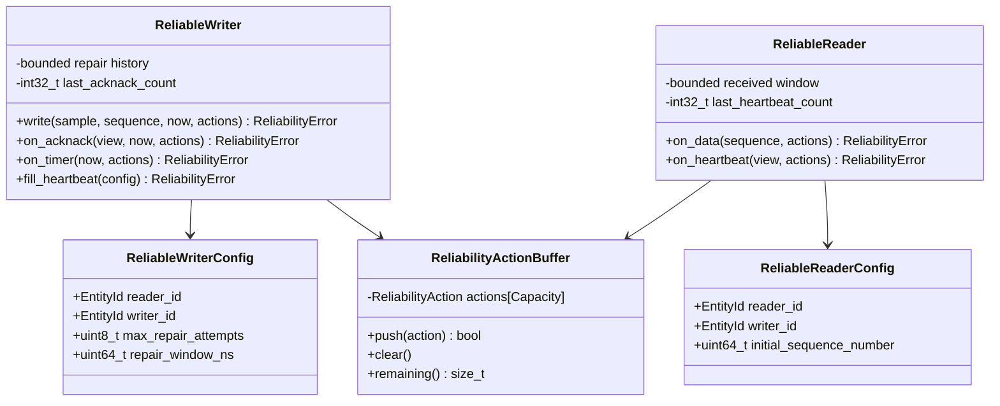
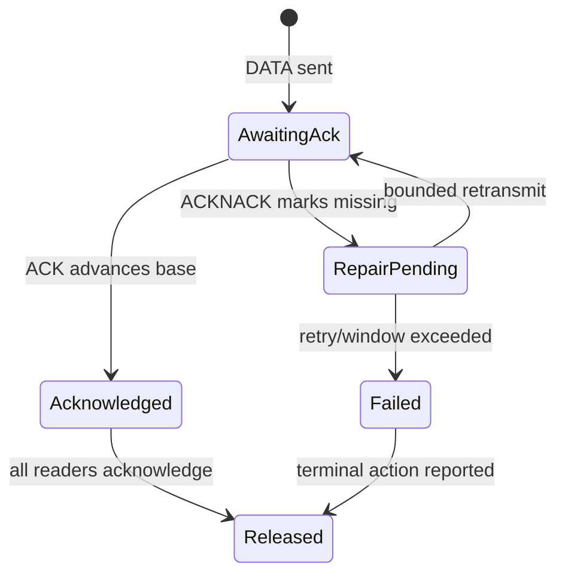
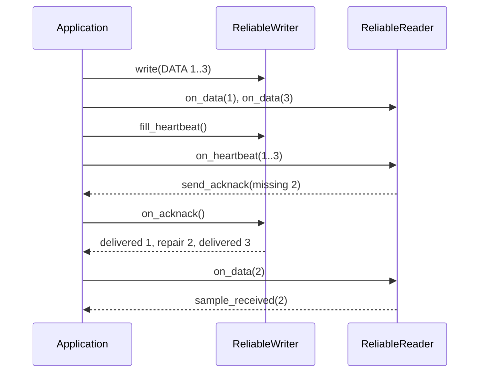

# Bounded reliability detailed design

**Design status:** Current  
**Requirements:** ORT-REL-001, ORT-REL-002, ORT-REL-003, ORT-REL-004  
**Requirements:** ORT-REL-005, ORT-REL-006  
**Current implementation:** `rtps/reliability_messages.hpp`,
`rtps/reliability_state.hpp`, `src/rtps/reliability_messages.cpp`,
`src/rtps/reliability_state.cpp`  
**Current verification:** `tests/test_reliability_messages.cpp`,
`tests/test_reliability_state.cpp`  
**Current examples:** `examples/rtps_reliability_message.cpp`,
`examples/reliable_pair.cpp`

## Scope and delivery boundary

The reliability feature implements deterministic HEARTBEAT/ACKNACK wire
handling plus bounded writer and reader state machines. One state-machine
instance represents one statically matched writer/reader pair. The caller owns
scheduling, transport, time acquisition, message construction, and action
execution; the component owns no timer, thread, socket, wait, or callback.

Dynamic discovery, fragmentation, persistence, durability, GroupInfo,
multi-reader aggregation, and unbounded recovery remain outside this profile.

| Capability | Status |
|---|---|
| HEARTBEAT build/parse | Current |
| ACKNACK build/parse | Current |
| 256-bit `SequenceNumberSet` | Current |
| writer repair history | Current |
| reader receive window | Current |
| stale-count handling | Current |
| retry/window policy | Current |

## Current class definitions



`HeartbeatView` and `AckNackView` mirror their configuration types and receive
validated parsed values. `ReliabilityMessageHeader` holds protocol version,
vendor ID, GUID prefix, and submessage byte order. All APIs are `noexcept`.

## Public API

```cpp
class ReliabilityMessageBuilder final {
 public:
  ReliabilityMessageBuilder(std::uint8_t* buffer,
                            std::size_t capacity) noexcept;
  bool build_heartbeat(const HeartbeatConfig& config) noexcept;
  bool build_acknack(const AckNackConfig& config) noexcept;
  const std::uint8_t* data() const noexcept;
  std::size_t size() const noexcept;
  ReliabilityMessageError error() const noexcept;
};

ReliabilityMessageError parse_heartbeat_message(
    const std::uint8_t* message, std::size_t message_size,
    HeartbeatView& view) noexcept;

ReliabilityMessageError parse_acknack_message(
    const std::uint8_t* message, std::size_t message_size,
    AckNackView& view) noexcept;
```

The builder writes to caller-owned storage. A failed build returns `false`,
sets `size()` to zero, and exposes a sticky error for that operation. A parse
function writes the output view only after every validation succeeds, so a
failure preserves the caller's prior view.

## Common RTPS message envelope

Both operations use this 24-byte prefix:

| Absolute offset | Size | Field | Validation |
|---:|---:|---|---|
| 0 | 4 | protocol | ASCII `RTPS` |
| 4 | 2 | version | major 2, minor 1 through 5 |
| 6 | 2 | vendor ID | retained without interpretation |
| 8 | 12 | GUID prefix | retained without interpretation |
| 20 | 1 | submessage ID | `0x07` or `0x06` as requested |
| 21 | 1 | flags | feature-specific allowed mask |
| 22 | 2 | content length | selected submessage byte order |

An explicit content length must equal the remaining datagram bytes. A zero
length is accepted with RTPS last-submessage semantics and consumes all
remaining bytes. The current API intentionally rejects multiple submessages in
one datagram so that its single-message ownership and WCET remain unambiguous.

## HEARTBEAT wire definition

The submessage ID is `0x07`. Its fixed content is 28 bytes, making the full
message 52 bytes.

| Content offset | Size | Field |
|---:|---:|---|
| 0 | 4 | reader entity ID |
| 4 | 4 | writer entity ID |
| 8 | 8 | first sequence number |
| 16 | 8 | last sequence number |
| 24 | 4 | signed count |

Supported flags are Endianness (`E`, bit 0), Final (`F`, bit 1), and
Liveliness (`L`, bit 2). GroupInfo (`G`, bit 3) and all reserved flags are
rejected as `unsupported_feature`.

`first_sequence_number` must be positive. `last_sequence_number` may be zero,
but neither value may exceed signed 64-bit RTPS sequence range. The range is
valid when `last >= first - 1`; equality to `first - 1` deliberately encodes an
empty writer history.

## ACKNACK wire definition

The submessage ID is `0x06`. With `M = ceil(num_bits / 32)`, content size is
`24 + 4M` bytes and full message size is `48 + 4M` bytes. The maximum full
message is therefore 80 bytes.

| Content offset | Size | Field |
|---:|---:|---|
| 0 | 4 | reader entity ID |
| 4 | 4 | writer entity ID |
| 8 | 8 | bitmap base sequence number |
| 16 | 4 | number of bits |
| 20 | `4M` | bitmap words |
| `20 + 4M` | 4 | signed count |

Supported flags are Endianness (`E`, bit 0) and Final (`F`, bit 1). All other
flags are rejected. The bitmap base must be positive. `num_bits` is in
`[0, 256]`, the implied final sequence must remain in signed 64-bit range, and
the declared content size must exactly match its implied word count.

The first sequence position is the most significant bit of the first bitmap
word. In general, position `n` maps to word `n / 32` and mask
`1 << (31 - n % 32)`. Bits outside `num_bits` are never exposed through the
public set.

## Build and parse behavior

```mermaid
sequenceDiagram
    participant C as Caller
    participant B as Builder
    participant P as Parser
    C->>B: build(config, fixed buffer)
    B->>B: validate version, range, capacity
    B-->>C: bytes + exact size
    C->>P: parse(bytes, prior view)
    P->>P: validate envelope, flags, length, fields
    alt valid
      P-->>C: commit candidate view
    else invalid
      P-->>C: error; prior view unchanged
    end
```

The codec performs only fixed copies, a maximum eight-word bitmap loop, and a
maximum 256-bit reconstruction loop. It performs no allocation, deallocation,
locking, waiting, system call, logging, or callback. Work is therefore bounded
by a small constant independent of payload traffic.

## Error codes and fault mapping

| `ReliabilityMessageError` | Condition | Fault mapping |
|---|---|---|
| `none` | operation succeeded | none |
| `invalid_argument` | invalid pointer/byte-order use | configuration/API |
| `buffer_overflow` | caller output storage is too small | resource/configuration |
| `truncated` | bytes end before declared content | `ORT-FLT-RTPS-001` |
| `invalid_protocol` | message header is not RTPS | `ORT-FLT-RTPS-001` |
| `unsupported_version` | protocol is outside 2.1 through 2.5 | `ORT-FLT-RTPS-002` |
| `unsupported_submessage` | requested parser sees another kind | `ORT-FLT-RTPS-002` |
| `unsupported_feature` | GroupInfo or another unsupported flag | `ORT-FLT-RTPS-002` |
| `invalid_submessage` | flags/length/layout are inconsistent | `ORT-FLT-RTPS-001` |
| `invalid_sequence_number` | invalid base or sequence range | `ORT-FLT-RTPS-003` |
| `bitmap_bound_exceeded` | ACKNACK declares over 256 bits | `ORT-FLT-RTPS-001` |

Counts are encoded as RTPS signed 32-bit values and the codec accepts every
bit pattern. The state machines apply wrap-aware ordering when a parsed count
is associated with a peer.

## Current verification

`test_reliability_messages.cpp` covers:

- byte-exact little-endian HEARTBEAT and ACKNACK messages;
- big-endian encoding and parsing;
- the legal empty HEARTBEAT range;
- zero-bit and maximum 256-bit ACKNACK sets;
- MSB-first bitmap position mapping;
- zero-length last-submessage encoding;
- invalid sequence ranges and bitmap bounds;
- unsupported flags and submessage kinds;
- truncated and inconsistent lengths;
- builder capacity failure; and
- transactional parse output on failure.

The example builds and parses both control messages with fixed 80-byte
storage. CI builds it with the same warning policy and runs it as a test.

## Reliable state-machine design

`ReliableWriter<HistoryDepth, MaxPayloadBytes>` and
`ReliableReader<WindowBits>` are caller-driven templates. Their storage is a
compile-time function of those parameters, and no object grows after
construction. A state-machine instance represents one statically matched
reader/writer pair.



The application supplies monotonic `now_ns`, invokes event functions, and
executes returned actions from caller-owned `ReliabilityActionBuffer<N>`
storage. Action kinds are `send_data`, `retransmit_data`, `send_acknack`,
`sample_received`, `sample_delivered`, and `sample_failed`.

If an event requires more actions than remain in the buffer, it returns
`action_capacity_exceeded` before changing state. Payload pointers in send and
retransmit actions refer to writer-owned fixed history and remain valid until
the next non-const operation on that writer.

Both machines bind the configured reader and writer entity IDs. A control
message for any other pair returns `unexpected_peer` before count comparison
or state mutation. ACKNACK actions carry the configured IDs so callers do not
have to reconstruct the association.

### Writer behavior

For each retained sequence number, the writer stores the bounded payload,
first-send time, and repair count. `write()` requires a positive, strictly
increasing state-machine sequence below `INT64_MAX`. It copies the payload into
the next fixed slot and emits `send_data`.

When all `HistoryDepth` slots contain unacknowledged samples, the writer
returns `history_full`; it never silently evicts one. ACKNACK processing scans
at most `HistoryDepth` records:

- sequences below `bitmap_base` are acknowledged;
- zero bits within the declared set are acknowledged;
- one bits request repair;
- sequences above the set remain pending;
- a repair within both limits emits `retransmit_data`;
- reaching the attempt or time bound emits exactly one `sample_failed` and
  releases the record.



`on_timer()` independently releases expired records with one terminal action.
`fill_heartbeat()` reports the retained first sequence, the last sequence ever
written, and the next wrap-safe control count. Empty history uses
`first = last + 1`.

### Reader behavior

The reader uses a circular `WindowBits` bitmap beginning at
`next_expected_sequence()`. DATA within the window marks one slot and emits
`sample_received`. Contiguous received positions advance the base without
shifting the array. Duplicate DATA returns `duplicate_data`; data below the
base returns `stale_data`; data beyond the window returns
`receive_window_exceeded`.

HEARTBEAT processing creates an ACKNACK over at most `WindowBits` positions.
Missing positions are one bits and already-received positions are zero bits.
If all advertised data is already received, a non-final HEARTBEAT receives a
final zero-bit ACKNACK; a final HEARTBEAT needs no response. If the writer's
first retained sequence has advanced beyond the reader base, the reader
returns `gap_not_repairable` without changing state.

Duplicate or stale HEARTBEAT and ACKNACK counts will not change state or
consume repair budget. `control_count_is_newer()` treats the signed count as a
32-bit serial value: differences in `(0, 2^31)` are newer, including the
`INT32_MAX` to `INT32_MIN` wrap.

### Action sequence



### Error and fault behavior

| `ReliabilityError` | Meaning | Fault/recovery owner |
|---|---|---|
| `invalid_configuration` | zero repair window or invalid initial base | startup configuration |
| `invalid_argument` | null payload with nonzero size | caller defect |
| `unexpected_peer` | control IDs do not match configured pair | routing/configuration |
| `invalid_sequence_number` | sequence outside state-machine range | `ORT-FLT-RTPS-003` |
| `non_monotonic_sequence` | writer sequence did not increase | writer/application |
| `payload_too_large` | payload exceeds template bound | resource/configuration |
| `history_full` | all retained slots still need resolution | writer backpressure |
| `action_capacity_exceeded` | caller action space is insufficient | caller retries with space |
| `stale_control` | duplicate/older control count | expected observable status |
| `duplicate_data`, `stale_data` | DATA was already represented | expected observable status |
| `receive_window_exceeded` | DATA jump exceeds fixed window | reader/application |
| `time_regression` | supplied monotonic time moved backward | `ORT-FLT-TIME-001` |
| `gap_not_repairable` | writer no longer retains reader's gap | `ORT-FLT-REL-001` |

`sample_failed` carries either `repair_limit_exceeded` or
`repair_window_expired`; both map to `ORT-FLT-REL-001`. The library reports the
condition and releases its bounded record. The application owns degradation,
deadline escalation, restart, and safe-state decisions.

### Bounds and determinism

- no more than `max_repair_attempts` per sample and peer;
- repair only within `repair_window_ns` from first transmission;
- at most `HistoryDepth` writer records or `WindowBits <= 256` reader bits per
  event;
- no internal waiting for acknowledgement or time passage;
- no heap allocation, locks, system calls, callbacks, or hidden retries;
- at most two bounded writer scans per ACKNACK/timer event; and
- exactly one terminal action on retry/window exhaustion.

Payload copies occur only on `write()` and are bounded by `MaxPayloadBytes`.
Repair actions reference retained storage and do not copy payload data.

## State-machine verification

`test_reliability_state.cpp` verifies history exhaustion, acknowledgement and
compaction, attempt and window boundaries, exactly-once terminal failures,
transactional action capacity, time regression, stale and wrapped counts,
duplicate/stale/out-of-window DATA, ACKNACK bitmap formation, unrecoverable
gaps, fixed object bounds, and a deterministic three-sample loss/repair
simulation.
