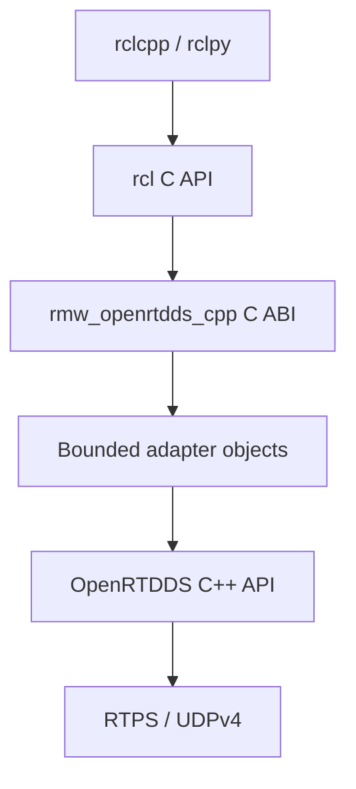
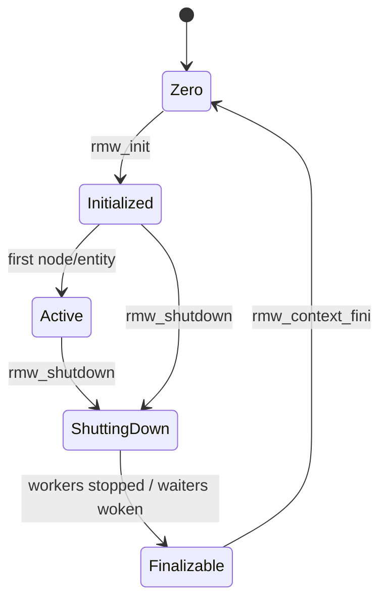
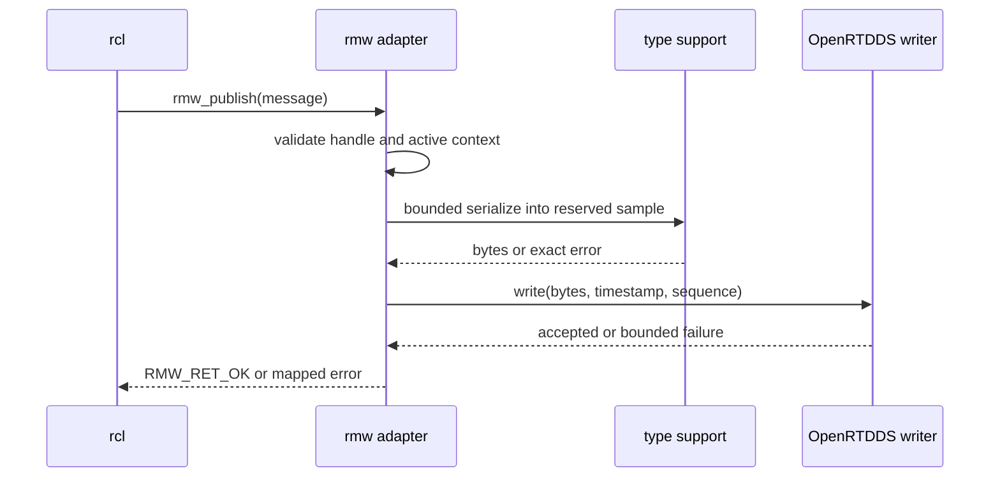
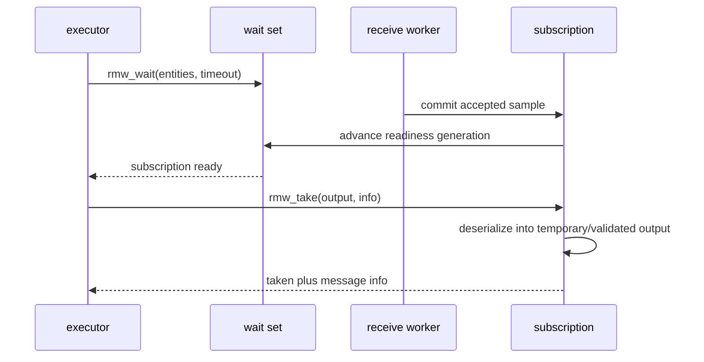

# ROS 2 RMW adapter detailed design

**Design status:** Planned

**Requirements:** ORT-RMW-001, ORT-RMW-002, ORT-RMW-003, ORT-RMW-004

**Requirements:** ORT-RMW-005, ORT-RMW-006, ORT-RMW-007, ORT-RMW-008

**Requirements:** ORT-RMW-009, ORT-RMW-010, ORT-RMW-011, ORT-RMW-012

**Requirements:** ORT-RMW-013, ORT-RMW-014, ORT-RMW-015, ORT-RMW-016

**Requirements:** ORT-RMW-017, ORT-RMW-018, ORT-RMW-019, ORT-RMW-020

**Requirements:** ORT-RMW-021, ORT-RMW-022

## Status and scope

`rmw_openrtdds_cpp` is a separate ROS-facing shared library layered over the
OpenRTDDS C++ library. The first target is ROS 2 Jazzy on Linux. The exact
Jazzy `rmw` ABI, ROS package set, compiler, and Ubuntu image will be pinned by
the first implementation PR. Rolling is a reference, not the compatibility
target.

This design covers lifecycle, pub/sub, wait/take, graph, services, metadata,
QoS, errors, bounds, and qualification. DDS Security, SROS 2, dynamic types,
content filtering, loaned messages, zero-copy, and network-flow endpoints are
deliberately excluded from the initial profile.

See [the capability-gap matrix](capability-matrix.md) for the feature-to-gate
plan.

## Architectural boundary



The adapter owns ROS ABI objects and conversion policy. OpenRTDDS owns DDS and
RTPS state. `rcl` and the caller own the memory passed into entry points. No
ROS headers enter the OpenRTDDS public C++ headers; the core library remains
buildable without a ROS installation.

## Package and source ownership

The planned source tree is:

```text
rmw_openrtdds_cpp/
  CMakeLists.txt
  package.xml
  include/rmw_openrtdds_cpp/visibility_control.h
  src/entry_points.cpp
  src/context.cpp
  src/entities.cpp
  src/type_support.cpp
  src/qos.cpp
  src/wait_set.cpp
  src/graph.cpp
  src/services.cpp
  src/errors.cpp
  test/
```

Whether this package remains in this repository or moves to a dedicated ROS
repository is a release-management decision. Its API and trace obligations are
unchanged. The core build shall not find or link ROS unless the adapter option
is explicitly enabled.

## Planned class and type definitions

| Type | Ownership and responsibility | Bound/lifetime |
|---|---|---|
| `RmwContext` | owns limits, domain, participant, transport workers, graph, entity pools, wait registry, and shutdown state | one per initialized `rmw_context_t`; finalized after shutdown |
| `RmwNode` | logical ROS node identity and graph record | context pool; destroyed before context finalization |
| `RmwPublisher` | writer, type support, mapped names, QoS, GID, and publication sequence | context pool; parent node must remain valid |
| `RmwSubscription` | reader, type support, QoS, receive history, readiness generation | context pool; parent node must remain valid |
| `RmwClient` | request writer, response reader, client GID, and outstanding-request table | context pool with fixed request bound |
| `RmwService` | request reader, response writer, and request-correlation records | context pool with fixed request bound |
| `RmwWaitSet` | caller-selected wait entries and wake generation snapshot | context pool; no ownership of waited entities |
| `RmwGuardCondition` | atomic trigger generation and wait-registry link | context pool; trigger is level-observable until consumed |
| `GraphCache` | local/remote nodes and endpoints plus committed generation | fixed-capacity context member |
| `TypeSupportView` | validated introspection metadata and maximum serialized size | immutable; refers to caller/ROS static metadata |
| `ErrorState` | bounded thread-local message for the last adapter failure | one record per calling thread |

Opaque `rmw_*_t::data` fields point to these objects. Every object also stores
the adapter identifier, context generation, lifecycle state, and pool slot
generation. A stale handle therefore fails validation even if its former slot
has been reused.

## Context and entity state



Entity slots use `free`, `constructing`, `active`, and `destroying` states.
Creation reserves a slot, validates and constructs all subordinate state, then
commits it to `active` and publishes one graph update. Any failure unwinds the
reserved state and leaves no visible graph entry. Destruction first prevents
new operations, wakes relevant waiters, removes the graph entry, releases DDS
state, advances the slot generation, and finally returns the slot to `free`.

## Initialization behavior

`rmw_init_options_init` records the caller allocator and initializes the ROS
security and discovery options without allocating OpenRTDDS runtime objects.
`rmw_init` performs:

1. adapter-identifier and lifecycle validation;
2. domain and localhost/discovery-option validation;
3. deterministic-limit loading and cross-bound validation;
4. pool, graph, wait-registry, socket, and worker creation;
5. SPDP/SEDP participant activation;
6. context commit only after all prior steps succeed.

Safety Profile activation pre-faults and locks declared memory, constructs the
fixed worker set, and closes all post-activation heap paths. A setup failure
unwinds in reverse order before the context is exposed.

## Publisher sequence



Serialization failure releases the reserved sample and does not advance the
published sequence. A DDS write failure returns the exact mapped error; the
reliability layer owns any already-committed sample according to its bounded
history and repair policy. The adapter never loops until success.

## Subscription and wait sequence



The receive worker signals only after identity, QoS, RTPS, CDR framing, and
history acceptance succeed. `rmw_take` leaves the caller output logically
unchanged when deserialization fails. Readiness is generation-based so a
signal arriving between inspection and blocking cannot be lost.

## Wait-set interface

Each context owns one wakeup primitive shared by a bounded readiness registry.
Entities and guard conditions maintain atomic readiness generations. A wait
call records generations, checks readiness, arms the registry, checks again,
then blocks until a generation changes, shutdown begins, or the monotonic
deadline expires. Spurious wakeups repeat only until that fixed deadline.

The wait call does not allocate, invoke user callbacks, or hold an entity lock
while blocking. It clears non-ready entries from the caller-provided arrays as
required by the pinned `rmw` ABI. Destruction and shutdown wake affected waits
before waiting for in-flight operations to leave their slots.

## Type-support interface

The first profile uses Jazzy introspection type support for C and C++. During
endpoint creation, `TypeSupportView` validates the identifier and recursively
walks the static member description to compute:

- maximum XCDR1 serialized size and alignment;
- maximum nesting depth;
- string and sequence bounds;
- whether the type is acceptable for the Safety Profile;
- serializer/deserializer operations for C or C++ storage.

Unbounded strings or sequences may be accepted only in the General Profile
with a configured endpoint byte ceiling and explicit allocation policy. They
are rejected in the initial Safety Profile. Recursive definitions, unsupported
field kinds, arithmetic overflow, and a maximum size above the configured
sample bound fail endpoint creation.

## Name and DDS mapping

Resolved ROS topic names enter the adapter after `rcl` validation. The adapter
maps ordinary topic names to the selected ROS-over-DDS topic convention and
uses distinct request/response prefixes and generated type identities for
services. `avoid_ros_namespace_conventions` selects a literal DDS mapping.
Mapped name and type bytes are checked before SEDP state is constructed.

The mapping algorithm and golden test vectors will be frozen with G4.2. Until
those tests exist, OpenRTDDS shall not claim wire compatibility with an
existing ROS DDS RMW implementation.

## QoS contract

| ROS policy | Initial mapping | Unsupported behavior |
|---|---|---|
| reliability | best effort / reliable | unknown resolved by documented default |
| durability | volatile | transient local rejected until bounded durable history exists |
| history | KEEP_LAST | KEEP_ALL rejected |
| depth | fixed positive history depth | zero/overflow rejected or resolved per pinned ABI |
| deadline | planned OpenRTDDS deadline monitor | unsupported until monitor evidence exists |
| lifespan | planned receive/write expiry | unsupported until expiry evidence exists |
| liveliness | automatic first | manual modes rejected initially |
| lease duration | bounded monotonic duration | unsupported combinations rejected |

The same normalized QoS object drives entity creation, SEDP advertisement,
matching, `get_actual_qos`, and compatibility checks. No path independently
reinterprets the caller profile.

## Graph behavior

SPDP and SEDP provide participants and DDS endpoints but not logical ROS node
membership. The adapter therefore maintains a context-level graph cache and a
bounded graph-update channel. A local node/entity change is committed to the
cache and announced as one ordered update. A remote update is accepted only
from a live participant, validated against configured bounds, and committed
atomically. Participant expiry removes its node and endpoint records in one
graph generation and triggers the graph guard condition once.

Queries copy a consistent snapshot into storage allocated with the caller's
allocator as required by `rmw`. Runtime graph mutation remains bounded inside
the adapter; query-result allocation is an explicit API boundary and is not a
Safety Profile real-time path.

## Service and client behavior

One ROS service maps to request and response pub/sub channels. The client GID
and request sequence form the correlation identity. The fixed outstanding
request table owns a state of `free`, `awaiting_response`, or `completed`.
Responses with an unknown client GID, sequence, or already-completed record are
discarded and counted as diagnostics. Timeout policy belongs to the caller;
the adapter does not retry service requests autonomously.

## API validation and errors

Every C entry point follows this order:

1. validate required pointers and scalar ranges;
2. validate the implementation identifier;
3. validate context, slot generation, and lifecycle state;
4. reserve bounded resources without making them externally visible;
5. perform the operation;
6. commit or unwind;
7. map the result and set a bounded diagnostic on failure.

Planned adapter-local error categories are stable symbols, not wire values:

| Adapter error | Typical `rmw_ret_t` | Fault mapping | Recovery owner |
|---|---|---|---|
| `RmwError::invalid_argument` | `RMW_RET_INVALID_ARGUMENT` | none; caller contract | caller |
| `RmwError::incorrect_implementation` | `RMW_RET_INCORRECT_RMW_IMPLEMENTATION` | none; caller contract | caller |
| `RmwError::bad_state` | `RMW_RET_ERROR` | `ORT-FLT-RMW-001` | context owner |
| `RmwError::resource_exhausted` | `RMW_RET_BAD_ALLOC` | `ORT-FLT-RMW-002` | system integrator |
| `RmwError::unsupported` | `RMW_RET_UNSUPPORTED` | none; declared limitation | application |
| `RmwError::timeout` | `RMW_RET_TIMEOUT` | optional timing event | executor/application |
| `RmwError::type_support` | `RMW_RET_ERROR` | `ORT-FLT-RMW-003` | application/build owner |
| `RmwError::serialization` | `RMW_RET_ERROR` | `ORT-FLT-SER-001` | publisher/subscriber owner |
| `RmwError::transport` | `RMW_RET_ERROR` | `ORT-FLT-UDP-001/002` | context/system owner |
| `RmwError::discovery` | `RMW_RET_ERROR` | `ORT-FLT-RMW-004` | context/system owner |

`RMW_RET_BAD_ALLOC` includes configured pool or byte-bound exhaustion even when
the failing resource is not the process heap. The diagnostic names the exact
pool or limit. No C entry point permits a C++ exception to cross the ABI.

## Planned fault codes

| Fault code | Detection | Containment and response |
|---|---|---|
| `ORT-FLT-RMW-001` | invalid internal lifecycle or stale active handle | reject call; preserve other entities; request context restart if persistent |
| `ORT-FLT-RMW-002` | configured adapter pool/table/byte bound exhausted | reject creation or sample atomically; emit bounded resource event |
| `ORT-FLT-RMW-003` | type-support identifier/schema/size violates profile | reject endpoint creation; no discovery advertisement |
| `ORT-FLT-RMW-004` | graph update malformed, over-bound, stale, or inconsistent | discard update; preserve last valid graph; expire with participant lease |
| `ORT-FLT-RMW-005` | wait registry generation or wake primitive failure | wake/abort affected wait; context enters degraded or shutdown state |

These codes are reserved by this design and recorded as Planned in the central
fault catalog. They are not Current fault records until an owning
implementation and verification evidence exist.

## Resource model

`RmwLimits` will extend `RuntimeLimits` with maxima for every adapter-owned
entity and byte store. Cross-validation shall ensure, at minimum, that endpoint
capacity covers publishers, subscriptions, client/service pairs, the graph can
describe every local entity plus its allowed remote peers, and wait-set entry
capacity cannot exceed the registry capacity.

All internal names, graph records, serialized samples, event records, and
diagnostics have explicit byte limits. No unbounded STL container is permitted
on the Safety Profile path. General Profile use of a caller allocator remains
visible in the owning type and failure contract.

## Concurrency and timing

The initial planned topology is one receive/discovery worker and one wait
wakeup primitive per context; application publishing and taking occur on
caller/executor threads. Reliability timers run in the bounded context worker,
not one thread per endpoint. The final priorities and affinities are startup
configuration and are validated before context activation.

Lock order is context lifecycle, graph, entity pool, then individual entity.
The receive worker never calls user code and never waits for an executor. CDR
serialization/deserialization occurs outside the graph lock. Every retry,
discovery announcement, lease, wait, and shutdown join has a monotonic bound.

## Qualification gates

| Gate | Required evidence | Claim enabled |
|---|---|---|
| G4.1 Build/load | Jazzy build/install, symbol/load test, init/node/shutdown sanitizer test | adapter skeleton loads |
| G4.2 Topics | C/C++ fixed-message best-effort and reliable talker/listener, QoS and metadata tests | bounded ROS topic exchange |
| G4.3 Graph | multi-process graph add/query/remove and lease-expiry tests | selected graph introspection |
| G4.4 Services | concurrent request/reply correlation, wait readiness, invalid response test | bounded ROS services |
| G4.5 Conformance | versioned upstream allowlist, exclusions, stress, sanitizers, determinism analysis | ROS 2 Jazzy readiness for documented profile |

G4 remains Planned until all five gates pass. Passing a lower gate shall be
claimed precisely and shall not be described as general ROS 2 support.

## Verification strategy

- unit tests cover lifecycle order, handle generation, mappings, size analysis,
  QoS normalization, wait generations, graph transactions, service correlation,
  and every error mapping;
- integration tests load the adapter through standard ROS runtime selection;
- examples provide fixed talker/listener and service/client demonstrations;
- multi-process tests exercise discovery, graph expiry, reliable repair, and
  bounded shutdown;
- ASan, UBSan, TSan where supported, and leak checks cover General Profile;
- allocation hooks prove no post-activation heap calls in Safety Profile tests;
- latency tests record wait wake, publish, take, and shutdown bounds without
  treating a non-real-time CI host as WCET proof;
- the selected upstream test allowlist and every exclusion are committed.

## Deliberate limitations

The planned first adapter is not a complete DDS RMW replacement and is not a
safety-certified ROS 2 stack. It supports only the documented Jazzy ABI,
Linux, bounded message/profile subset, UDPv4 transport, and qualification
tests. ROS 2 client libraries, executors, third-party nodes, and vendor RMW
implementations may allocate or create threads outside OpenRTDDS control.
