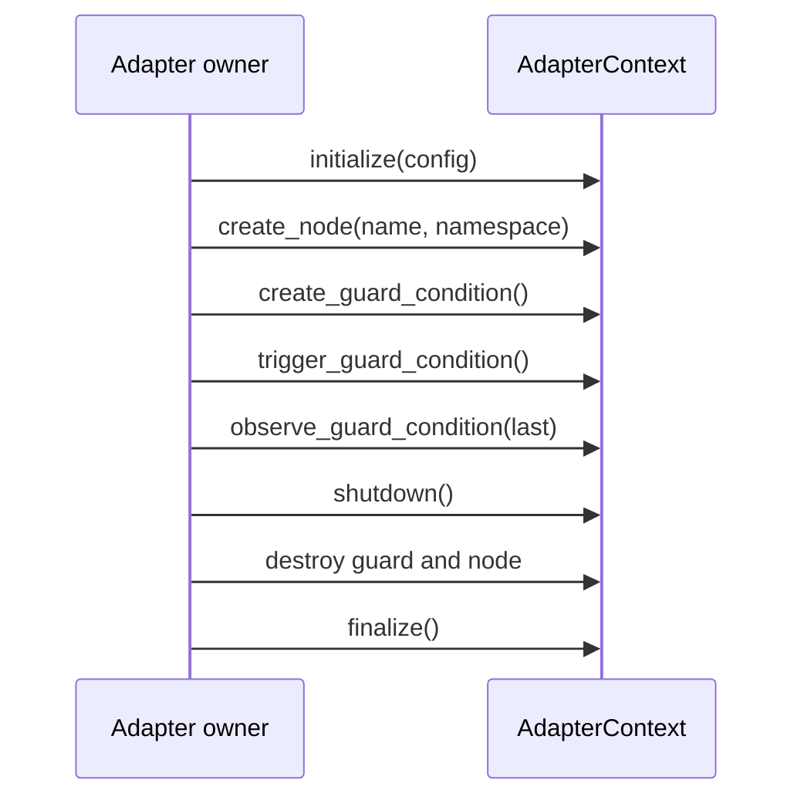
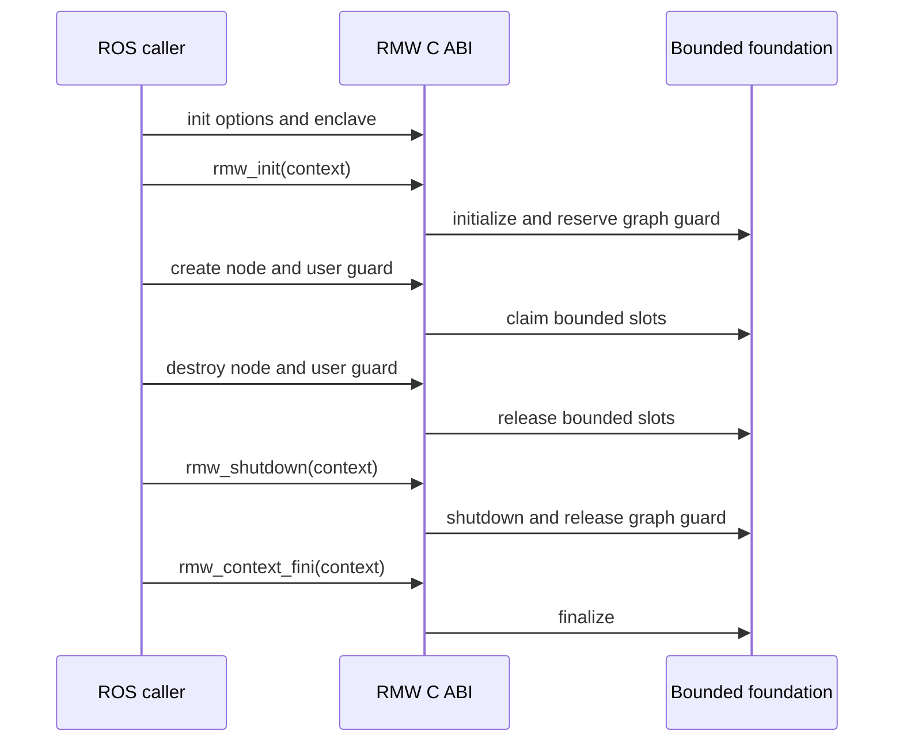
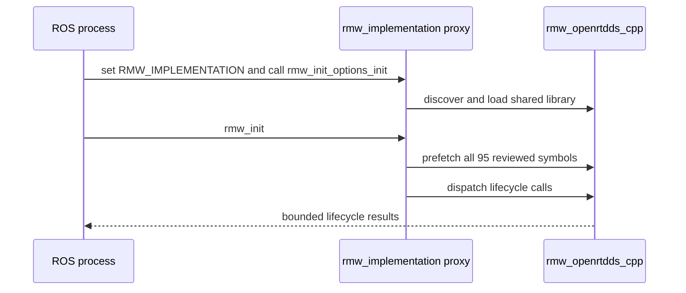
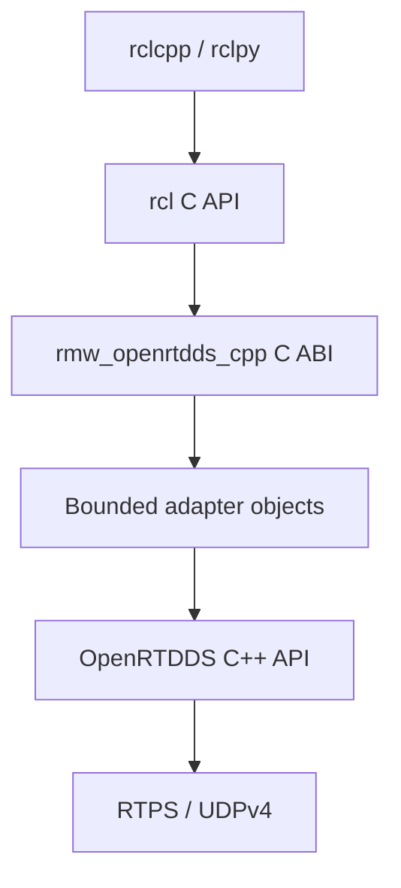
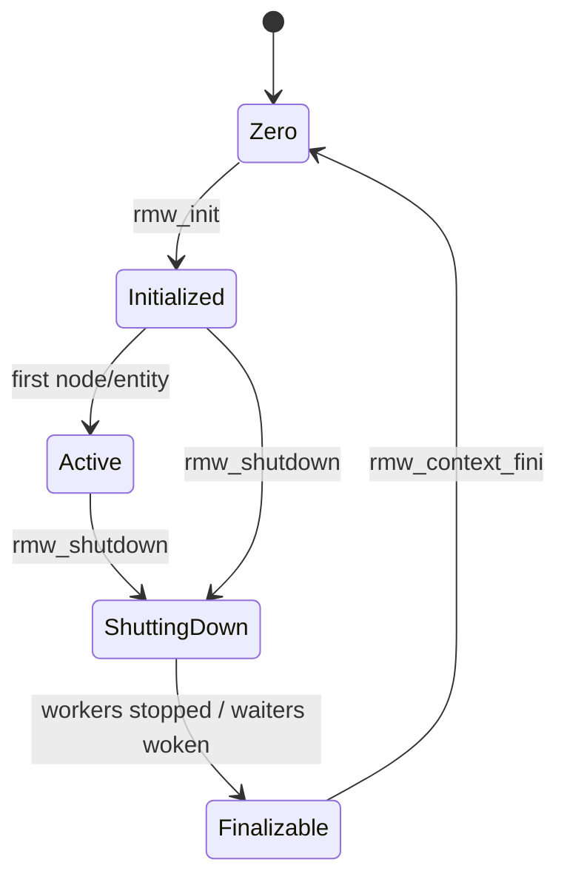
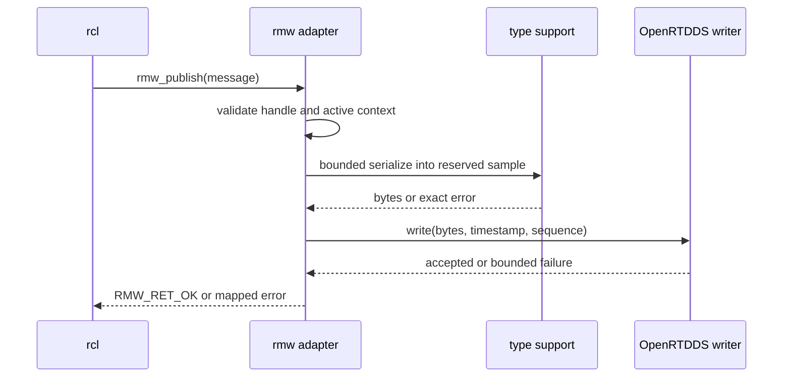
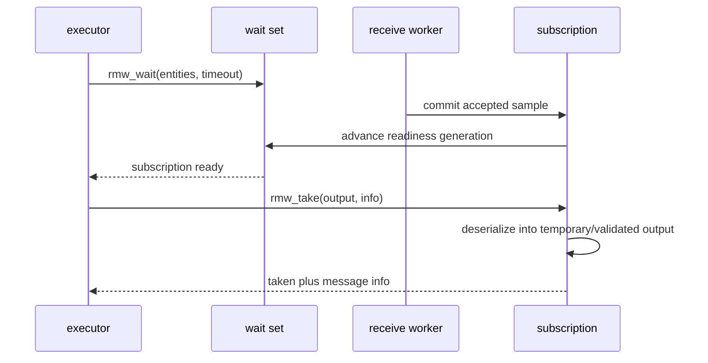
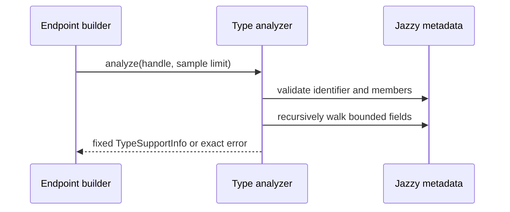

# ROS 2 RMW adapter detailed design

**Design status:** Current for the bounded foundation, complete Jazzy proxy ABI
surface, lifecycle semantics, G4.1 memory-safety qualification, and bounded
type/name foundations; Planned for endpoint communication semantics and the
remaining G4.2 through G4.5 evidence

**Requirements:** ORT-RMW-001, ORT-RMW-002, ORT-RMW-003, ORT-RMW-004

**Requirements:** ORT-RMW-005, ORT-RMW-006, ORT-RMW-007, ORT-RMW-008

**Requirements:** ORT-RMW-009, ORT-RMW-010, ORT-RMW-011, ORT-RMW-012

**Requirements:** ORT-RMW-013, ORT-RMW-014, ORT-RMW-015, ORT-RMW-016

**Requirements:** ORT-RMW-017, ORT-RMW-018, ORT-RMW-019, ORT-RMW-020

**Requirements:** ORT-RMW-021, ORT-RMW-022

**Requirements:** ORT-RMW-023, ORT-RMW-024, ORT-RMW-025, ORT-RMW-026

**Requirements:** ORT-RMW-027, ORT-RMW-028

**Requirements:** ORT-RMW-029, ORT-RMW-030, ORT-RMW-031, ORT-RMW-032

**Requirements:** ORT-RMW-033

**Requirements:** ORT-RMW-034, ORT-RMW-035, ORT-RMW-036

**Requirements:** ORT-RMW-037, ORT-RMW-038, ORT-RMW-039

**Requirements:** ORT-RMW-040, ORT-RMW-041

## Status and scope

`rmw_openrtdds_cpp` is a separate ROS-facing shared library layered over the
OpenRTDDS C++ library. The first target is ROS 2 Jazzy on Linux. The exact
reviewed `rmw` header baseline is version `7.3.4` and upstream `package.xml`
blob `6b81eedd240033dcd695d5fa14511b0e41cdfd39`. The package accepts the bounded
Jazzy patch range `>=7.3.3,<7.4.0`; CI currently compiles and runs against the
7.3.3 package in `ros:jazzy-ros-core`. A version outside that range fails at
configure time. Rolling is a reference, not the compatibility target.

This design covers lifecycle, pub/sub, wait/take, graph, services, metadata,
QoS, errors, bounds, and qualification. DDS Security, SROS 2, dynamic types,
content filtering, loaned messages, zero-copy, and network-flow endpoints are
deliberately excluded from the initial profile.

See [the capability-gap matrix](capability-matrix.md) for the feature-to-gate
plan.

## Current bounded foundation

`include/openrtdds/rmw/foundation.hpp` supplies the ROS-independent ownership
layer that future C entry points will wrap. `src/rmw/foundation.cpp` supplies
stable diagnostic names. The unit owner is `tests/test_rmw_foundation.cpp`,
and `examples/rmw_foundation_lifecycle.cpp` demonstrates a complete bounded
context, node, guard-condition, shutdown, release, and finalize sequence. The
upstream selection evidence is recorded in `rmw_openrtdds_cpp/BASELINE.md`.

The foundation is compiled into `OpenRTDDS::openrtdds`; it includes no ROS
headers. The separate `rmw_openrtdds_cpp` ament package registers and exports a
loadable shared library with the complete reviewed Jazzy proxy symbol surface,
but it deliberately registers an empty type-support set. The current adapter
can complete its lifecycle through the standard runtime-selection proxy; it
cannot yet run a ROS publisher, subscription, service, client, or executor end
to end.

### Current types and ownership

| Type | Current responsibility | Bound/lifetime |
|---|---|---|
| `AdapterLimits` | validates runtime node and guard-condition limits against template capacities | copied into a successfully initialized context |
| `AdapterConfig` | supplies limits, portable domain ID, and exact implementation identifier | caller-owned input, never retained by pointer |
| `AdapterContext<N,G>` | owns fixed node/guard slots, lifecycle, context generation, and wake generation | static or caller-owned object; no heap allocation |
| `NodeHandle` | identifies one node slot plus slot/context generations | valid only while its exact slot instance is active |
| `GuardConditionHandle` | identifies one guard slot plus slot/context generations | valid only while its exact slot instance is active |
| `AdapterError` | exact immediate foundation result | symbolic; integer values are not persistent diagnostics |

Node records contain fixed arrays for name and namespace. Guard-condition
trigger generations and the context wake generation are atomics. Lifecycle,
node, and guard slot creation/destruction are deliberately single-owner in
this increment; only trigger/wake generation storage is prepared for the later
concurrent wait-set boundary. Concurrent destroy/trigger behavior remains
Planned under ORT-RMW-009 and ORT-RMW-016.

### Current behavior and invariants

- initialization commits only after identifier, limits, and portable domain
  ID (`0..232`) validation succeeds;
- failed creation leaves the output handle and slot counts unchanged;
- each initialization and slot reuse advances a wrapping nonzero generation;
- node and guard handles must match context, slot, and slot generation;
- shutdown advances the wake generation and prohibits new/trigger operations;
- objects may be released during shutdown, and the final release transitions
  the context to `finalizable`;
- finalization is rejected while an object remains owned;
- no operation allocates, creates a thread, blocks, invokes a callback, or
  performs I/O.

### Current normal sequence



### Current error and fault mapping

| `AdapterError` | Meaning | Planned external mapping |
|---|---|---|
| `invalid_argument` | null/empty required input | `RMW_RET_INVALID_ARGUMENT` |
| `incorrect_implementation` | identifier differs from `rmw_openrtdds_cpp` | `RMW_RET_INCORRECT_RMW_IMPLEMENTATION` |
| `invalid_limits` | zero or over-capacity startup limit | `RMW_RET_INVALID_ARGUMENT`, `ORT-FLT-RMW-002` |
| `invalid_domain` | domain exceeds initial portable bound | `RMW_RET_INVALID_ARGUMENT` |
| `invalid_state` | lifecycle ordering violation | `RMW_RET_ERROR`, `ORT-FLT-RMW-001` |
| `resource_exhausted` | active configured slot limit reached | `RMW_RET_BAD_ALLOC`, `ORT-FLT-RMW-002` |
| `name_too_long` | name or namespace lacks terminator inside bound | `RMW_RET_INVALID_ARGUMENT` |
| `stale_handle` | context/slot generation or active state mismatch | `RMW_RET_ERROR`, `ORT-FLT-RMW-001` |
| `unsupported` | reserved for truthful unsupported semantics | `RMW_RET_UNSUPPORTED` |

The Jazzy lifecycle wrapper maps these results to `rmw_ret_t`; later entity
families shall reuse the same mapping rather than invent local return policy.

## Current Jazzy C ABI and lifecycle scaffold

`rmw_openrtdds_cpp/src/rmw_adapter.cpp` owns all ROS ABI objects and wraps the
bounded foundation. The implemented entry points are limited to identity,
serialization-format declaration, conservative feature reporting, init
options, context lifecycle, node lifecycle, and guard-condition lifecycle.
`rmw_openrtdds_cpp/src/rmw_unsupported.cpp` supplies type-correct definitions
for every other function required by the pinned Jazzy proxy. The reviewed
`rmw_openrtdds_cpp/abi_symbols.txt` manifest contains all 95 exports: 94
macro-routed proxy functions plus the separately dispatched `rmw_init`.

The proxy reference is `ros2/rmw_implementation` Jazzy commit
`835ff87c676cd65634edd3ad7ba88c8d8a0452e7`, with `src/functions.cpp` blob
`6201e037b7997bea8f66c552f2075887a62adf92`. Any baseline change requires a
manifest diff, header compatibility review, and CI evidence before acceptance.

The ament resource index contains `rmw_openrtdds_cpp`, but its registered type
support list is empty. Publisher, subscription, wait-set, graph-cache, service,
client, event, serialization, and take APIs are not implemented by this PR.
All optional features return `false` from `rmw_feature_supported`.

### Unsupported-entry-point contract

An exported symbol does not imply implemented semantics. Every unimplemented
entry point follows a return-type-specific policy and must leave adapter state
unchanged.

| Return family | Required result | Diagnostic policy |
|---|---|---|
| `rmw_ret_t` | `RMW_RET_UNSUPPORTED` | set an `rcutils` error naming the unsupported function |
| created-handle pointer | `nullptr` | set an `rcutils` error naming the unsupported function |
| capability query `bool` | `false` | do not set an error; unsupported is the query result |

Stub definitions use the official Jazzy declarations so signature drift is a
compile error. They do not allocate, dereference caller objects, mutate
contexts or handles, invoke callbacks, create threads, or perform I/O.

### ABI ownership

| Object | Allocation and ownership | Release rule |
|---|---|---|
| `rmw_init_options_t` owned fields | caller-provided `rcutils_allocator_t`; security, discovery, and enclave are deep-copied | `rmw_init_options_fini` |
| `rmw_context_impl_t` | context allocator; placement-constructed C++ foundation | only after shutdown and release of all external handles |
| `rmw_node_t`, node data, name, namespace | context allocator; one bounded foundation node slot | `rmw_destroy_node`, including during shutdown |
| user `rmw_guard_condition_t` and data | context allocator; one bounded foundation guard slot | `rmw_destroy_guard_condition`, including during shutdown |
| graph guard condition | context-owned; reserves one guard slot at initialization | automatically released by first shutdown |

### Implemented lifecycle sequence



`rmw_shutdown` is idempotent. `rmw_context_fini` rejects an active context and
also rejects a shutdown context that still owns an external node or guard.
This preserves the underlying foundation's no-abandoned-handle invariant.

### Standard runtime-selection sequence



The proxy-linked test does not link directly to `rmw_openrtdds_cpp`. This
prevents link-time resolution from masking package discovery, loader, manifest,
or proxy-dispatch defects.

### Qualification boundary

The Jazzy CI job builds with `colcon`, runs direct lifecycle and unsupported
contract tests, checks ament registration, loads the installed shared library,
and compares all `rmw_*` dynamic exports with `abi_symbols.txt`. A second
lifecycle executable links only to `rmw_implementation`, selects this adapter
with `RMW_IMPLEMENTATION=rmw_openrtdds_cpp`, and exercises proxy load, full
symbol prefetch, and lifecycle dispatch.

PR26 adds a caller-supplied accounting allocator and exercises 256 complete
lifecycle cycles at the configured maximum of eight nodes and fifteen user
guards (the graph guard owns the sixteenth slot). Every cycle deliberately
exceeds both pools, verifies atomic rejection, shuts down with live objects,
releases them, finalizes, and requires zero outstanding allocations. Separate
failure sweeps reject each partial context, graph-guard, node, and guard
construction edge, verify allocation and slot rollback, then perform a valid
recovery operation.

The sanitizer job instruments the adapter, its ROS-free OpenRTDDS dependency,
and all lifecycle executables with AddressSanitizer and
UndefinedBehaviorSanitizer. Leak detection is enabled and failures stop the
job. It covers direct and proxy-selected lifecycle paths, invalid null and
foreign-implementation inputs, resource exhaustion, allocation fault
injection, and repeated cleanup.

Passing these checks qualifies ORT-RMW-029 through ORT-RMW-039 and closes
G4.1. This proves that the documented lifecycle scaffold loads and survives
the tested memory and fault paths; it does not qualify endpoint, wait-set,
graph, service, client, executor, or general ROS application behavior.

## Architectural boundary



The adapter owns ROS ABI objects and conversion policy. OpenRTDDS owns DDS and
RTPS state. `rcl` and the caller own the memory passed into entry points. No
ROS headers enter the OpenRTDDS public C++ headers; the core library remains
buildable without a ROS installation.

## Package and source ownership

The planned source tree is:

```text
rmw_openrtdds_cpp/
  CMakeLists.txt
  package.xml
  include/rmw_openrtdds_cpp/visibility_control.h
  src/entry_points.cpp
  src/context.cpp
  src/entities.cpp
  src/type_support.cpp
  src/qos.cpp
  src/wait_set.cpp
  src/graph.cpp
  src/services.cpp
  src/errors.cpp
  test/
```

Whether this package remains in this repository or moves to a dedicated ROS
repository is a release-management decision. Its API and trace obligations are
unchanged. The core build shall not find or link ROS unless the adapter option
is explicitly enabled.

## Planned class and type definitions

| Type | Ownership and responsibility | Bound/lifetime |
|---|---|---|
| `RmwContext` | owns limits, domain, participant, transport workers, graph, entity pools, wait registry, and shutdown state | one per initialized `rmw_context_t`; finalized after shutdown |
| `RmwNode` | logical ROS node identity and graph record | context pool; destroyed before context finalization |
| `RmwPublisher` | writer, type support, mapped names, QoS, GID, and publication sequence | context pool; parent node must remain valid |
| `RmwSubscription` | reader, type support, QoS, receive history, readiness generation | context pool; parent node must remain valid |
| `RmwClient` | request writer, response reader, client GID, and outstanding-request table | context pool with fixed request bound |
| `RmwService` | request reader, response writer, and request-correlation records | context pool with fixed request bound |
| `RmwWaitSet` | caller-selected wait entries and wake generation snapshot | context pool; no ownership of waited entities |
| `RmwGuardCondition` | atomic trigger generation and wait-registry link | context pool; trigger is level-observable until consumed |
| `GraphCache` | local/remote nodes and endpoints plus committed generation | fixed-capacity context member |
| `TypeSupportView` | validated introspection metadata and maximum serialized size | immutable; refers to caller/ROS static metadata |
| `ErrorState` | bounded thread-local message for the last adapter failure | one record per calling thread |

Opaque `rmw_*_t::data` fields point to these objects. Every object also stores
the adapter identifier, context generation, lifecycle state, and pool slot
generation. A stale handle therefore fails validation even if its former slot
has been reused.

## Context and entity state



Entity slots use `free`, `constructing`, `active`, and `destroying` states.
Creation reserves a slot, validates and constructs all subordinate state, then
commits it to `active` and publishes one graph update. Any failure unwinds the
reserved state and leaves no visible graph entry. Destruction first prevents
new operations, wakes relevant waiters, removes the graph entry, releases DDS
state, advances the slot generation, and finally returns the slot to `free`.

## Initialization behavior

`rmw_init_options_init` records the caller allocator and initializes the ROS
security and discovery options without allocating OpenRTDDS runtime objects.
`rmw_init` performs:

1. adapter-identifier and lifecycle validation;
2. domain and localhost/discovery-option validation;
3. deterministic-limit loading and cross-bound validation;
4. pool, graph, wait-registry, socket, and worker creation;
5. SPDP/SEDP participant activation;
6. context commit only after all prior steps succeed.

Safety Profile activation pre-faults and locks declared memory, constructs the
fixed worker set, and closes all post-activation heap paths. A setup failure
unwinds in reverse order before the context is exposed.

## Publisher sequence



Serialization failure releases the reserved sample and does not advance the
published sequence. A DDS write failure returns the exact mapped error; the
reliability layer owns any already-committed sample according to its bounded
history and repair policy. The adapter never loops until success.

## Subscription and wait sequence



The receive worker signals only after identity, QoS, RTPS, CDR framing, and
history acceptance succeed. `rmw_take` leaves the caller output logically
unchanged when deserialization fails. Readiness is generation-based so a
signal arriving between inspection and blocking cannot be lost.

## Wait-set interface

Each context owns one wakeup primitive shared by a bounded readiness registry.
Entities and guard conditions maintain atomic readiness generations. A wait
call records generations, checks readiness, arms the registry, checks again,
then blocks until a generation changes, shutdown begins, or the monotonic
deadline expires. Spurious wakeups repeat only until that fixed deadline.

The wait call does not allocate, invoke user callbacks, or hold an entity lock
while blocking. It clears non-ready entries from the caller-provided arrays as
required by the pinned `rmw` ABI. Destruction and shutdown wake affected waits
before waiting for in-flight operations to leave their slots.

## Current type-support analysis foundation

`rmw_openrtdds_cpp/type_support.hpp` exposes an allocation-free analyzer for
direct Jazzy C and C++ introspection handles. The output is a value-owned
`TypeSupportInfo`; the input metadata remains owned by generated ROS code.

| API/type | Current contract |
|---|---|
| `analyze_type_support` | atomically derives the DDS type name and maximum XCDR1 PLAIN_CDR size within a caller-provided sample ceiling |
| `TypeSupportInfo` | language, maximum wire size including the four-byte encapsulation, maximum alignment, maximum nesting depth, and fixed DDS type name |
| `TypeSupportError` | stable exact rejection category; output remains unchanged on failure |

The current accepted subset is boolean, character/octet, integer and floating
scalar kinds up to 64 bits, fixed arrays, bounded sequences, bounded narrow
strings, and nested messages. The recursive walk applies CDR alignment at the
actual accumulated offset, includes the sequence length and string terminator,
and caps nesting at 16. Empty messages have a four-byte maximum wire size.

The analyzer rejects unbounded strings or sequences, wide strings/characters,
long double, malformed member tables, mixed nested introspection languages,
recursive schemas, excessive nesting, arithmetic overflow, and a result above
the configured sample limit. These are schema-validation results, not runtime
fault records; endpoint integration will map them to `ORT-FLT-RMW-003`.



PR27 does not serialize or deserialize caller messages and does not resolve a
generic dispatch handle into an introspection backend. Consequently
ORT-RMW-006 remains Draft until those operations and endpoint integration are
implemented and tested.

## Current name and DDS mapping foundation

`map_ros_to_dds_names` writes one fixed `DdsNames` value without allocation.
Resolved ROS names are expected after `rcl` validation. The pinned mapping is:

| Channel | Normal topic mapping | Literal DDS mode |
|---|---|---|
| topic | `rt` + ROS name | ROS name |
| service request | `rq` + ROS service name + `Request` | ROS service name + `Request` |
| service response | `rr` + ROS service name + `Reply` | ROS service name + `Reply` |

C namespaces replace `__` with `::`; C++ namespaces are retained. Both produce
`<namespace>::dds_::<message>_`. Topic and type outputs allow at most 255 bytes
plus the terminator. Empty or over-bound names fail atomically.

Golden vectors cover all channels, C/C++ type-name equivalence, literal mode,
the 255-byte boundary, and unchanged output after failure. ORT-RMW-007 remains
Draft until publisher, subscription, service, and client creation consume the
mapping and announce the resulting identities through SEDP.

## QoS contract

| ROS policy | Initial mapping | Unsupported behavior |
|---|---|---|
| reliability | best effort / reliable | unknown resolved by documented default |
| durability | volatile | transient local rejected until bounded durable history exists |
| history | KEEP_LAST | KEEP_ALL rejected |
| depth | fixed positive history depth | zero/overflow rejected or resolved per pinned ABI |
| deadline | planned OpenRTDDS deadline monitor | unsupported until monitor evidence exists |
| lifespan | planned receive/write expiry | unsupported until expiry evidence exists |
| liveliness | automatic first | manual modes rejected initially |
| lease duration | bounded monotonic duration | unsupported combinations rejected |

The same normalized QoS object drives entity creation, SEDP advertisement,
matching, `get_actual_qos`, and compatibility checks. No path independently
reinterprets the caller profile.

## Graph behavior

SPDP and SEDP provide participants and DDS endpoints but not logical ROS node
membership. The adapter therefore maintains a context-level graph cache and a
bounded graph-update channel. A local node/entity change is committed to the
cache and announced as one ordered update. A remote update is accepted only
from a live participant, validated against configured bounds, and committed
atomically. Participant expiry removes its node and endpoint records in one
graph generation and triggers the graph guard condition once.

Queries copy a consistent snapshot into storage allocated with the caller's
allocator as required by `rmw`. Runtime graph mutation remains bounded inside
the adapter; query-result allocation is an explicit API boundary and is not a
Safety Profile real-time path.

## Service and client behavior

One ROS service maps to request and response pub/sub channels. The client GID
and request sequence form the correlation identity. The fixed outstanding
request table owns a state of `free`, `awaiting_response`, or `completed`.
Responses with an unknown client GID, sequence, or already-completed record are
discarded and counted as diagnostics. Timeout policy belongs to the caller;
the adapter does not retry service requests autonomously.

## API validation and errors

Every C entry point follows this order:

1. validate required pointers and scalar ranges;
2. validate the implementation identifier;
3. validate context, slot generation, and lifecycle state;
4. reserve bounded resources without making them externally visible;
5. perform the operation;
6. commit or unwind;
7. map the result and set a bounded diagnostic on failure.

Planned adapter-local error categories are stable symbols, not wire values:

| Adapter error | Typical `rmw_ret_t` | Fault mapping | Recovery owner |
|---|---|---|---|
| `RmwError::invalid_argument` | `RMW_RET_INVALID_ARGUMENT` | none; caller contract | caller |
| `RmwError::incorrect_implementation` | `RMW_RET_INCORRECT_RMW_IMPLEMENTATION` | none; caller contract | caller |
| `RmwError::bad_state` | `RMW_RET_ERROR` | `ORT-FLT-RMW-001` | context owner |
| `RmwError::resource_exhausted` | `RMW_RET_BAD_ALLOC` | `ORT-FLT-RMW-002` | system integrator |
| `RmwError::unsupported` | `RMW_RET_UNSUPPORTED` | none; declared limitation | application |
| `RmwError::timeout` | `RMW_RET_TIMEOUT` | optional timing event | executor/application |
| `RmwError::type_support` | `RMW_RET_ERROR` | `ORT-FLT-RMW-003` | application/build owner |
| `RmwError::serialization` | `RMW_RET_ERROR` | `ORT-FLT-SER-001` | publisher/subscriber owner |
| `RmwError::transport` | `RMW_RET_ERROR` | `ORT-FLT-UDP-001/002` | context/system owner |
| `RmwError::discovery` | `RMW_RET_ERROR` | `ORT-FLT-RMW-004` | context/system owner |

`RMW_RET_BAD_ALLOC` includes configured pool or byte-bound exhaustion even when
the failing resource is not the process heap. The diagnostic names the exact
pool or limit. No C entry point permits a C++ exception to cross the ABI.

## Planned fault codes

| Fault code | Detection | Containment and response |
|---|---|---|
| `ORT-FLT-RMW-001` | invalid internal lifecycle or stale active handle | reject call; preserve other entities; request context restart if persistent |
| `ORT-FLT-RMW-002` | configured adapter pool/table/byte bound exhausted | reject creation or sample atomically; emit bounded resource event |
| `ORT-FLT-RMW-003` | type-support identifier/schema/size violates profile | reject endpoint creation; no discovery advertisement |
| `ORT-FLT-RMW-004` | graph update malformed, over-bound, stale, or inconsistent | discard update; preserve last valid graph; expire with participant lease |
| `ORT-FLT-RMW-005` | wait registry generation or wake primitive failure | wake/abort affected wait; context enters degraded or shutdown state |

These codes are reserved by this design and recorded as Planned in the central
fault catalog. They are not Current fault records until an owning
implementation and verification evidence exist.

## Resource model

`RmwLimits` will extend `RuntimeLimits` with maxima for every adapter-owned
entity and byte store. Cross-validation shall ensure, at minimum, that endpoint
capacity covers publishers, subscriptions, client/service pairs, the graph can
describe every local entity plus its allowed remote peers, and wait-set entry
capacity cannot exceed the registry capacity.

All internal names, graph records, serialized samples, event records, and
diagnostics have explicit byte limits. No unbounded STL container is permitted
on the Safety Profile path. General Profile use of a caller allocator remains
visible in the owning type and failure contract.

## Concurrency and timing

The initial planned topology is one receive/discovery worker and one wait
wakeup primitive per context; application publishing and taking occur on
caller/executor threads. Reliability timers run in the bounded context worker,
not one thread per endpoint. The final priorities and affinities are startup
configuration and are validated before context activation.

Lock order is context lifecycle, graph, entity pool, then individual entity.
The receive worker never calls user code and never waits for an executor. CDR
serialization/deserialization occurs outside the graph lock. Every retry,
discovery announcement, lease, wait, and shutdown join has a monotonic bound.

## Qualification gates

| Gate | Required evidence | Claim enabled |
|---|---|---|
| G4.1 Build/load | Jazzy build/install, exact symbol/load test, runtime selection, failure injection, allocation balance, and init/node/shutdown ASan/LSan/UBSan stress | Passed by PR26: adapter lifecycle scaffold loads |
| G4.2 Topics | C/C++ fixed-message best-effort and reliable talker/listener, QoS and metadata tests | bounded ROS topic exchange |
| G4.3 Graph | multi-process graph add/query/remove and lease-expiry tests | selected graph introspection |
| G4.4 Services | concurrent request/reply correlation, wait readiness, invalid response test | bounded ROS services |
| G4.5 Conformance | versioned upstream allowlist, exclusions, stress, sanitizers, determinism analysis | ROS 2 Jazzy readiness for documented profile |

G4.1 is passed; G4 remains Planned until all five gates pass. Passing a lower
gate shall be claimed precisely and shall not be described as general ROS 2
support.

## Verification strategy

- unit tests cover lifecycle order, handle generation, mappings, size analysis,
  QoS normalization, wait generations, graph transactions, service correlation,
  and every error mapping;
- integration tests load the adapter through standard ROS runtime selection;
- examples provide fixed talker/listener and service/client demonstrations;
- multi-process tests exercise discovery, graph expiry, reliable repair, and
  bounded shutdown;
- ASan, UBSan, TSan where supported, and leak checks cover General Profile;
- allocation hooks prove no post-activation heap calls in Safety Profile tests;
- latency tests record wait wake, publish, take, and shutdown bounds without
  treating a non-real-time CI host as WCET proof;
- the selected upstream test allowlist and every exclusion are committed.

## Deliberate limitations

The planned first adapter is not a complete DDS RMW replacement and is not a
safety-certified ROS 2 stack. It supports only the documented Jazzy ABI,
Linux, bounded message/profile subset, UDPv4 transport, and qualification
tests. ROS 2 client libraries, executors, third-party nodes, and vendor RMW
implementations may allocate or create threads outside OpenRTDDS control.
