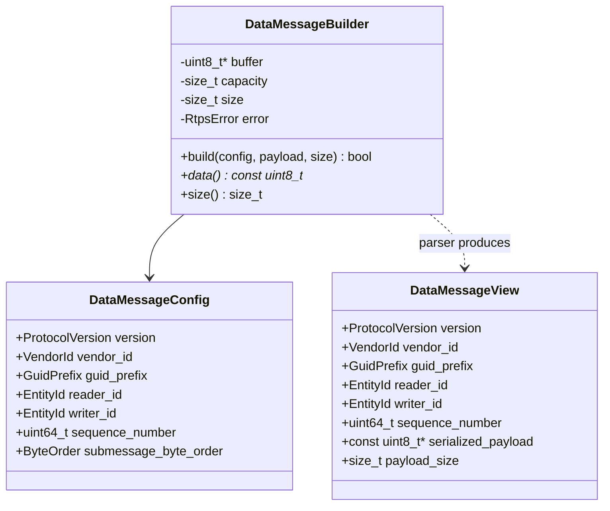
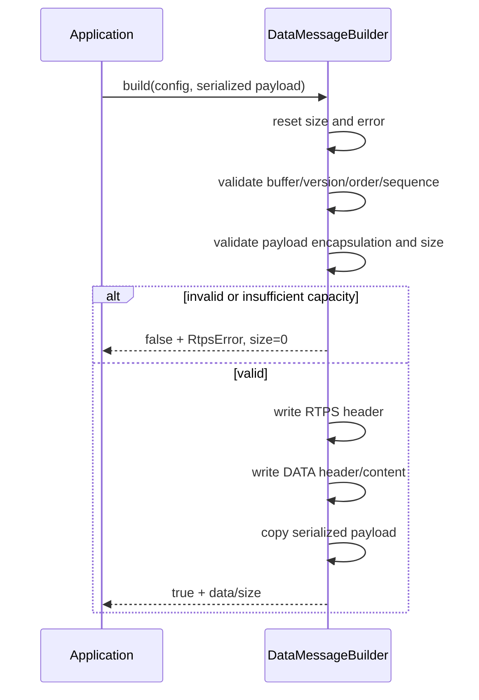

# RTPS DATA detailed design

**Design status:** Current  
**Requirements:** ORT-RTPS-001, ORT-RTPS-002, ORT-RTPS-003, ORT-RTPS-004  
**Requirements:** ORT-RTPS-005, ORT-RTPS-006, ORT-RTPS-007  
**Source:** `include/openrtdds/rtps/types.hpp`,
`include/openrtdds/rtps/data_message.hpp`, `src/rtps/data_message.cpp`

## Responsibility and subset

This component constructs and parses one RTPS message containing exactly one
unfragmented DATA submessage and one XCDR1 payload. Static caller configuration
provides protocol identity, GUID prefix, endpoint EntityIds, sequence number,
and submessage byte order.

## Types and ownership

The builder borrows caller output storage. `DataMessageView` borrows the
validated input datagram and does not copy payload bytes.

## Wire layout

| Offset | Size | Field |
|---:|---:|---|
| 0 | 4 | ASCII `RTPS` |
| 4 | 2 | protocol version |
| 6 | 2 | caller-supplied VendorId |
| 8 | 12 | GuidPrefix |
| 20 | 1 | DATA submessage ID `0x15` |
| 21 | 1 | flags: endian + DATA; no inline QoS/key/nonstandard payload |
| 22 | 2 | `octetsToNextHeader` in submessage byte order |
| 24 | 2 | `extraFlags`, required zero |
| 26 | 2 | `octetsToInlineQos`, minimum/current value 16 |
| 28 | 4 | reader EntityId |
| 32 | 4 | writer EntityId |
| 36 | 4 | sequence high word |
| 40 | 4 | sequence low word |
| 44 | N | XCDR1 serialized payload |

The minimum payload is its four-byte encapsulation. Total message size must not
exceed 65,507 bytes. The fixed RTPS/DATA overhead is 44 bytes.

## Build behavior

Supported protocol major is 2; supported minor is 1 through 5. Writer sequence
numbers are in `[1, INT64_MAX]`. The builder checks arithmetic overflow,
protocol maximum, output capacity, and the 16-bit submessage-length limit
before writing the message.

## Parse behavior

Parsing validates before publishing a candidate view:

1. pointer and minimum RTPS/DATA/payload length;
2. `RTPS` magic and protocol version;
3. DATA submessage ID and supported flags;
4. declared length, including final-submessage length zero;
5. zero extra flags and valid inline-QoS offset;
6. positive signed RTPS sequence number;
7. supported XCDR1 payload encapsulation;
8. copy parsed metadata into a local candidate;
9. assign candidate to the caller's view only after all checks succeed.

This commit-last pattern ensures a parse failure leaves the caller's existing
view unchanged.

## Supported and rejected features

| Feature | Behavior |
|---|---|
| DATA payload flag | required |
| Big/little submessage endian | supported |
| final submessage length zero | supported |
| extended `octetsToInlineQos` offset | honored when within bounds |
| inline QoS | rejected |
| keyed DATA | rejected |
| nonstandard payload | rejected |
| DATA_FRAG | rejected |
| multiple-submessage traversal | not implemented; first must be DATA |

## RtpsError contract

| Enumerator | Meaning | Fault mapping |
|---|---|---|
| `none` | success | none |
| `invalid_argument` | inconsistent pointer or enum input | configuration/programmer fault |
| `buffer_overflow` | caller output storage too small | `ORT-FLT-RTPS-001` |
| `message_too_large` | protocol/UDP/length bound exceeded | `ORT-FLT-RTPS-001` |
| `truncated` | incomplete declared input | `ORT-FLT-RTPS-001` |
| `invalid_protocol` | bad RTPS magic/header | `ORT-FLT-RTPS-001` |
| `unsupported_version` | outside supported RTPS version | `ORT-FLT-RTPS-002` |
| `unsupported_submessage` | first submessage is not DATA | `ORT-FLT-RTPS-002` |
| `unsupported_feature` | QoS/key/nonstandard flag/extra flags | `ORT-FLT-RTPS-002` |
| `invalid_submessage` | invalid length/offset/layout | `ORT-FLT-RTPS-001` |
| `invalid_sequence_number` | nonpositive/out-of-range sequence | `ORT-FLT-RTPS-003` |
| `invalid_serialized_payload` | missing/unsupported encapsulation | `ORT-FLT-SER-002` |

## Memory, concurrency, and timing

No heap allocation, locks, threads, waits, retries, or system calls occur.
Work is linear in serialized payload size due to one copy; validation outside
the copy is constant time. Builder/parser instances and borrowed buffers
require caller-controlled concurrency.

## Verification and examples

- `tests/test_rtps_data_message.cpp`
- `tests/test_udp_socket.cpp` for end-to-end datagram use
- `examples/rtps_static_message.cpp`

