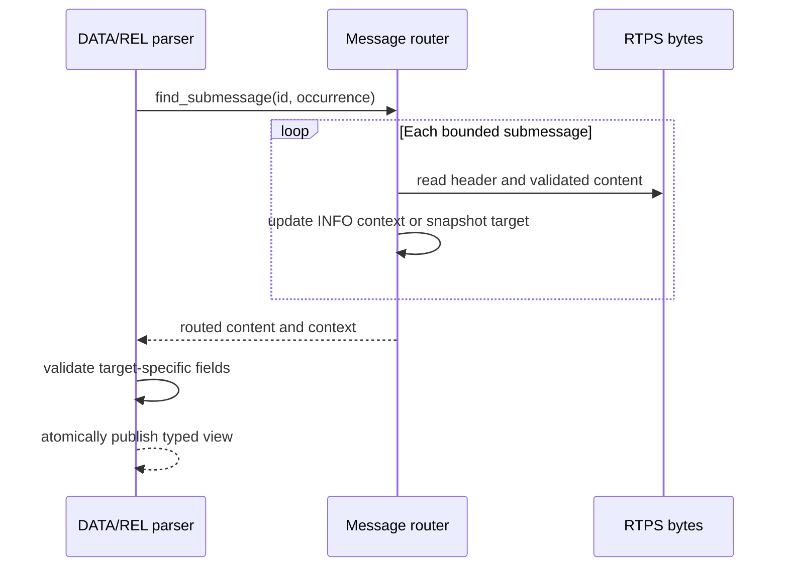
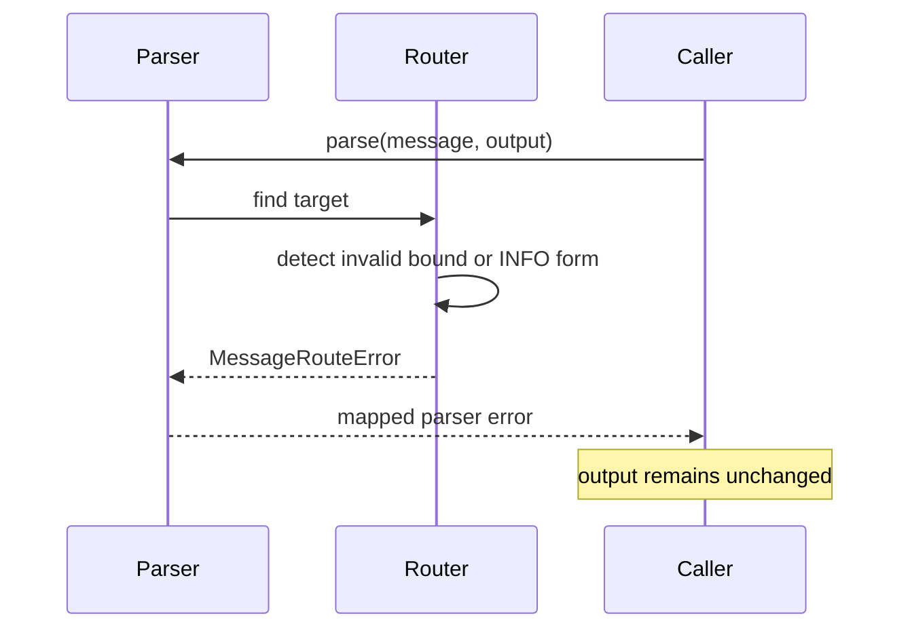

# Compound RTPS message-routing detailed design

**Status:** Current  
**Requirements:** ORT-ROUTE-001, ORT-ROUTE-002, ORT-ROUTE-003  
**Requirements:** ORT-ROUTE-004, ORT-ROUTE-005, ORT-ROUTE-006  
**Source ownership:** `include/openrtdds/rtps/message_router.hpp`,
`src/rtps/message_router.cpp`, DATA and reliability parsers

## Scope

The router validates one bounded RTPS message, walks its submessages, maintains
the RTPS interpreter state, and returns a non-owning view of a requested
submessage occurrence. It is the dispatch layer shared by DATA, HEARTBEAT,
and ACKNACK parsing.

This design is an interoperability prerequisite. It does not by itself claim
interoperability with Fast DDS, Cyclone DDS, or ROS 2; those claims require
captured-packet and live bidirectional system gates described in
`docs/interoperability.md`.

## Behavior and invariants

1. Validate the fixed 20-byte RTPS header and initialize interpreter state.
2. At each submessage boundary, read the ID, flags, and length using the
   submessage's endian flag.
3. Resolve the content bound. A zero length extends a non-`PAD`, non-`INFO_TS`
   submessage to the end of the RTPS message. Zero-length `PAD` and `INFO_TS`
   have no content and permit another header immediately after them.
4. Snapshot the current interpreter state when the requested occurrence is
   encountered.
5. Validate and apply interpreter submessages to subsequent submessages.
6. Continue validating the whole message even after finding the target.
7. Publish the candidate view only after all message bytes validate.

The following invariants hold:

- `offset + 4 + content_size` never exceeds `message_size`;
- returned pointers always refer to bytes inside the caller-owned message;
- interpreter state affects only later submessages;
- unknown submessage IDs are skipped only by a validated declared bound;
- failure leaves the caller's `RoutedSubmessageView` unchanged;
- no heap allocation, blocking operation, lock, or system call occurs.

## Type and class definitions

| Type | Responsibility | Ownership/lifetime |
|---|---|---|
| `MessageRouteError` | Stable result taxonomy for routing validation | Value |
| `RtpsTimestamp` | RTPS seconds and fractional-second representation | Value |
| `RoutedSubmessageView` | Effective interpreter context plus target content span | Non-owning; input message must outlive it |
| internal `RouteContext` | Mutable interpreter state during a single walk | Stack-local |

`RoutedSubmessageView` contains protocol version, vendor ID, effective source
GUID prefix, optional destination GUID prefix, optional source timestamp,
submessage ID/flags/byte order, content pointer and size, and byte offset.

## Public API

```cpp
MessageRouteError find_submessage(
    const std::uint8_t* message,
    std::size_t message_size,
    std::uint8_t submessage_id,
    std::size_t occurrence,
    RoutedSubmessageView& view) noexcept;
```

Preconditions:

- `message` points to at least `message_size` readable bytes;
- `message` may be null only when `message_size` is zero;
- `occurrence` is zero based.

Postconditions on success:

- `view` identifies the requested occurrence and its effective context;
- `view.content` spans exactly `view.content_size` bytes within `message`.

Postcondition on failure: `view` is unchanged.

DATA, HEARTBEAT, and ACKNACK parsers call this API and then validate their own
submessage-specific flags, fields, bounds, and semantic rules.

## Wire interfaces

| Submessage | ID | Supported content | Effect |
|---|---:|---:|---|
| `PAD` | `0x01` | Zero or declared opaque bytes | No state change |
| `ACKNACK` | `0x06` | Passed to reliability parser | Target candidate |
| `HEARTBEAT` | `0x07` | Passed to reliability parser | Target candidate |
| `INFO_TS` | `0x09` | 8 bytes, or zero with invalidate flag | Set/clear source timestamp |
| `INFO_SRC` | `0x0c` | Exactly 20 bytes | Replace protocol, vendor, source prefix |
| `INFO_DST` | `0x0e` | Exactly 12 bytes | Set destination; all-zero means unknown |
| `DATA` | `0x15` | Passed to DATA parser | Target candidate |
| Unknown | any other | Declared bounded bytes | Safely skipped |

Each submessage independently selects little or big endian interpretation for
its two-byte content length and structured content.

## Normal sequence



## Failure sequence



## State model

The router is stateless between calls. Within a call, `RouteContext` begins
from the RTPS header and evolves when interpreter submessages are encountered.
The target candidate snapshots context at the target position. Validation then
continues, so a malformed trailing submessage invalidates the whole parse but
cannot alter the already snapshotted candidate.

## Errors and fault mapping

| Error | Trigger | Parser mapping | Recovery owner |
|---|---|---|---|
| `invalid_argument` | Null pointer with nonzero size | Invalid argument | Caller |
| `truncated` | Header/content exceeds supplied bound | Truncated message | Receive path drops datagram |
| `invalid_protocol` | Magic is not `RTPS` | Invalid protocol | Receive path drops datagram |
| `unsupported_version` | Unsupported protocol major/minor | Unsupported version | Compatibility/configuration owner |
| `malformed_submessage` | Incomplete header or impossible boundary | Invalid submessage | Receive path drops datagram |
| `invalid_info_submessage` | Wrong INFO size or form | Invalid submessage | Receive path drops datagram |
| `submessage_not_found` | Requested occurrence absent | Unsupported submessage | Dispatch caller |

No parse error is automatically retried. Fault counters and safety-monitor
escalation are integration responsibilities; the routing layer provides a
deterministic classification only.

## Memory, concurrency, and timing

- Memory is constant: one stack `RouteContext` and one candidate view.
- Runtime is `O(message_size)` and each byte range is advanced monotonically.
- The API is reentrant and thread-safe when callers do not mutate a shared
  message concurrently.
- The router never writes to the input buffer.
- Returned views do not extend buffer lifetime.

## Deliberate limitations

- The router returns one selected occurrence rather than a callback/range.
- It does not validate the content of unknown submessages.
- It does not reassemble fragmented DATA.
- It does not implement inline QoS, security submessages, or vendor-specific
  semantics.
- Protocol support is limited to RTPS 2.x within the project's declared
  compatibility boundary.

## Verification evidence

- `tests/test_message_router.cpp`: compound messages, INFO context, unknown
  submessages, occurrence selection, DATA/reliability dispatch, malformed
  bounds, and atomic outputs.
- `examples/compound_rtps_message.cpp`: allocation-free compound DATA parse.
- Existing DATA and reliability golden-message tests remain regression gates.
