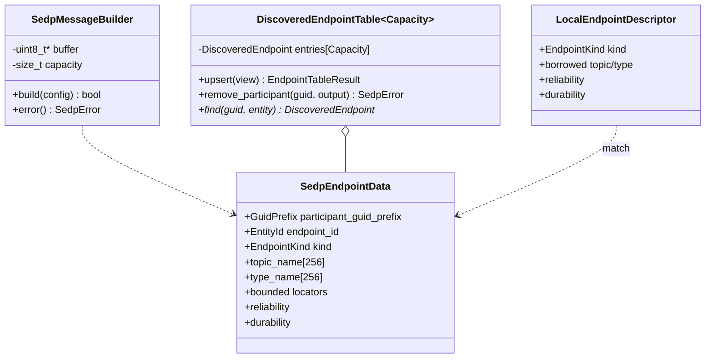
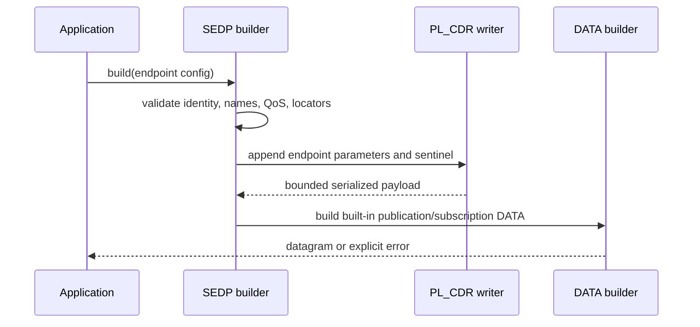
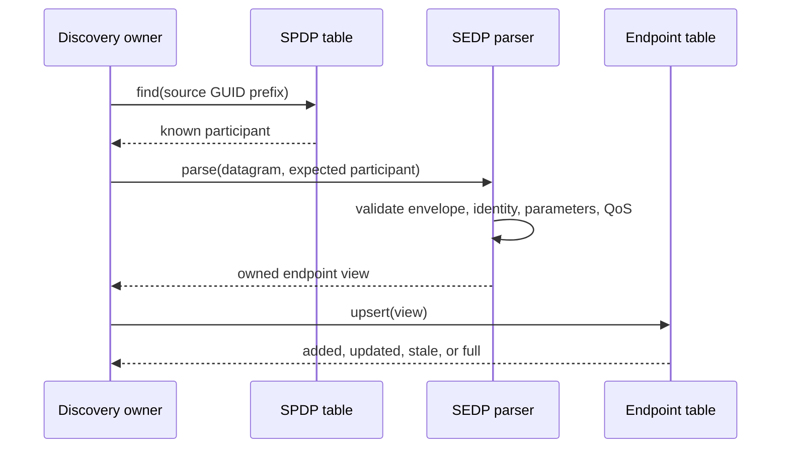
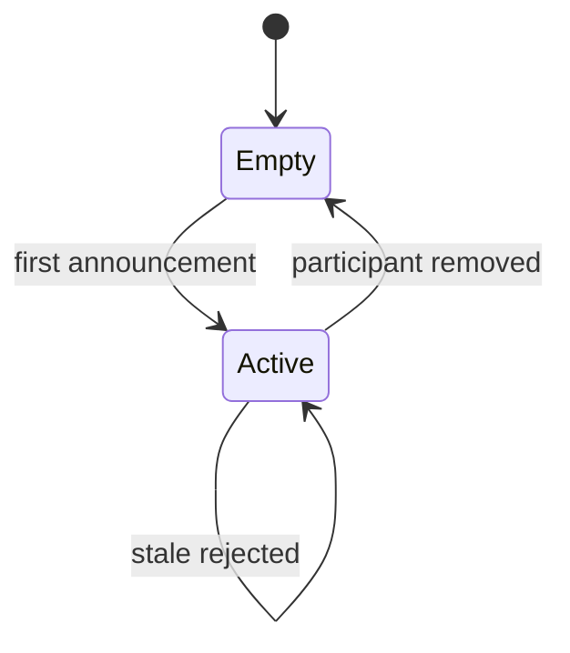

# SEDP endpoint discovery detailed design

**Design status:** Current  
**Requirements:** ORT-SEDP-001, ORT-SEDP-002, ORT-SEDP-003  
**Requirements:** ORT-SEDP-004, ORT-SEDP-005, ORT-SEDP-006  
**Current implementation:** `rtps/sedp.hpp`, `src/rtps/sedp.cpp`  
**Current verification:** `tests/test_sedp.cpp`  
**Current example:** `examples/sedp_matching.cpp`

## Scope

This feature implements the bounded endpoint-record and matching portion of
the DDSI-RTPS 2.5 Simple Endpoint Discovery Protocol (SEDP). It constructs and
parses publication and subscription discovery DATA, stores validated remote
endpoints, removes their state when an SPDP participant expires, and evaluates
the supported request/offered QoS subset.

The caller still owns the SEDP built-in reliable writer/reader state,
HEARTBEAT/ACKNACK scheduling, UDP sockets, retransmission cadence, participant
lookup, and creation/destruction of application data endpoints. This PR does
not claim complete DDS discovery interoperability; that requires the planned
Fast DDS and Cyclone DDS gates.

## Types and ownership

The builder borrows a caller-owned datagram buffer and uses a fixed 1,280-byte
stack parameter buffer during `build()`. A parsed `SedpMessageView` owns copies
of all supported endpoint fields and does not retain the input datagram.
`DiscoveredEndpointTable<Capacity>` owns inline records. A
`LocalEndpointDescriptor` borrows its topic/type character spans only for the
duration of `evaluate_endpoint_match()`.

## Public API contracts

| API | Preconditions | Success | Failure guarantee |
|---|---|---|---|
| `SedpMessageBuilder::build` | valid participant/endpoint identity, nonempty bounded names, at least one valid locator, supported QoS | one complete DATA datagram | size becomes zero; explicit `SedpError` and optional `RtpsError` |
| `parse_sedp_message` | immutable datagram and SPDP-validated expected participant | owned parsed endpoint view | caller's previous view is unchanged |
| `DiscoveredEndpointTable::upsert` | validated parsed view | add or strictly newer update | no table mutation for stale/capacity failure |
| `remove_participant` | participant GUID and adequate output array | all owned endpoint IDs copied and records cleared | two-pass operation leaves table unchanged on insufficient output |
| `find` | participant GUID and endpoint entity ID | stable pointer until table mutation | null when absent |
| `evaluate_endpoint_match` | valid local borrowed spans and supported QoS | one explicit match status | no state mutation |

Instances are not internally synchronized. A caller shall serialize access to
each mutable builder or table instance.

## Announcement construction behavior

An announced writer uses
`ENTITYID_SEDP_BUILTIN_PUBLICATIONS_ANNOUNCER` (`00 00 03 c2`); an announced
reader uses `ENTITYID_SEDP_BUILTIN_SUBSCRIPTIONS_ANNOUNCER`
(`00 00 04 c2`). The DATA reader identity is unknown, allowing directed or
undirected transport orchestration above this codec.

The PL_CDR payload emits:

| Parameter | Cardinality | Encoding |
|---|---:|---|
| `PID_ENDPOINT_GUID` | one | participant prefix + user endpoint EntityId |
| `PID_PARTICIPANT_GUID` | one | participant prefix + `00 00 01 c1` |
| `PID_TOPIC_NAME` | one | bounded CDR string, maximum 255 characters |
| `PID_TYPE_NAME` | one | bounded CDR string, maximum 255 characters |
| `PID_RELIABILITY` | one | RTPS kind plus nonnegative max-blocking duration |
| `PID_DURABILITY` | one | volatile or transient-local kind |
| `PID_EXPECTS_INLINE_QOS` | one | boolean; descriptive only in this subset |
| `PID_UNICAST_LOCATOR` | zero to four | validated UDPv4 locator |
| `PID_MULTICAST_LOCATOR` | zero to four | validated UDPv4 locator |
| `PID_SENTINEL` | one, last | parameter-list terminator |

At least one unicast or multicast locator is required. Each parameter length
is padded to a multiple of four and each value begins a new CDR alignment
scope. Big- and little-endian PL_CDR are supported.

## Parse and participant-validation sequence

The expected participant argument is the trust link to SPDP. The parser
requires the RTPS header GUID prefix, `PID_PARTICIPANT_GUID`, and prefix of
`PID_ENDPOINT_GUID` to match it. The endpoint EntityId kind must match whether
the message arrived through the publications or subscriptions built-in
writer. Unknown ignorable parameters are skipped; bit-14 must-understand
parameters are rejected.

Reliability and durability parameters may be omitted and then take DDS
defaults of best-effort and volatile. Endpoint GUID, participant GUID, topic,
type, at least one locator, and sentinel are mandatory in this implementation.
Parsing uses a local candidate and commits it only after complete validation.

## Endpoint cache behavior

The cache key is `(participant GUID prefix, endpoint EntityId)`. Updates must
carry a strictly greater SEDP built-in writer sequence number. Capacity
exhaustion does not evict an existing endpoint. SPDP lease expiry is handled
by first obtaining the expired participant from the participant table, then
calling `remove_participant()`; the latter counts removals before changing
state so insufficient caller output cannot cause partial teardown.

## Match behavior

Matching is a pure ordered decision:

1. validate the local descriptor and supported QoS values;
2. require one writer and one reader;
3. require exact topic-name bytes and length;
4. require exact type-name bytes and length;
5. identify the writer as offered QoS and reader as requested QoS;
6. require offered reliability to be at least requested reliability;
7. require offered durability to be at least requested durability;
8. return `matched`.

The supported compatibility order is:

| Policy | Lower | Higher | Compatibility rule |
|---|---|---|---|
| Reliability | best effort | reliable | offered ≥ requested |
| Durability | volatile | transient local | offered ≥ requested |

A mismatch is a normal discovery outcome, not a fault. This subset does not
yet compare deadline, liveliness, ownership, partition, data representation,
or type consistency metadata.

## Errors and fault mapping

| `SedpError` group | Condition | Fault mapping |
|---|---|---|
| `invalid_argument`, `invalid_configuration`, `invalid_duration`, `invalid_locator` | invalid local API/configuration | `ORT-FLT-DISC-001` |
| `buffer_overflow`, `locator_bound_exceeded`, `table_full`, `action_capacity_exceeded` | configured bound exceeded | `ORT-FLT-DISC-002` |
| `rtps_error`, `unsupported_representation`, `malformed_parameter`, `duplicate_parameter`, `missing_required_parameter` | malformed/unsupported remote input | `ORT-FLT-DISC-003` |
| `unknown_required_parameter` | incompatible mandatory extension | `ORT-FLT-DISC-004` |
| `invalid_identity`, `participant_mismatch` | wrong route or untrusted endpoint owner | reject; deployment diagnostic policy |
| `stale_announcement` | duplicate/older record | observable status; no fault by itself |

`MatchStatus` values are decision evidence, not `SedpError` values. No error
or mismatch creates a fault event, endpoint, socket operation, or retry.

## Determinism and concurrency

| Property | Bound/owner |
|---|---|
| Endpoint records | `DiscoveredEndpointTable<Capacity>` |
| Topic/type names | 255 characters each |
| Locator categories | four each |
| Parameter construction | 1,280-byte fixed stack buffer |
| Datagram | caller owned; DATA builder maximum applies |
| Removal events | caller-owned array |
| Heap allocation | none |
| Threads/locks/waits | none |
| Reliability scheduling | caller + existing reliability state machines |

All loops are bounded by a compile-time capacity, an encoded payload length,
or a caller-supplied length. There are no callbacks during state mutation.

## Deliberate limitations

- Publication and subscription endpoint data only; built-in topic discovery
  is not implemented.
- UDPv4 locators only.
- Reliable delivery of SEDP traffic must be orchestrated with the existing
  reliability layer; this codec does not own built-in endpoint state.
- Endpoint disposal/key-only DATA, DATA_FRAG, inline QoS, partitions,
  content filters, DDS Security, XTypes type objects, and extended QoS are not
  implemented.
- No direct creation of typed DDS entities from a match yet.
- No Fast DDS, Cyclone DDS, or ROS 2 interoperability claim yet.

## Verification evidence

- `tests/test_sedp.cpp`: publication/subscription and endian round trips,
  defensive parsing, participant ownership, cache lifecycle, atomic removal,
  QoS matching, and fixed-storage properties.
- `examples/sedp_matching.cpp`: builds and parses a publication, stores it,
  and deterministically matches a local subscription.
- `tools/check_requirement_traces.py`: checks requirement/design/code/test/
  example references.
