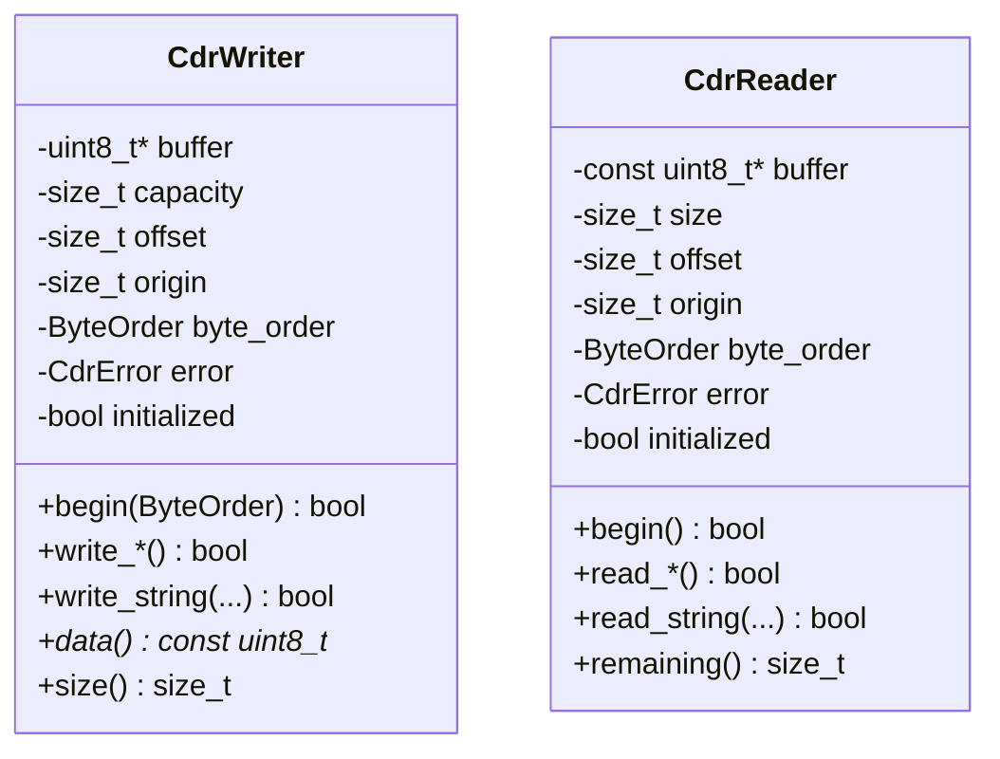
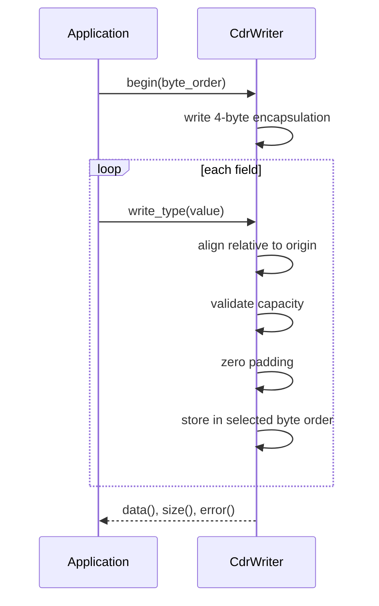

# XCDR1 serialization detailed design

**Design status:** Current  
**Requirements:** ORT-SER-001, ORT-SER-002, ORT-SER-003, ORT-SER-004  
**Requirements:** ORT-SER-005, ORT-SER-006  
**Source:** `include/openrtdds/serialization/cdr.hpp`,
`src/serialization/cdr.cpp`

## Responsibility and supported representation

`CdrWriter` and `CdrReader` encode/decode the XCDR1 PLAIN_CDR subset used by
final and appendable types. Both operate on caller-owned fixed buffers. The
supported encapsulations are `CDR_BE` (`0x0000`) and `CDR_LE` (`0x0001`).

## Class definitions

Objects borrow their buffers; they do not own or resize them. A buffer must
outlive every reader/writer using it.

## Writer behavior

### Initialization

`begin(byte_order)` resets offset, origin, initialization state, and any prior
error. It validates the borrowed buffer and byte order, requires four bytes,
writes the encapsulation header, then sets `origin = offset = 4`.

### Field write sequence

Alignment is computed relative to the first byte after encapsulation. Alignment
must be a nonzero power of two. Space is validated before padding or field data
is committed. Padding bytes written by the writer are zero.

### Supported fields

| API family | Width/alignment | Encoding |
|---|---:|---|
| bool, uint8 | 1/1 | bool is exactly 0 or 1 |
| int16, uint16 | 2/2 | two's-complement bit representation |
| int32, uint32 | 4/4 | selected byte order |
| int64, uint64 | 8/8 | selected byte order |
| float32 | 4/4 | IEEE-754 binary32 bits |
| float64 | 8/8 | IEEE-754 binary64 bits |
| bytes | N/1 | unchanged byte sequence |
| bounded string | 4 + N + 1 / 4 | uint32 length including NUL, then data/NUL |

The build has static assertions for IEEE-754 float sizes.

## Reader behavior

`begin()` requires at least four bytes and accepts only `0x0000` or `0x0001`
encapsulation. It resets the alignment origin after the header.

For every read, the reader computes aligned start/end positions and validates
the complete field before assigning the caller's output or advancing offset.
Boolean values greater than one and strings without a terminal NUL are invalid.
A string must fit both its declared IDL bound and destination capacity.

## Atomic failure and sticky errors

The first error is retained until the next `begin()` call. Later operations
return `false` without progressing. A failed field read leaves its destination
and reader position unchanged. A failed write does not advance `size()`.

## CdrError contract

| Enumerator | Writer condition | Reader condition | Fault mapping |
|---|---|---|---|
| `none` | success | success | none |
| `invalid_argument` | invalid pointer/order | invalid pointer/destination | SER-001/002 by direction |
| `not_initialized` | write before `begin` | read before `begin` | programmer/configuration error |
| `overflow` | insufficient output capacity | — | `ORT-FLT-SER-001` |
| `underflow` | — | truncated field/input | `ORT-FLT-SER-002` |
| `unsupported_encoding` | — | unsupported encapsulation | `ORT-FLT-SER-002` |
| `invalid_data` | — | invalid bool/string/data | `ORT-FLT-SER-002` |
| `bound_exceeded` | source exceeds declared bound | destination/declared bound exceeded | SER-001/002 by direction |

## Preconditions and postconditions

- Nonzero buffer sizes require non-null pointers.
- `begin()` must succeed before field operations.
- String `length` excludes the terminator; destination capacity includes it.
- On success, `size()`/`position()` points immediately after the field.
- The application owns schema and field ordering; no runtime type metadata is
  encoded by this layer.

## Memory, concurrency, and timing

No heap allocation, locks, threads, or system calls occur. Primitive work is
constant time. Byte and string operations are linear in their explicitly
bounded length. Instances are not internally synchronized.

## Deliberate limitations

No XCDR2, mutable types, parameter lists, sequences, arrays-as-schema, unions,
wide strings, or generated type support is present yet. Applications compose
supported primitive calls in schema order.

## Verification and examples

- `tests/test_cdr.cpp`
- `examples/vehicle_state.cpp`
- `examples/rtps_static_message.cpp`

