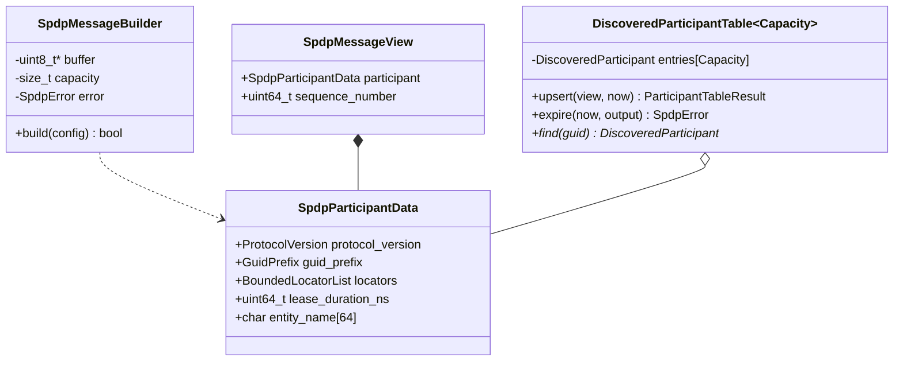
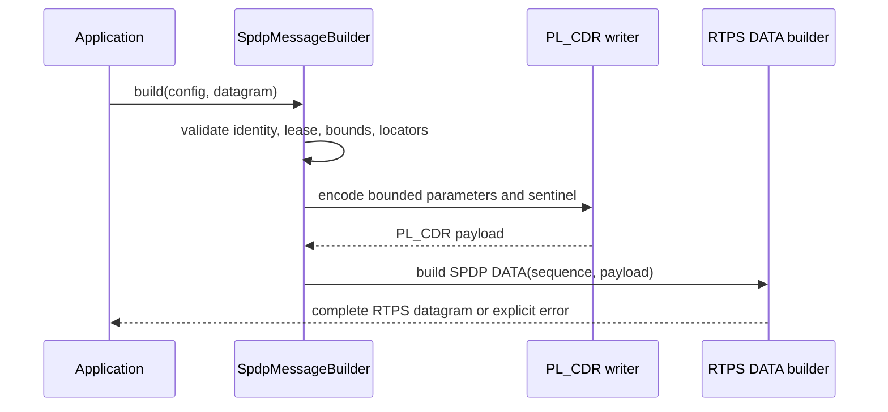
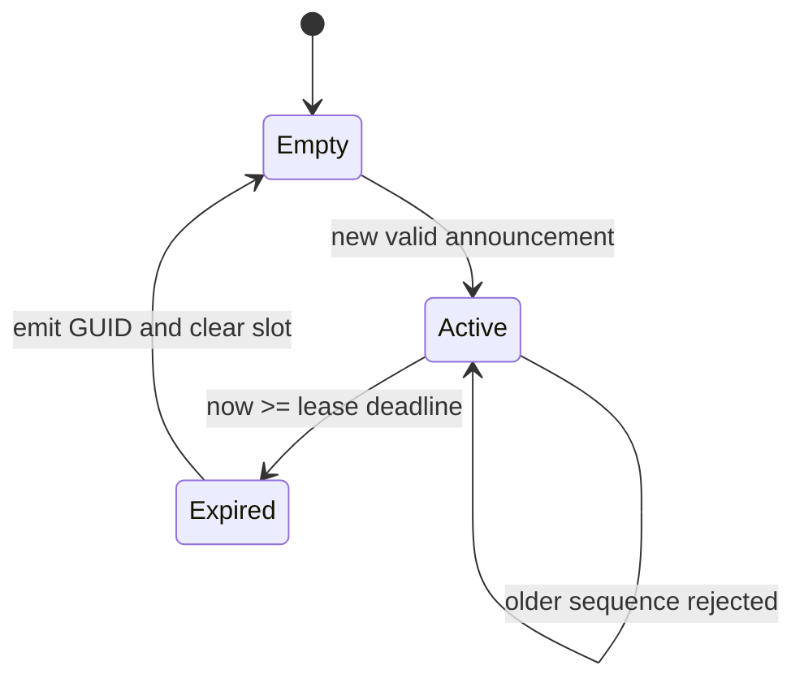

# SPDP participant discovery detailed design

**Design status:** Current  
**Requirements:** ORT-SPDP-001, ORT-SPDP-002, ORT-SPDP-003  
**Requirements:** ORT-SPDP-004, ORT-SPDP-005, ORT-SPDP-006  
**Current implementation:** `rtps/spdp.hpp`, `src/rtps/spdp.cpp`  
**Current verification:** `tests/test_spdp.cpp`  
**Current example:** `examples/spdp_participants.cpp`

## Scope

This feature implements the Simple Participant Discovery Protocol portion of
DDSI-RTPS 2.5 for bounded UDPv4 deployments. It builds and parses participant
announcements and stores discovered participants in a lease-aware fixed table.
The application owns sockets, multicast membership, announcement scheduling,
monotonic time, expiry cadence, and reactions to discovery events.

SPDP discovers participants and the locators/endpoint capabilities needed to
start endpoint discovery. SEDP endpoint announcements and matching are not
implemented in this feature. The static DDS data path remains usable without
SPDP, and the Safety Profile may continue to disable discovery entirely.

## Types and ownership

The builder borrows a caller-owned datagram buffer for its lifetime and uses a
fixed stack parameter-list buffer during `build()`. A parsed view owns copies
of all supported participant fields and therefore does not borrow the input
datagram after parsing. The table owns an inline array. Expired GUID output is
borrowed caller storage.

## UDP port and locator mapping

`SpdpPortConfig` exposes the DDSI-RTPS UDP PSM parameters. Defaults are:

| Parameter | Default |
|---|---:|
| port base (`PB`) | 7400 |
| domain gain (`DG`) | 250 |
| participant gain (`PG`) | 2 |
| multicast offset (`d0`) | 0 |
| unicast offset (`d1`) | 10 |

The helper calculations are:

$$P_{multicast}=PB+DG\cdot domain+d0$$

$$P_{unicast}=PB+DG\cdot domain+d1+PG\cdot participant$$

An operation fails if the result is zero or exceeds 65,535. The current
`Locator` validation accepts only `LOCATOR_KIND_UDPv4`, a nonzero 16-bit port,
12 leading zero address bytes, and a nonzero IPv4 address in the final four
bytes. The parser skips locator values with unsupported transport kinds such
as Fast DDS shared memory (kind 16), while retaining any valid UDPv4 locators.
Malformed UDPv4 locators still fail parsing, and at least one supported
default-unicast and metatraffic locator must remain. UDPv6 is a future
transport extension.

## Announcement wire behavior

The outer RTPS header uses the participant protocol version, vendor ID, and
GUID prefix. DATA uses `ENTITYID_UNKNOWN` as reader and
`ENTITYID_SPDP_BUILTIN_PARTICIPANT_ANNOUNCER` (`00 01 00 c2`) as writer.
The participant key contains the same GUID prefix plus participant entity ID
`00 00 01 c1`.

The serialized payload is PL_CDR big- or little-endian with zero
representation options. The builder emits these parameters:

| Parameter | Cardinality | Value |
|---|---|---|
| `PID_PROTOCOL_VERSION` | one | RTPS 2.1–2.5 |
| `PID_VENDORID` | one | caller vendor ID |
| `PID_DOMAIN_ID` | one | configured domain |
| `PID_PARTICIPANT_GUID` | one | participant GUID |
| `PID_EXPECTS_INLINE_QOS` | one | configured boolean |
| `PID_BUILTIN_ENDPOINT_SET` | one | supported built-in endpoints |
| `PID_PARTICIPANT_LEASE_DURATION` | one | NTP seconds/fraction duration |
| metatraffic locator PIDs | zero to four each | UDPv4 locators |
| default locator PIDs | one to four unicast; zero to four multicast | UDPv4 locators |
| `PID_ENTITY_NAME` | zero or one | bounded CDR string |
| `PID_SENTINEL` | one, last | parameter-list terminator |

Every parameter value starts a fresh CDR alignment scope and its encoded
length is a multiple of four. The lease converts nanoseconds to RTPS
seconds/fraction; decoding may round down by less than one nanosecond.

## Parse and commit sequence

The parser performs these stages before assigning the caller's view:

1. parse the bounded DATA message;
2. require the SPDP writer and unknown or SPDP detector reader identity;
3. require PL_CDR_BE or PL_CDR_LE;
4. walk four-byte-aligned parameters within the payload bound;
5. validate singleton cardinality and UDPv4 locator capacity, skipping
   unsupported transport kinds after checking their parameter length;
6. skip unknown ignorable parameters and reject unknown bit-14
   must-understand parameters;
7. require the sentinel and mandatory participant fields;
8. compare parameter GUID, version, vendor, and expected domain to the outer
   message/caller context;
9. atomically assign the candidate view.

Malformed input therefore leaves the caller's previous view unchanged.
Repeated locator parameters form bounded lists; repeated singleton parameters
are rejected.

## Participant table state

`upsert()` rejects the local GUID, zero lease, monotonic-time regression,
expiration arithmetic overflow, stale sequence, and capacity exhaustion.
Periodic SPDP retransmission may reuse the same writer sequence number, so an
equal sequence refreshes the lease but does not replace participant data. A
newer sequence replaces data and refreshes the lease.

`expire()` first counts due entries. If the caller output is absent or too
small, it returns without changing the table. Otherwise it copies each expired
GUID, clears its entry, and reports the count. No callback runs while table
state is changing.

## Error and fault mapping

| `SpdpError` group | Condition | Design fault mapping |
|---|---|---|
| `invalid_argument`, `invalid_configuration`, `invalid_locator`, `invalid_duration` | invalid local configuration/API | `ORT-FLT-DISC-001` |
| `buffer_overflow`, `locator_bound_exceeded`, `table_full`, `action_capacity_exceeded` | configured resource bound exceeded | `ORT-FLT-DISC-002` |
| `rtps_error`, `unsupported_representation`, `malformed_parameter`, `duplicate_parameter`, `missing_required_parameter` | malformed/unsupported remote message | `ORT-FLT-DISC-003` |
| `unknown_required_parameter` | incompatible mandatory remote extension | `ORT-FLT-DISC-004` |
| `invalid_identity`, `domain_mismatch`, `self_announcement` | message is not an eligible remote participant | reject; diagnose by deployment policy |
| `stale_announcement` | older writer sequence | observable status; no fault by itself |
| `time_regression`, `expiration_overflow` | invalid timing basis/arithmetic | `ORT-FLT-TIME-001` |

`SpdpResult` preserves the underlying `RtpsError` when the DATA layer fails.
No error publishes a fault event or initiates a retry internally.

## Determinism and concurrency

| Property | Current bound |
|---|---|
| Participant capacity | `DiscoveredParticipantTable<Capacity>` |
| Locator capacity | four per locator category |
| Entity name | 63 bytes plus terminator |
| Parameter construction | 768-byte fixed scratch buffer |
| Datagram | caller-owned, max enforced by DATA builder |
| Expiry events | caller-provided array |
| Heap/threads/locks/waits | none |
| Socket and multicast ownership | application |

Table operations scan at most `Capacity` entries. Parsing scans at most the
bounded datagram and copies at most 16 locators plus 63 name bytes. Instances
are not internally synchronized; one mutable instance must be serialized by
the caller.

## Current limitations

- participant discovery only; no SEDP endpoint discovery or matching;
- UDPv4 locators only;
- no DATA_FRAG, inline QoS, dispose/unregister, security, domain tag,
  properties, user data, manual liveliness count, or vendor extensions;
- no multicast socket membership helper or discovery scheduler;
- no interoperability claim until Fast DDS and Cyclone DDS gates pass;
- General Profile feature; Safety Profile deployments may disable it.

## Verification

`tests/test_spdp.cpp` covers default/customizable port arithmetic, locator
validation, big- and little-endian round trips, malformed/truncated input,
domain and identity mismatch, must-understand rejection, invalid builder
configuration, bounded table capacity, refresh, stale sequence, and exact
lease removal. `examples/spdp_participants.cpp` demonstrates one complete
announcement over nonblocking UDP loopback followed by cache insertion and
caller-driven expiry.
