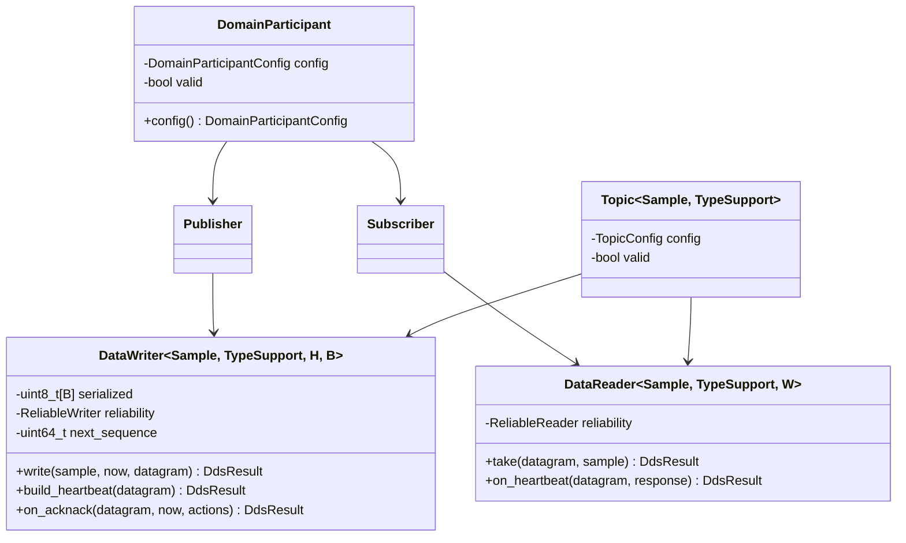
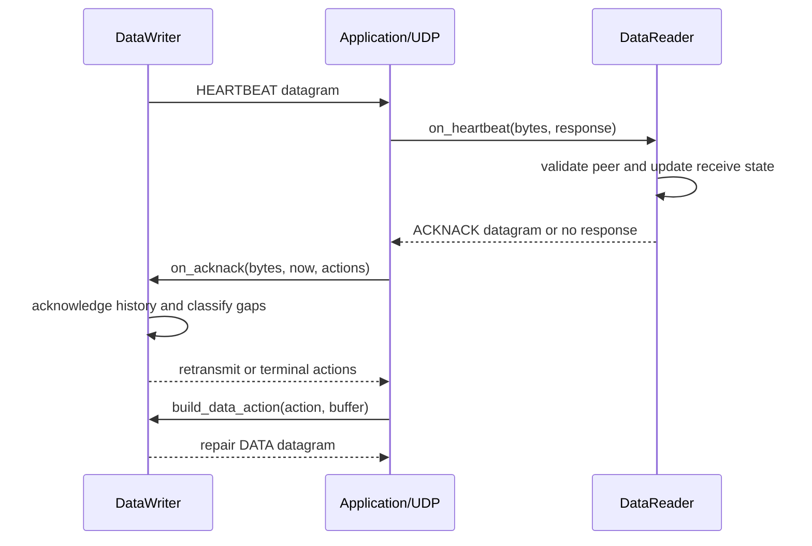

# Static DDS API detailed design

**Design status:** Current  
**Requirements:** ORT-DDS-001, ORT-DDS-002, ORT-DDS-003  
**Requirements:** ORT-DDS-004, ORT-DDS-005, ORT-DDS-006  
**Current implementation:** `dds/static_entities.hpp`,
`src/dds/static_entities.cpp`  
**Current verification:** `tests/test_static_dds.cpp`  
**Current example:** `examples/static_dds_udp.cpp`

## Scope and configuration boundary

This feature is the first typed DDS-facing composition of the bounded XCDR1,
RTPS DATA, reliability, and UDP components. An application creates two
statically configured participants and supplies the topic/type binding,
reader and writer entity IDs, remote GUID prefix, byte order, reliability
bounds, datagram buffers, current monotonic time, and UDP scheduling.

The library does not perform SPDP/SEDP discovery, name lookup, endpoint
matching, socket ownership, thread creation, waiting, timer scheduling, or
hidden retry. `topic_id` and `type_id` are local/generated identifiers in this
profile; they are not added to the RTPS DATA wire representation. Static
configuration establishes the topic match before activation.

## Types and ownership



`DomainParticipant`, `Publisher`, and `Subscriber` copy their small
configuration values; they do not retain references to construction
arguments. A `Topic` owns only its numeric configuration. A `DataWriter` owns
fixed serialization storage and a bounded reliable history. A `DataReader`
owns a fixed receive-window state. Datagram buffers, action buffers, sample
objects, sockets, and clocks remain caller-owned.

## Type-support contract

Each typed topic supplies a `TypeSupport` with this compile-time interface:

```cpp
struct ExampleTypeSupport final {
  static constexpr std::uint32_t type_id = /* nonzero generated ID */;
  static bool serialize(const Sample&, serialization::CdrWriter&) noexcept;
  static bool deserialize(serialization::CdrReader&, Sample&) noexcept;
};
```

`Topic<Sample, TypeSupport>` is valid only when its nonzero configured
`type_id` equals `TypeSupport::type_id`. A reader sample must be nothrow
default-constructible and nothrow copy-assignable because decoding uses a
temporary and commits only after all validation and state processing succeed.

## Static identity and activation

A participant is valid when its protocol is RTPS 2.1 through 2.5 and its
12-byte GUID prefix is nonzero. A static endpoint is valid when both entity
IDs and the remote GUID prefix are nonzero and byte order is supported. A
writer additionally requires a nonzero repair window. Construction records
validity; runtime operations on invalid entities return the most specific
`invalid_participant`, `invalid_topic`, or `invalid_endpoint` result.

Incoming DATA and HEARTBEAT messages must carry the configured remote GUID
prefix. DATA must also carry the configured reader and writer IDs. ACKNACK
endpoint identity is checked by the underlying reliable-writer state machine.
Rejected identity does not update the receive window, history, sequence
counter, or caller sample.

## Typed publication behavior

```mermaid
sequenceDiagram
    participant A as Application
    participant W as DataWriter
    participant C as CdrWriter
    participant R as RTPS builder
    participant H as ReliableWriter
    A->>W: write(sample, now, buffer)
    W->>C: begin(byte order); serialize(sample)
    C-->>W: bounded XCDR1 payload
    W->>R: build DATA(next sequence, payload)
    R-->>W: complete caller-owned datagram
    W->>H: retain(payload, sequence, now)
    alt accepted
      W-->>A: bytes and sequence; increment sequence
    else history/resource failure
      W-->>A: error; sequence unchanged; bytes = 0
    end
```

The writer constructs the datagram before changing reliable state. It then
retains the serialized payload in fixed history. The sequence number advances
only after retention succeeds. On any failure `DdsResult::bytes` is zero, so
the caller must not transmit scratch bytes that may already have been written
to its buffer.

`build_data_action()` converts only `send_data` and `retransmit_data` actions
with a valid retained XCDR1 payload into DATA datagrams. `build_heartbeat()`
derives the advertised range and counter from the reliable-writer state.

## Typed subscription behavior

The reader processes one DATA datagram in this order:

1. parse and validate the supported RTPS DATA representation;
2. compare participant GUID prefix and endpoint entity IDs;
3. deserialize into a temporary `Sample`;
4. update the reliable-reader receive window;
5. copy the temporary into the caller sample;
6. return the consumed size and sequence number.

This ordering prevents malformed, misrouted, duplicate, stale, or
out-of-window data from modifying the caller's prior sample. Duplicate and
stale classifications are returned as `reliability_state_failed` with the
underlying `ReliabilityError` preserved.

## Reliability control behavior



The application transmits returned control and repair datagrams. It also
calls `on_timer(now, actions)` at a deployment-defined cadence and executes
or reports its actions. The DDS layer does not hide retry or discard terminal
repair failures. HEARTBEAT and ACKNACK count ordering, history release,
retry limits, and repair-window expiry remain owned by the bounded reliability
state machines.

## API result and error model

`DdsResult` is the single composition-layer result. `ok()` is true only when
`DdsError::none`. The result retains exactly one relevant lower-layer error
domain plus output byte count and sequence number when applicable.

| `DdsError` | Meaning | Preserved detail / recovery owner |
|---|---|---|
| `none` | operation succeeded | caller consumes bytes/actions |
| `invalid_participant` | participant configuration is unusable | correct startup configuration |
| `invalid_topic` | topic ID/type binding is unusable | regenerate or correct static topic table |
| `invalid_endpoint` | endpoint IDs, peer, byte order, or writer QoS is unusable | correct static endpoint table |
| `serialization_failed` | typed encoding failed | `cdr_error`; publisher owns policy |
| `deserialization_failed` | typed decoding failed | `cdr_error`; subscriber rejects sample |
| `rtps_data_failed` | DATA build or parse failed | `rtps_error`; reject or resize caller buffer |
| `reliability_message_failed` | HEARTBEAT/ACKNACK build or parse failed | `reliability_message_error` |
| `reliability_state_failed` | bounded state rejected the event | `reliability_error`; execute deployment policy |
| `unexpected_participant` | GUID prefix is not the configured peer | reject without state change |
| `unexpected_endpoint` | DATA entity IDs do not match | reject without state change |
| `invalid_action` | action cannot become a DATA message | caller/state integration defect |

No error triggers allocation, logging, callback, sleep, retry, socket I/O, or
fault publication. The application maps errors to the stable fault catalog
and decides degradation or safe-state behavior.

## Datagram and transport interface

Successful writer operations produce one complete RTPS datagram in
caller-owned storage. A successful reader consumes one complete datagram.
The bytes are passed unchanged to or from `transport::UdpSocket`; the typed
DDS objects do not depend on that transport type. This boundary allows a
future bounded transport to reuse the same DDS API while keeping scheduling
and endpoint policy explicit.

## Determinism, concurrency, and bounds

| Property | Bound or rule |
|---|---|
| Heap allocation | none in entity construction or steady-state operations |
| Threads/locks/waits | none owned by this layer |
| Writer serialized storage | `MaxSerializedBytes` at compile time |
| Writer retained samples | `HistoryDepth` at compile time |
| Reader gap tracking | `WindowBits` at compile time |
| Action capacity | caller template argument |
| Datagram storage | caller-provided pointer and capacity |
| Work per DATA | bounded serialize/deserialize plus fixed-capacity state scan |
| Instance synchronization | none; caller serializes access to one mutable instance |

Different objects may be assigned to different threads. Concurrent access to
one writer or reader requires caller-owned synchronization and must be
included in the deployment's priority-inversion and WCET analysis.

## Current limitations

- exactly one statically matched writer/reader pair per writer or reader;
- reliable KEEP_LAST behavior only; no best-effort DDS entity policy yet;
- no discovery, dynamic type, keyed instance, ownership, durability, inline
  QoS, fragmentation, security, content filtering, or listener callbacks;
- topic name and DDS QoS compatibility negotiation are not implemented;
- UDP endpoints are configured and operated separately by the application;
- no claim of safety certification or wire interoperability beyond the
  documented RTPS subset.

## Verification evidence

`tests/test_static_dds.cpp` verifies invalid identities and type bindings,
typed DATA round-trip, peer and endpoint rejection, duplicate/stale behavior,
HEARTBEAT/ACKNACK acknowledgement, loss repair, bounded-history failure,
serialization overflow, static storage properties, and unchanged UDP
datagram delivery. `examples/static_dds_udp.cpp` demonstrates typed DATA and
reliability control over two nonblocking loopback UDP sockets.
