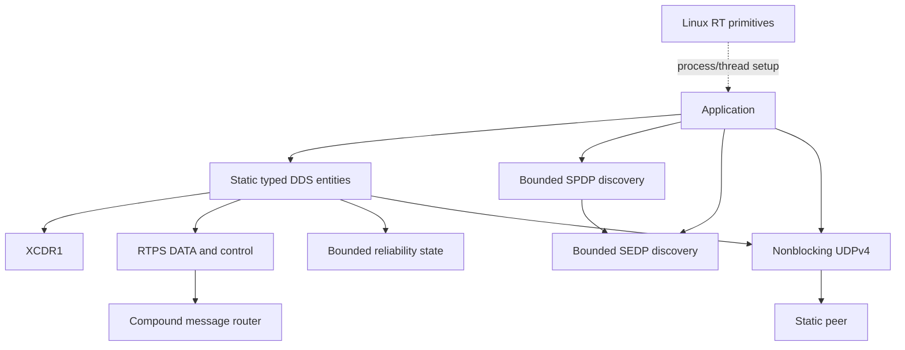
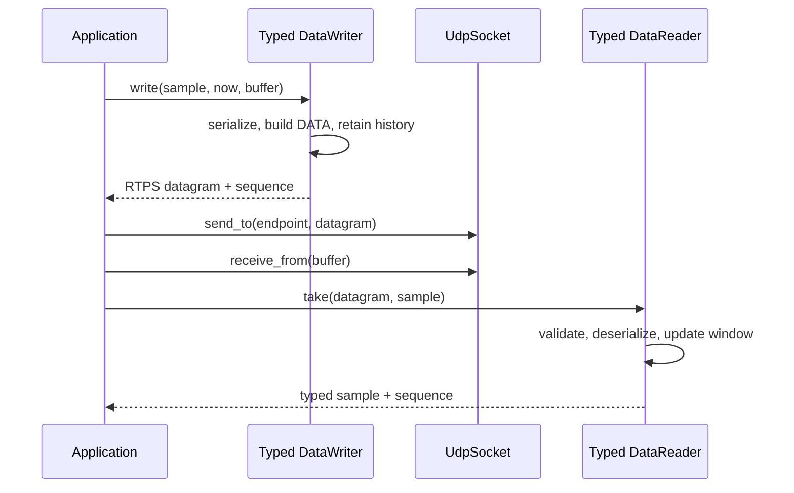

# System detailed design

**Design status:** Current  
**Scope:** PR1–PR13 implementation baseline  
**Requirements:** This document is architectural context; normative feature
requirements are traced in their feature designs.

## Responsibility and boundary

The current library is a synchronous, caller-driven C++17 component. It
provides bounded storage, XCDR1 serialization, compound RTPS routing,
unfragmented RTPS DATA,
bounded HEARTBEAT/ACKNACK reliability, a static typed DDS API, bounded SPDP
participant discovery, and nonblocking UDPv4 transport. It does not create
threads or schedule callbacks. Bounded SEDP endpoint discovery and matching
are caller-driven.

The application owns orchestration. It selects static identifiers and
endpoints, provides all message and action buffers, moves complete datagrams
through transport, calls timer events, handles errors and actions, and decides
retry, deadline, and degradation policies.

## End-to-end transmit and receive behavior

Each step is explicit and synchronous. There are no internal queues between
these components. Failure terminates the current call and is returned to the
application.

## Execution and concurrency model

| Property | Current design |
|---|---|
| Internal threads | None |
| Internal blocking waits | None |
| Hidden retries | None |
| Callbacks | None |
| Runtime heap allocation | None in implemented components |
| Synchronization | None |
| Thread safety | Instances are not internally synchronized |

Distinct instances may be used by distinct threads. Concurrent access to the
same mutable object requires caller-provided synchronization. The caller must
analyze any synchronization for priority inversion and bounded blocking.

## Ownership model

- CDR writers/readers and RTPS builders/views borrow caller buffers for their
  object or view lifetime.
- Static DDS writers and readers copy their configuration; each call only
  borrows its supplied datagram, action, or sample storage.
- Readers and parsed views borrow immutable input buffers.
- A `DataMessageView` becomes invalid when its source datagram storage is
  modified or destroyed.
- `BoundedSample`, `KeepLastHistory`, and `StaticPool` own inline storage.
- `UdpSocket` exclusively owns one file descriptor and transfers ownership on
  move.

## Initialization order

Recommended application order:

1. validate `RuntimeLimits` and static configuration;
2. create fixed storage and communication objects;
3. open and bind UDP sockets;
4. lock process memory and pre-fault application stacks;
5. set thread affinity and scheduling policy;
6. enter the caller's cyclic/event loop;
7. treat any setup failure according to the deployment safety concept.

The library does not enforce this order because the application owns process
startup and thread creation.

## Failure propagation

Local API errors are returned using feature-specific enums. `RealtimeResult`
and `UdpResult` preserve native OS error information. No component currently
publishes a diagnostic event; the application maps errors into the stable
design-level fault codes defined in [faults-and-errors](../faults-and-errors.md).

## Current limitations

- Linux and UDPv4 only.
- Static typed data endpoints remain the only application data path; SPDP and
  SEDP discovery can identify and match peers, but do not yet instantiate
  typed endpoints automatically.
- Builders emit one unfragmented DATA/control submessage; parsers route a
  supported target within a compound datagram.
- No inline QoS, keys, DATA_FRAG, security, or dynamic types.
- One statically matched reliable pair per typed writer or reader; no
  multi-reader aggregation or best-effort entity policy yet.
- No DDS deadline implementation or health monitor yet.
- No internal application-level end-to-end safety envelope yet.
