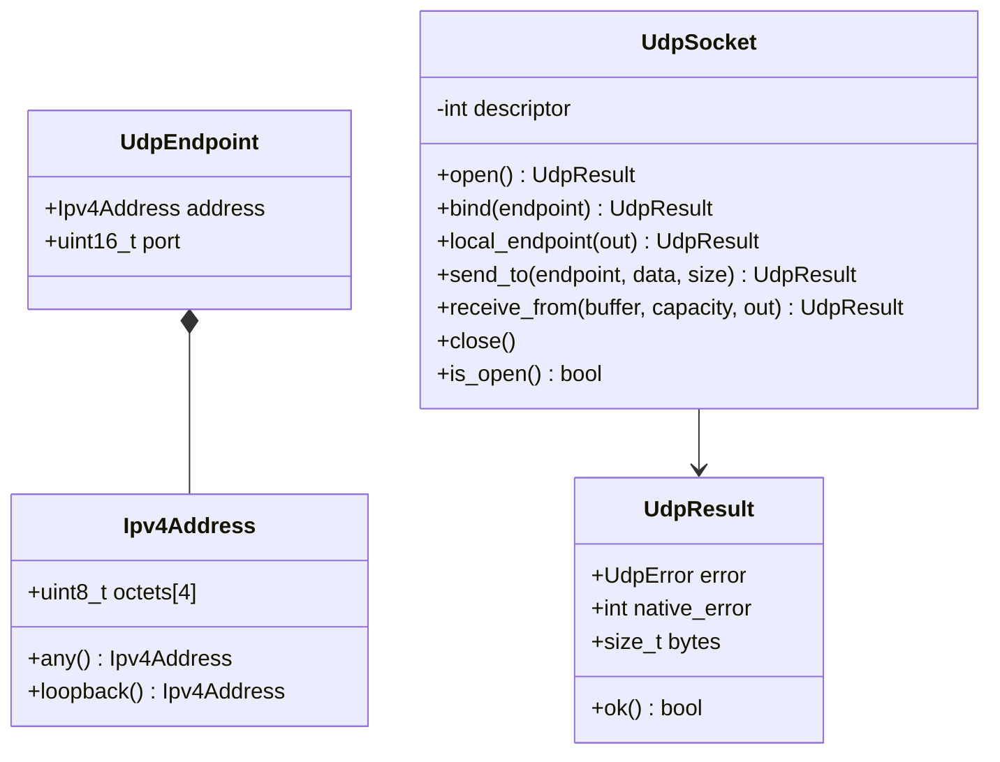
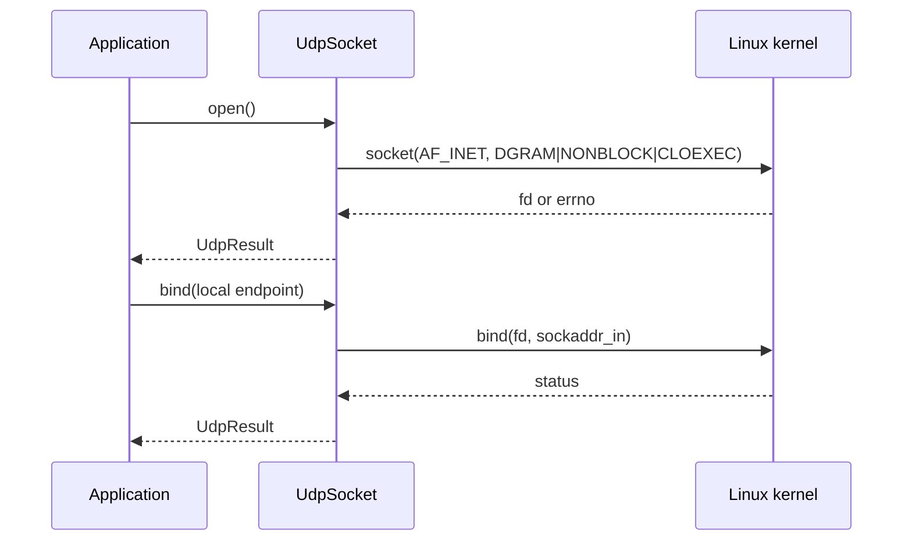
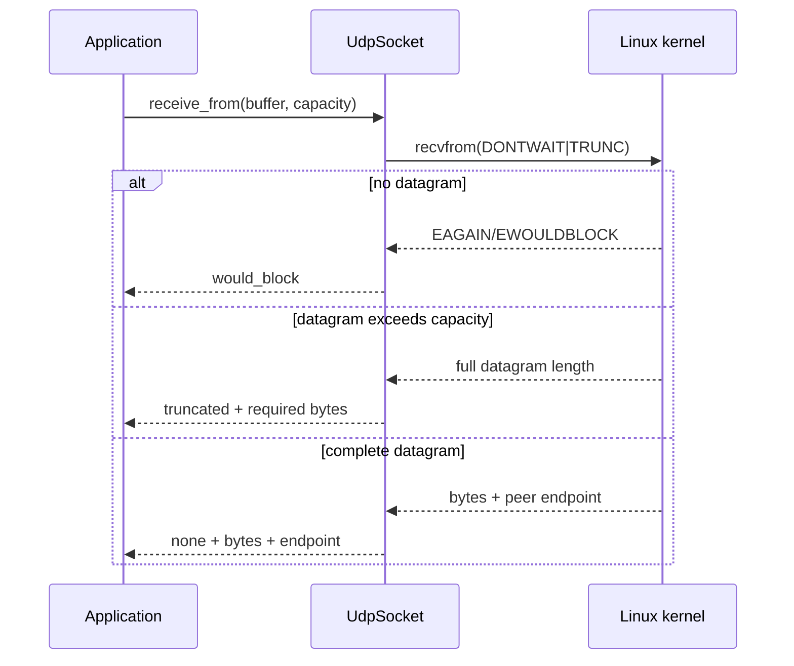

# UDPv4 transport detailed design

**Design status:** Current  
**Requirements:** ORT-UDP-001, ORT-UDP-002, ORT-UDP-003, ORT-UDP-004  
**Requirements:** ORT-UDP-005  
**Source:** `include/openrtdds/transport/udp_socket.hpp`,
`src/transport/udp_socket.cpp`

## Responsibility

`UdpSocket` is a Linux-only, allocation-free RAII wrapper around one IPv4 UDP
descriptor. All I/O is nonblocking. The wrapper performs no DNS, multicast
management, polling, retry, deadline, fragmentation, or queueing.

## Class and data definitions

IPv4 addresses are stored as four network-order octets. Native `sockaddr_in`
conversion copies those octets directly and converts only the port with
`htons`/`ntohs`.

## Ownership and lifecycle

- Default construction creates a closed object (`descriptor == -1`).
- `open()` on an already open object is idempotent success.
- Copy is disabled.
- Move construction/assignment transfers the descriptor and closes any
  descriptor previously owned by the destination.
- A moved-from object is closed and safe to destroy.
- `close()` is idempotent; the destructor calls it.

## Open and bind sequence

Binding port zero is supported for operating-system-selected ephemeral ports;
`local_endpoint()` retrieves the selected address/port.

## Send behavior

`send_to()` requires an open socket, nonzero destination port, and a non-null
pointer for nonzero data. It rejects sizes above 65,507 before calling Linux.
It calls `sendto` with `MSG_DONTWAIT | MSG_NOSIGNAL`. A partial datagram send is
treated as `send_error`; success reports the requested byte count.

## Receive behavior

`receive_from()` requires an open socket and valid destination buffer. It calls
`recvfrom` with `MSG_DONTWAIT | MSG_TRUNC` so the returned byte count represents
the full datagram length. If length exceeds capacity, copied data is not
presented as a valid datagram: result is `truncated` and `bytes` reports the
required/full size.

## UdpError contract

| Enumerator | Meaning | `native_error`/`bytes` | Fault mapping |
|---|---|---|---|
| `none` | success | errno 0; operation byte count | none |
| `invalid_argument` | pointer/endpoint invalid | zero | caller/configuration |
| `not_open` | operation requires descriptor | zero | startup/lifecycle |
| `socket_error` | socket creation failed | errno | `ORT-FLT-UDP-001` |
| `bind_error` | bind failed | errno | `ORT-FLT-UDP-001` |
| `endpoint_error` | local/remote endpoint invalid | errno if available | `ORT-FLT-UDP-001` |
| `send_error` | send failed/partial | errno or partial bytes | `ORT-FLT-UDP-002` |
| `receive_error` | receive/native address failed | errno | `ORT-FLT-UDP-003` |
| `would_block` | no immediate progress possible | EAGAIN/EWOULDBLOCK | not a fault alone |
| `truncated` | datagram exceeds buffer | full datagram bytes | `ORT-FLT-UDP-003` |
| `message_too_large` | size exceeds UDP maximum | zero | `ORT-FLT-UDP-002` |

## Concurrency and timing

Operations contain one bounded system call and never poll or wait internally.
The wrapper has mutable descriptor state and is not internally synchronized.
One owner should control open/close/move; external synchronization is required
if send/receive calls share an instance across threads.

## Deployment interface

The application supplies static local and remote endpoints. Network routing,
firewall, socket buffer sizing, DSCP, multicast, NIC queues, IRQ affinity, and
TSN configuration are outside this component and must be handled by platform
configuration.

## Verification

- `tests/test_udp_socket.cpp`

